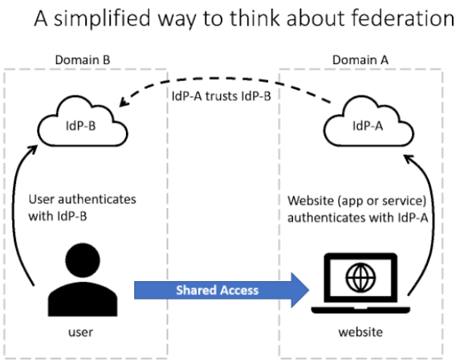
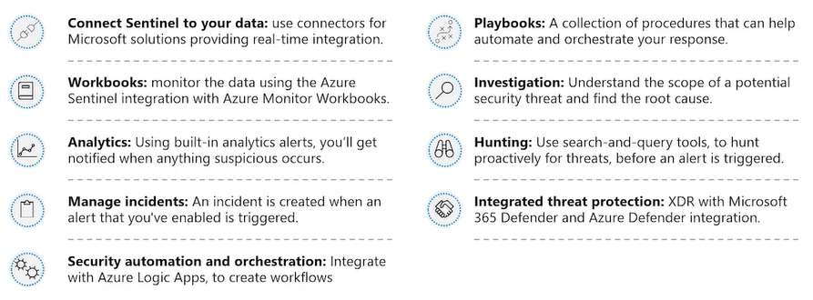
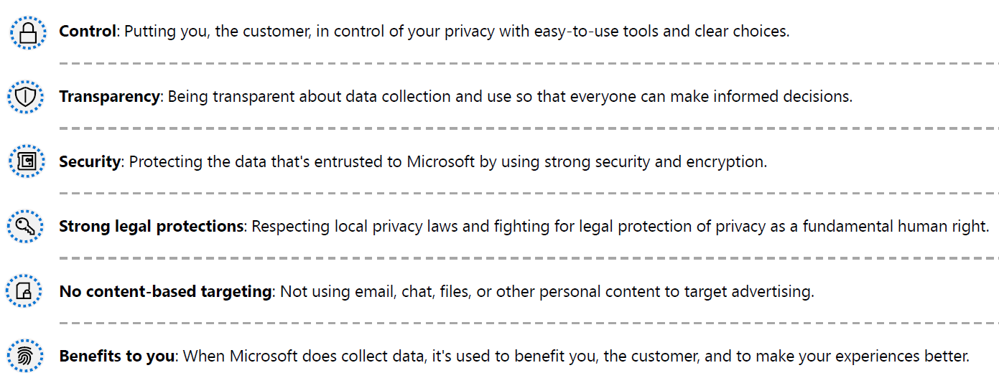
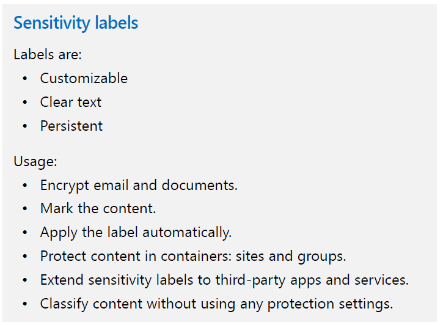
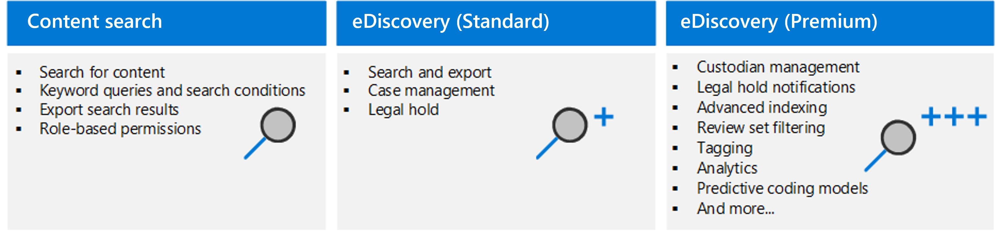
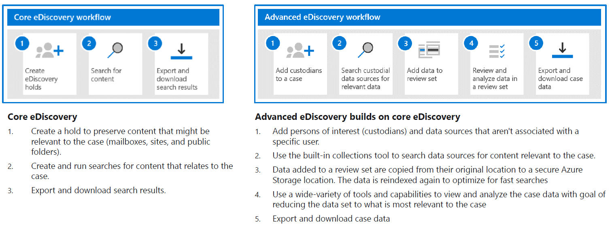
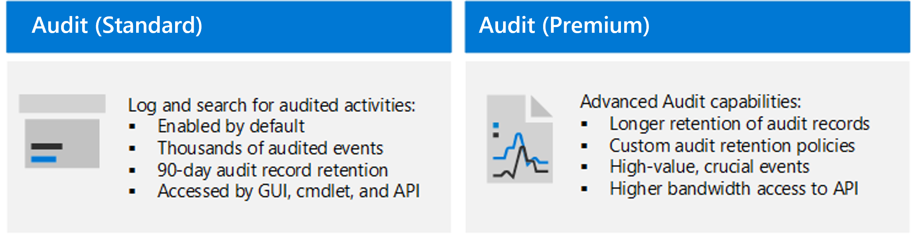
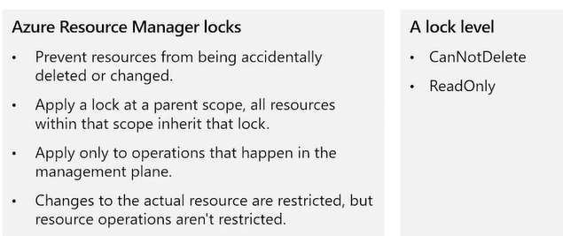

#### Microsoft Security Compliance and Identity Fundamentals | M0 Notes

# M1-1 Security and Compliance Concepts

Shared responsibilities model 
- Responsibilities always retained by the customer organization include: 
  - Information and data 
  - Devices (mobile and PCs) 
  - Accounts and identities 
 
Defense in depth 
- Physical Security 
- Identity and Access 
- Perimeter 
- Network 
- Compute 
- Application 
- Data 
 
CIA Triad 
 
Zero Trust (Trust no one, Verify everything) 
- 3 Principal 
  - Verify Explicitly 
  - Least Privilege Access 
  - Assume Breach 
- 6 Foundational Pillars 
  - Identity 
  - Application 
  - Devices 
  - Infrastructure 
  - Network 
  - Data 

Encryption 
- Symmetric and Asymmetric Encryption 
- 3 States of Data 
  - Data in Use 
  - Data in Transit 
  - Data at Rest 
- Hashing 
  - Does not need keys and cannot be "decrypt" to original 
 
Compliance 
- Data residency 
  - Govern how data can be stored and how it can be transferred, processed or accessed internationally 
- Data sovereignty 
  - The subjection of data to laws and regulations of country/region on how it's physically collected, held or processed. 
  - Will be complicated due to collection, storage, processing can all be done from different location 
- Data privacy 
  - Fundamental principal laws of privacy are to provide notice and being transparent about collection, processing, use and sharing of personal data 
  - Originally it means any information / PII (personally identifiable information), but now it has expanded to be any data that is directly or indirectly linked back to a person. 

# M1-2 Identity Concepts 

Authentication / AuthN 
- Process of proving that a person is who they say they are 
 
Authorization / AuthZ 
- Determine the level of access or permission an authenticated person has to data and resources 
 
Identity 
- Set of things that define or characterize someone or something  
 
Four Pillars of Identity Infrastructure 
- Administration 
- Authentication 
- Authorization 
- Auditing 
 
Modern Authentication consist of Identity Provider (IDP) 
- IDP provides authentication, authorization and auditing 
- A fundamental capability of modern AuthN and IDP is Single Sign-On (SSO) 
- E.g., of cloud-based identity provider: Microsoft Azure Active Directory 

Claims 
- Set of information 
 
Subject 
- Unique Identifier to a specific person 
- This is because a person name can change 
 
Audience 
- Which server can view this token 

Directory 
- Hierarchical structure that stores information about objects on the network. 
- Stores directory data and makes it available to network users, administrators, services, and applications. 
 
Active Directory Domain Services (AD DS).  
- Stores information about members of the domain, including devices and users, verifies their credentials, and defines their access rights.  
- A server running AD DS is a domain controller (DC). 
- AD DS is a central component in organizations with on-premises IT infrastructure.  
- AD DS gives organizations the ability to manage multiple on-premises infrastructure components and systems using a single identity per user.  
- AD DS does not natively support mobile devices, SaaS applications, or line of business apps that require modern authentication methods. 
 
Azure Active Directory 
- Provides organizations with an Identity as a Service (IDaaS) solution for all their apps across cloud and on-premises.  
 
Federation 
- SSO between multiple IDP 
- Federation may not be a two-way trust street or on cloud 

# M2-1 Services and Identity Types of Azure AD 

Microsoft's cloud-based IAM has four types of Azure AD. 

- Free 
  - Allow administration of users and create groups 
  - Synchronize with on-premise Active Directory 
  - Create basic report 
  - Configure self-service password change for cloud users 
  - Enable single sign-on across Azure, Microsoft 365 and many popular SaaS apps 
  - Included in subscriptions to Office 365, Azure, Dynamics 365, Intune and Power Platform 
- Office 365 Apps 
  - Include all features in Free version. 
  - Include self-service password reset for cloud users 
  - Device write-bac that offer two-way synchronization between on-premises directories and Azure AD 
  - Office 365 Apps edition of Azure Active Directory is included in subscriptions to Office 365 E1, E3, E5, F1, and F3. 
- Premium P1 
  - Include all features in free and Office 365 apps 
  - Support advanced administration 
    - Dynamic groups 
     - Self-service group management 
     - Microsoft Identity Manager (an on-premises IAM suite) 
     - Cloud write-back capabilities which allow self-service password reset for on-premise users 
- Premium P2 
  - Offer all P1 features and Azure Active Directory Identity Protection 
     - Provide risk-based conditional access to apps and critical company data 
  - Give Privileged Identity Management 
     - Discover, restrict, and monitor administrators and their access to resources and provide just-in-time access when needed 

Azure AD manages different type of identities 
- User 
  - Able to create group and assign people with the same privilege 
  - With Azure AD B2B collaboration, we are able to add external guest and share resources 
- Service principal 
  - Identity for application. 
  - Require application to be registered with Azure AD to enable integration 
  - Enable core features such as authentication and authorization of the application 
- Managed Identity 
  - Type of service principal that are automatically managed in Azure AD and eliminate the need for developers to manage credentials 
  - Managed identities provide an identity for applications to use when connecting to Azure resources that support Azure AD authentication and can be used without any extra cost 
  - Two types of Managed Identities 
- System-Assigned 
- Enable managed identity directly on service instance. 
- When enabled, an identity is created in Azure AD that is tied to the lifecycle of that service instance 
- Once resource is deleted, Azure will automatically delete the identity 
- By design, only Azure resource can use this identity to request tokens from Azure AD 
- User-Assigned 
- Allow the creation of a managed identity as a standalone Azure resource that can be assign to one or more instances of an Azure service 
-  The identity is managed separately from the resources that use it 
  - 
  - 
- Device 
  - A piece of hardware such as mobile devices, laptops, servers or printers. 
  - Device identities can be set up differently in Azure AD 
- Azure AD registered devices 
- Allow BYOD as personal devices can access organisational resources without organisational account. 
- Supports Windows 10 and above, iOS, Android and MacOS 
- Azure AD joined devices 
- A company-owned device that needs to sign in with an organisational account. 
- Windows 10 or greater (except Home edition) and Windows Server 2019 Virtual Machines 
- Hybrid Azure AD joined devices 
- Devices that are joined to on-premises Active Directory implementation  and Azure AD which needs to sign in with organisational account 
- Registering and joining devices to Azure AD provide SSO to cloud-based resources 
- E.g., can use tools like Microsoft Intune to do Mobile Device Management and Mobile Application Management. 
 
Azure AD External Identities 
- Admins can set up federation with identity providers so that external users can sign in with existing social or enterprise accounts 
- Features of Premium P1 and Premium P2 Azure AD editions 
- Two different Azure AD external identities 
  - B2B 
- Allow to share apps and resources with external users 
- Can enable self-service sign-up to let external users sign up for apps or resources themselves 
- Allow SSO with other Azure AD-connected apps 
  - B2C 
- Identity Management Solution for consumer and customer facing apps 
- A Customer Identity Access Management (CIAM) solution 
- Allow users to sign in with their own social or enterprise account for SSO to Azure apps, enterprise apps or customer owned apps within Azure AD B2C tenant. 
- It handles scaling and safety of authentication platform, monitoring and automatically handling threats like denial-of-service, password spray or brute force attack 
- Managed in the Azure AD B2C directory, separately from organisation's employee and partner directory 
 
Hybrid Identity 
- It is important to think of the right authentication method for Azure AD solution in a hybrid model of cloud and on-premise. 
- Each hybrid authentication method require an on-premises active directory. 
- Azure AD Connect, an on-premise Microsoft application that server as a bridge between Azure AD and on-premise AD is required to be run on the server 
  - Azure AD Password hash synchronization 
- Send on-premise password hash to cloud via AD connect with additional security applied. 
- Synchronisation will occur to ensure hash is always updated and allow on-premise users to authenticate with Azure AD to access cloud-based app when on-premise AD is down 
  - Azure AD Pass-through authentication 
- For organisation who want to enforce their on-premises AD security and password policy by authenticating like Azure AD password hash synchronisation but on on-premise. 
- Has additional requirement of running one or more authentication agents that helps to authenticate user as it serve as an intermediary between Azure AD and the on-premise AD 
- Due to use of authenticating agents, there will be a larger infrastructure footprint 
- This authentication method should apply to distributed, redundant software and hardware to provide high availability of sing-in request as outage of on-premises server will not allow authentication to Microsoft 365 
  - Federated Authentication 
- Recommended for organisation using authentication methods (E.g., sign-on with smart cards or certificates, or on-premises multi-factor authentication or third party solution) or advanced features that are not supported in Azure AD. 
- Hands off the authentication process to a separated trusted authentication system such as on-premises Active Directory Federation Services (AD FS) to validate user's password. 
- Ensure user authentication occur on-premise 
- Requires additional server to support federation and thus larger infrastructure footprint 
- Can choose to set up password hash synchronisation as a backup in the scenario where AD FS infrastructure fails 

# M2-2 Authentication Capabilities of Azure AD 

Password 
- Phone-based authentication 
  - SMS-based authentication 
  - Voice call verification 
- OATH (Open Authentication) 
  - Time-based, One-Time Password (TOTP) 
- Software OATH tokens are typically applications 
- Azure AD generate secret key or seed, input into application and generate OTP 
- OATH TOTP hardware tokens are small hardware devices that look like key fob 
- Require the keys and other information specific to each token to be input into Azure AD and activated for use by end-users 
  - OATH software and hardware tokens are only supported as secondary forms of authentication in Azure AD to verify during self-service password rest (SSPR) or Azure AD Multi-factor Authentication 
- Passwordless authentication 
  - Windows Hello for Business 
- Replace password with strong two-factor authentication with PIN or biometrics. 
- They both trigger use of private key to cryptographically sign data that is sent to identity provider. 
- Can be used as primary or secondary authentication 
  - Fast Identity Online (FIDO2) 
- Look like USB devices. 
- Great for enterprise who are security sensitive or have scenarios or employees that are not willing to use phone as secondary authentication factor 
- Can be used as primary or secondary authentication 
- Microsoft Authenticator App 
  - Can be used as primary or secondary authentication 
 
Security Defaults 
- Basic level of security is enabled at no extra cost 
  - Enforce Azure Active Directory MFA for all users 
  - Force administrators and normal users to use MFA 
 
Self-Service Password Reset (SSPR) 
- 3 Scenarios 
  - Password change: When user know password but want to change to something new 
  - Password reset: When user can't sign in, and want to reset password 
  - Account unlock: When a user can't sign in because account locked out 
- To use SSPR, users must be: 
  - Assigned an Azure AD license 
  - Enabled for SSPR by an administrators 
  - Registered with the authentication methods that they want to use 
- By default administrators cannot use security questions as verification method as compared to normal users 
- When user reset password with SSPR, it can be written back to an on-premise AD. 
  - Password write-back allow users to use updated credentials with on-premise device and application without delay 
  - Reset via mobile app notification, mobile app code and email 
- Admin can configure email notification to be sent when SSPR happens 
  - All global admins would be notified when SSPR is used on an admin accoount 
 
Password List 
- Global banned password list 
  - Automatically applied and cannot be disabled 
- Custom banned password list 
  - Feature of Azure AD Premium 1 and 2 
- Protecting against password spray 
  - Azure AD Password Protection block known weak password in password spray attack based on real-world security telemetry data from Azure AD 
- Hybrid Security 
  - Azure AD Password Protection can be integrated with on-premises AD environment 

# M2-3 Access Management Capabilities of Azure AD 

Conditional Access 
- Feature of Azure AD that provides an extra layer of security before allowing authenticated user access data or other asset 
- Implemented through polices that are created and managed in Azure AD 
- The policy analyse signals such as user, location, device, application and risk to automate decisions for authorizing access to resources 
- It creates an informed decision on whether to grant access, block access or require extra verification 
- Conditional Access policies can be targeted to members of specific groups or guests. For example, you can create a policy to exclude all guest accounts from accessing sensitive resources.  
- Feature of paid Azure AD editions. 
 
Azure AD roles control 
- Built-in Roles 
  - All built-in roles are preconfigured bundles of permissions designed for specific tasks and thus can't be modified 
- Global administrator 
- Users with this role have access to all administrative features in Azure Active Directory 
- The person who signs up for Azure Active Directory tenant automatically becomes a global administrator 
- User administrator 
- User can create and manage all aspects of users and groups 
- Include ability to manage support tickets and monitor service health 
- Billing administrators 
- Make purchases, manage subscriptions and support tickets and monitor service health 
- Custom Roles 
  - Provide flexibility when granting access 
  - Can be assigned organisation-wide scope (over all resource) or object scope (a single application) 
  - Require Azure AD Premium P1 or P2 license 
- Least privilege for these roles are preferred 
- Categories of Azure AD roles 
  - Azure AD-specific roles (E.g., User Administrator, Applcation Administrator) 
  - Service-specific roles  (E.g., Exchange Administrator, Intune Administrator) 
  - Cross-service roles (E.g., Security Administrators) 
 
Azure AD RBAC vs Azure RBAC 
- Azure AD RBAC - Azure AD roles control access to Azure AD resources such as users, groups, and applications. 
- Azure RBAC - Azure roles control access to Azure resources such as virtual machines or storage using Azure Resource Management. 

# M2-4 Identity Protection and Governance Capabilities of Azure AD

Azure AD Identity Governance give organisation the ability to 
- Govern identity lifecycle 
  - Join, Move, Leave 
  - Azure AD can create corresponding user account when new employee is added to HR system 
  - Azure AD premium offer integration with cloud-based HR system 
  - Azure AD premium include Microsoft Identity manager which import records from on-premise HR system 
- Govern access lifecycle 
  - Automate access lifecycle with dynamic group 
  - Dynamic group enable admin to create attribute-based rules to determine membership of group 
  - When any attribute of a user or group change, the system evaluate all dynamic group rules to see any actions need to be performed 
- Secure privileged access for administration 
  - Azure AD Privileged Identity Management (PIM) provide extra control to secure access rights 
  - Provide comprehensive governance controls to secure company's resources 
  - Feature of Azure AD Premium P2 
 
Entitlement Management 
- An identity governance feature that enables organisation to manage identity and access lifecycle at scale 
- An entitlement is a named set of access rights to a set of resources that a user can be granted access to either  
- implicitly or explicitly through a request / approval process 
- Automates access request workflows, access assignments, reviews and expiration 
  - Delegate the creation of access packages to non-administrator per request 
  - Manage external users 
- Features of Azure AD Premium P2 
 
Azure AD Access Reviews 
- Enable organisations to efficiently manage group memberships, access to enterprise applications and role assignment 
- Regular access reviews ensure right people have access to resources 
- Feature of Azure AD Premium P2 
 
Azure AD Terms of Use 
- Allow information to be presented to users before they access data or an application 
- Ensure users read relevant disclaimers for legal or compliance requirements 
 
Privileged Identity Management 
- Enable to manage, control and monitor access to important resources in organisation 
- Aims to mitigate the risk of excessive, unnecessary or misused access permissions 
- Requires justification to understand why users want permissions and enforces MFA to activate any role 
- It is 
  - JIT to provide privileged access when needed, and not before 
  - Time-bound by assigning start and end dates to indicate when a user can access resources 
  - Approval=-based, require specific approval to activate privileges 
  - Visible, sending notification when user can access resources 
  - Auditable, allow a full access history to be downloaded 
- Feature of Azure AD Premium P2 (not included in all editions) 
 
Azure Identity Protection 
- Help to accomplish three task 
  - Automate the detection and remediation of identity-based risks 
  - Investigate risks using data in the portal 
  - Export disk detection data to third-party utilities for further analysis 
- Can be used by tools such as Conditional Access to make access decisions or Microsoft Sentinel to investigate 
- Categorise risk into three tiers of low, medium and high 
- Able to calculate sign-in risk or user identity risk 
  - Sign-in risk 
- Represents probability that a given authentication request isn't authorized by the identity owner 
- Anonymous IP address, atypical travel, unfamiliar sign-in properties, Azure AD Threat Intelligence 
  - User risk 
- Represents probability that a given identity or account is compromised 
- Leaked credentials (Dark Web), Azure AD Threat Intelligence 
- Only generate risk detection when correct credentials are used in the authentication request. Thus incorrect credentials will not be flagged by Identity Protection 
- Three reports are generated: Risky users, Risky sign-ins and risk detection 
- Features of Azure AD Premium P2 

# M3-1 Basic Security Capabilities in Azure 

Azure DDoS Protection 
- Protect against DDos Attack 
  - Volumetric, Protocol, Resource/Application layer attack 
- Two Tiers 
  - Basic 
- Automatically enabled for every property in Azure at no extra cost 
- Always on-traffic monitoring and real-time mitigation of common network-level attacks 
- Azure's global network is used to distribute and mitigate attack traffic across regions 
  - Standard 
- Paid service to be activated 
- Provides extra mitigation capabilities that are tuned specifically to Microsoft Azure Virtual Network resources 
- Simple to enable and require no application changes 
- Protection policies are tuned through dedicated traffic monitoring and machine learning algorithms 
- Applied to public IP addresses that are associated with more resources deployed in virtual network such as Azure Load Balancer and Application Gateway 
- Monthly charge that includes protection for 100 resources. 
- Protection for additional resources are charged on a monthly per-resource basis 
 
Azure Firewall 
- Managed, cloud-based network security service that protects Azure Virtual Network resources from attackers 
- Best on centralised Vnet so that it is applicable to other virtual and on-premises network 
- Has features such as 
  - High availbility and availability zone 
  - Network and application level filtering (can filter inbound and outbound traffic) 
  - Outbound SNAT and inbound DNAT to communicate with internet resources 
  - Multiple public IP addresses 
  - Threat Intelligence 
  - Integration with Azure Monitor (to enable collect, analyse and acting on telemetry from Azure Firewall logs) 
 
Web Application Firewall 
- Can be centralised for all the pros of centralisation 
 
Network Segmentation 
- Purpose of Network Segmentation 
  - Ability to group related assets that are part of workload operations 
  - Isolation of resources 
  - Governance policies set by organisations 
 
Azure Virtual Network 
- Provide ability to scale, availability and isolation 
- Able to create multiple VNets per region per subscription and multiple subnets within each Vnet 
- Provide network level containment of resources with not traffic allowed across VNets or Inbound to the Vnet 
 
Azure Network Security Group 
- Filter traffic to and from Azure resources in an Azure virtual network 
- Made up of five information points: Source, Source Port, Destination, Destination Port, Protocol 
- Cannot remove default rules but can override with new rules of higher priorities 
- Azure Firewall complement network security group functionality by providing better defense-in-depth network security 
  - Network security group provide distributed network layer traffic filtering to limit traffic to resources within Vnet in each subscription. 
  - Azure Firewall is a fully stateful, centralized network firewall as a service that provide network and application-level protection across different subscriptions and virtual network 
 
Azure Bastion 
- Despite NSG and Azure Firewall are set up to protect and filter access to asset and resources, but there will be a need to allow developers and data scientist to remote connect to those resources/virtual machines 
- Normally need to expose SSH or RDP ports 
- Azure Bastion allow you to connect to a virtual machine with browser and Azure portal 
- It is a PaaS that provide secure and seamless RDP and SSH connectivity to your virtual machines directly from the Azure portal using TLS 
- When using Azure Bastion, the virtual machine does not need a public IP address, agent or special client software 
- Features 
  - RDP and SSH directly in Azure portal 
  - Remote session over TLS and firewall traversal for RDP/SSH 
  - No public IP required on Azure VM 
  - No hassle of managing NSG 
  - Protection against port scanning 
  - Hardening in one place to protect against zero-day exploits 
 
Just-In-time Access 
- Allow lock down of the inbound traffic to VMs, reduce exposure to attack while providing easy access to connect to VMs when needed. 
  - Able to select which ports on VM to which inbound traffic to be blocked so that Microsoft Defender for Cloud will ensure that Azure VM's management ports will be restricted and be protected 
- When a user requests access to a VM, Defender for Cloud checks that the user has Azure role-based access control (Azure RBAC) permissions for that VM. If the request is approved, Defender for Cloud configures the NSGs and Azure Firewall to allow inbound traffic to the selected ports from the relevant IP address (or range), for the amount of time that was specified. After the time has expired, Defender for Cloud restores the NSGs to their previous states. Connections that are already established are not interrupted. 
- JIT requires Microsoft Defender for servers to be enabled on the subscription 
 
Encryption on Azure 
- Azure Storage Service Encryption 
  - Help to protect data at rest by automatically encrypt before persisting to Azure-managed disks, Azure Blob Storage, Azure Files, or Azure Queue Storage, and decrypts the data before retrieval. 
- Azure Disk Encryption 
  - Uses industry-standard BitLocker feature of Windows and the dm-crypt feature of Linux to provide volume encryption for the OS and data disks. 
  - Helps to encrypt Windows and Linux IaaS virtual machine disks 
- Transparent data encryption (TDE)  
  - Performs real-time encryption and decryption of the database, associated backups, and transaction log files at rest without requiring changes to the application. 
  - Protect Azure SQL Database and Azure Data Warehouse against the threat of malicious activity. 
 
Azure Key Vault 
- Centralized cloud service for storing your application secrets.  
- Control your applications' secrets by keeping them in a single, central location and by providing secure access, permissions control, and access logging capabilities.  
- It's useful for different kinds of scenarios: 
  - Secrets management.  
- Store securely and tightly control access to tokens, passwords, certificates, Application Programming Interface (API) keys, and other secrets. 
  - Key management.  
- Act as a key management solution 
- Easier to create and control the encryption keys used to encrypt your data. 
  - Certificate management 
- Key Vault lets you provision, manage, and deploy your public and private Secure Sockets Layer/ Transport Layer Security (SSL/ TLS) certificates for Azure, and internally connected, resources more easily. 
  - Store secrets backed by hardware security modules (HSMs).  
- The secrets and keys can be protected either by software or by FIPS 140-2 Level 2 validated HSM. 

# M3-2 Security Management Capabilities of Azure 
Cloud Security Posture Management 
- improve your cloud security management by assessing the environment, and automatically alerting security staff for vulnerabilities. 
-  uses a combination of tools and services: 
  - Zero Trust-based access control: Considers the active threat level during access control decisions. 
  - Real-time risk scoring: To provide visibility into top risks. 
  - Threat and vulnerability management (TVM): Establishes a holistic view of the organization's attack surface and risk and integrates it into operations and engineering decision-making. 
  - Discover risks: To understand the data exposure of enterprise intellectual property, on sanctioned and unsanctioned cloud services. 
  - Technical policy: Apply guardrails to audit and enforce the organization's standards and policies to technical systems. 
  - Threat modeling systems and architectures: Used alongside other specific applications. 
 
 
Microsoft Defender for Cloud 
- Tool for security posture management and threat protection 
- Fulfills three vital needs 
  - Continuously assess - Know your security posture, identify and track vulnerabilities. 
  - Secure - Harden all connected resources and services. 
  - Defend - Detect and resolve threats to resources, workloads, and services. 
- Offer two broad pillar of cloud security 
  - Cloud Security Posture Management 
- Provide visibility - to understand current security situation 
- Central feature is Secure Score 
- Aggregate finding into a single score; Higher the score, the lower the identified risk level 
- Hardening guidance - to help efficiently and effectively improve security 
- Provide hardening recommendations based on any identified security misconfigurations and weaknesses 
- Recommendations are grouped into security controls. 
- Score only improves when you remediate all of the recommendations for a single resource within a control 
  - Cloud Workload Protection 
- Able to detect and resolve threats to resources, workloads, and services. 
 
Enhanced Security of Microsoft Defender for Cloud 
- Offered in two modes 
  - Microsoft Defender for Cloud (Free) 
- Enabled for free on all Azure subscriptions 
- Provide secure score and related features such as security policy, continuous security assessment, and actionable security recommendations to protect Azure resources 
  - Microsoft Defender for Cloud with Enhanced Security Features 
- Enabling enhanced security extends capabilities of free mode to workloads running in Azure, hybrid and other cloud platform 
- Provide unified security management and threat protection across your workload 
- Cloud Workload Protections are delivered through integrated Microsoft Defender plans, specific to the types of resources in your subscriptions and provide enhanced security features for your workloads 
 
Defender plans 
- Microsoft Defender for Cloud includes a range of advanced intelligent protections for your workloads. The workload protections are provided through Microsoft Defender plans specific to the types of resources in your subscriptions. The Microsoft Defender for Cloud plans you can select from are: 
  - Microsoft Defender for Servers 
- Adds threat detection and advanced defenses for your Windows and Linux machines. 
  - Microsoft Defender for App 
- Service identifies attacks targeting applications running over App Service. 
  - Microsoft Defender for Storage 
- Detects potentially harmful activity on your Azure Storage accounts. 
  - Microsoft Defender for SQL 
- Secures your databases and their data wherever they're located. 
  - Microsoft Defender for Kubernetes 
- Provides cloud-native Kubernetes security environment hardening, workload protection, and run-time protection. 
  - Microsoft Defender for Container Registries 
- Protects all the Azure Resource Manager based registries in your subscription. 
  - Microsoft Defender for Key Vault 
- Advanced threat protection for Azure Key Vault. 
  - Microsoft Defender for Resource Manager 
- Automatically monitors the resource management operations in your organization. 
  - Microsoft Defender for DNS 
- Provides an additional layer of protection for resources that use Azure DNS's Azure-provided name resolution capability. 
  - Microsoft Defender for open-source relational protections 
- Brings threat protections for open-source relational databases. 
- These different plans can be enabled separately and will run simultaneously to provide a comprehensive defense for compute, data, and service layers in your environment. 
 
Enhanced security features 
- Microsoft Defender plans specific to the types of resources in your subscriptions provide enhanced security features for your workloads. Listed below are some of the enhanced security features. 
  - Comprehensive endpoint detection and response 
- Microsoft Defender for servers includes Microsoft Defender for Endpoint for comprehensive endpoint detection and response (EDR). 
  - Vulnerability scanning for virtual machines, container registries, and SQL resources 
- Easily deploy a scanner to all of your virtual machines. View, investigate, and remediate the findings directly within Microsoft Defender for Cloud. 
  - Multi-cloud security 
- Connect your accounts from Amazon Web Services (AWS) and Google Cloud Platform (GCP) to protect resources and workloads on those platforms with a range of Microsoft Defender for Cloud security features. 
  - Hybrid security 
- Get a unified view of security across all of your on-premises and cloud workloads. Apply security policies and continuously assess the security of your hybrid cloud workloads to ensure compliance with security standards. Collect, search, and analyze security data from multiple sources, including firewalls and other partner solutions. 
  - Threat protection alerts 
- Monitor networks, machines, and cloud services for incoming attacks and post-breach activity. Streamline investigation with interactive tools and contextual threat intelligence. 
  - Track compliance with a range of standards  
- Microsoft Defender for Cloud continuously assesses your hybrid cloud environment to analyze the risk factors according to the controls and best practices in Azure Security Benchmark. When you enable the enhanced security features, you can apply a range of other industry standards, regulatory standards, and benchmarks according to your organization's needs. Add standards and track your compliance with them from the regulatory compliance dashboard. 
  - Access and application controls 
- Block malware and other unwanted applications by applying machine learning powered recommendations adapted to your specific workloads to create allowlists and blocklists. Reduce the network attack surface with just-in-time, controlled access to management ports on Azure VMs. Access and application controls drastically reduce exposure to brute force and other network attacks. 
- Additional benefits include threat protection for the resources connected to the Azure environment and container security features, among others. Some features may be associated with specific defender plans for specific workloads. 
 
Azure Security Benchmark 
- Aim to help organizations secure cloud solutions on Azure 
- Provide prescriptive best practices and recommendations to improve security of workloads, data and services on Azure 
- Can be viewed on Github Azure Security Benchmark V3 for more details 
 
Security Baseline for Azure 
- Security baselines for Azure help organizations strengthen their security through improved tooling, tracking, and security features.  
- Provide organizations a consistent experience when securing their environment.  

# M3-3 Security Capabilities of Microsoft Sentinel 

Security Information Event Management (SIEM) 
- A tool that an organisation uses to collect data from across the whole estate, including infrastructure, software and resources. 
- Does analysis, looks for correlations or anomalies and generates alerts and incidents 
 
Security Orchestration Automated Response (SOAR) 
- Take alerts from many sources such as SIEM system 
- Trigger action-driven automated workflows and processes to run security tasks that mitigate the issue 
 
Extended Detection Response (XDR) 
- Deliver intelligent, automated, and integrated security across an organisation's domain. 
- Help prevent, detect and respond to threats across identities, endpoints, applications, email, IoT, infrastructure and cloud platforms 
 
Microsoft Sentinel 
- A scalable, cloud-native SIEM/SOAR solution that delivers intelligent security analytics and threat intelligence across the enterprise 
- A single solution that provides alert detection, threat visibility, proactive hunting and threat response 
- End-to-end functionality consist of 
  - Collect data across enterprise 
  - Detect threats with analytics and threat intelligence 
  - Investigate threats with artificial intelligence 
  - Respond rapidly to incidents 
- Help end-to-end security operation in a SOC 
- Key features of Microsoft Sentinel are: 
  - Connect Sentinel to your data 
- Connectors to Microsoft solutions and provide real-time integration 
- Built-in connectors to broader security ecosystem of non-Microsoft solutions 
  - Workbooks 
- Monitor data with Azure Monitor Workbooks 
  - Analytics 
- Correlate alert into incidents that can be investigated and resolved 
- Also utilised machine learning rules to map network behaviour and look for anomalies across resources 
  - Managed incidents in Microsoft Sentinel 
- Can triage and investigate, trigger playbook to resolve incidents 
- Able to do standard incident management tasks like changing status or assigning incidents to individuals for investigation 
  - SOAR 
- Make SOC productive with automation 
- Integrate with Azure Logic App to create automated workflows or playbook in response to events 
- Security playbook is a collection of procedures that can automate and simplify task and orchestrate a response 
  - Investigation 
- Help to find root cause of the threat 
  - Hunting 
- A search-and-query tool based on MITRE framework to hunt for security threats before alert is triggered 
- Can create custom detection rules based on query 
  - Notebooks 
- Support Jupyter notebook that provide visualisation etc and analytics that may not be built in Microsoft Sentinel 
  - Community 
- Microsoft security analyst constantly create and add new workbooks, playbooks, hunting queries and more for the community 
- Two ways to pay 
  - Capacity Reservations 
- Billed a fixed fee based on selected tier, enabling a predictable total cost for Microsoft Sentinel 
  - Pay-As-You-Go 
- Billed per GB for the volume of data ingested for analysis in Microsoft Sentinel and stored in the Azure Monitor Log Analytics workspace 
 
 

Secure Score 
- Apply system updates 
- Across Azure subscriptions 
- Enable MFA 

# M3-4 Threat Protection with Microsoft 365 Defender 

Microsoft 365 Defender 
- An enterprise defense suite that protects against sophisticated cyberattacks 
- Able to coordinate detection, prevention, investigation and response to threats across endpoints, identities, email and applications 
- Protects 
  - Identities with Microsoft Defender for Identity and Azure AD Identity Protection 
- Use Active Directory signals to identify, detect and investigate advanced threats, compromised identities actions directed at your organisation 
  - Endpoints with Microsoft Defender for Endpoint 
- Unified endpoint platform for preventive protection, post-breach detection, automated investigation and response 
  - Applications with Microsoft Defender for Cloud Apps 
- Comprehensive cross-SaaS solution that bring deep visibility, strong data controls and enhanced threat protection to cloud apps 
  - Email and Collaboration with Microsoft Defender for Office 365 
- Safeguard against malicious threats by email messages, links and collaboration tools 
 
Microsoft Defender for Office 365 
- Threat protection policies 
  - Define threat protection policies to set the appropriate level of protection for your organization. 
- Reports 
  - View real-time reports to monitor Microsoft Defender for Office 365 performance in your organization. 
- Threat investigation and response capabilities 
  - Use leading-edge tools to investigate, understand, simulate, and prevent threats. 
- Automated investigation and response capabilities 
  - Save time and effort investigating and mitigating threats. 
- Offers two plans 
  - Microsoft Defender for Office 365 Plan 1 
- Safe Attachments 
- Checks email attachments for malicious content. 
- Safe Links 
- Links are scanned for each click. A safe link remains accessible, but malicious links are blocked. 
- Safe Attachments for SharePoint, OneDrive, and Microsoft Teams 
- Protects your organization when users collaborate and share files by identifying and blocking malicious files in team sites and document libraries. 
- Anti-phishing protection 
- Detects attempts to impersonate your users and internal or custom domains. 
- Real-time detections 
- A real-time report that allows you to identify and analyze recent threats 
  - Microsoft Defender for Office 365 Plan 2 
- Includes all core features of Plan 1 
- Provide automation, investigation, remediation and simulation tools to help protect Office 365 suite 
- Threat Trackers 
- Provide the latest intelligence on prevailing cybersecurity issues, and allow an organization to take countermeasures before there's an actual threat. 
- Threat Explorer 
- A real-time report that allows you to identify and analyze recent threats. 
- Automated investigation and response (AIR) 
- Includes a set of security playbooks that can be launched automatically, such as when an alert is triggered, or manually. A security playbook can start an automated investigation, provide detailed results, and recommend actions that the security team can approve or reject. 
- Attack Simulator 
- Allows you to run realistic attack scenarios in your organization to identify vulnerabilities. These simulations test your security policies and practices, as well as train your employees to increase their awareness and decrease their susceptibility to attacks. 
- Proactively hunt for threats with advanced hunting in Microsoft 365 Defender 
- Advanced hunting is a query-based threat hunting tool that lets you explore up to 30 days of raw data. You can proactively inspect events in your network to locate threat indicators and entities. 
- Investigate alerts and incidents in Microsoft 365 Defender 
- Microsoft Defender for Office 365 P2 customers have access to Microsoft 365 Defender integration to efficiently detect, review, and respond to incidents and alerts. 
  - Microsoft Defender for Office 365 availability 
- Included in subscription such as Microsoft Office 365 E5, Office 365 E5, Office 365 A5, and Microsoft 365 Business Premium 
- If your subscription doesn’t include Defender for Office 365, you can purchase it as an add-on. 
 
Microsoft Defender for Endpoint 
- Features 
  - Threat and vulnerability management 
- A risk-based approach to the discovery, prioritization, and remediation of endpoint vulnerabilities and misconfigurations. It uses sensors on devices to avoid the need for agents or scans, and prioritizes vulnerabilities. 
  - Attack surface reduction 
- The attack surface reduction set of capabilities provides the first line of defense in the stack. By ensuring configuration settings are properly set and exploit mitigation techniques are applied, the capabilities resist attacks and exploitation. This set of capabilities also includes network protection and web protection, which regulate access to malicious IP addresses, domains, and URLs; helping prevent apps from accessing dangerous locations 
  - Next generation protection 
- Brings together machine learning, big data analysis, in-depth threat resistance research, and the Microsoft cloud infrastructure to protect devices in your enterprise organization. 
  - Endpoint detection and response 
- Provides advanced attack detections that are near real time and actionable. Security analysts can prioritize alerts, see the full scope of a breach, and take response actions to remediate threats. 
  - Automated investigation and remediation 
- The automated investigation feature uses inspection algorithms and processes used by analysts (such as playbooks) to examine alerts and take quick remediation action to resolve breaches. This process significantly reduces the volume of alerts that must be investigated individually. 
  - Microsoft Threat Experts 
- A managed threat hunting service that provides Security Operation Centers (SOCs) with monitoring and analysis tools to ensure critical threats don’t get missed. 
  - Management and APIs 
- Provides APIs to integrate with other solutions. 
- Include Microsoft Secure Score for Devices to assess security state of enterprise network, identify unprotected system and provide recommended actions to improve overall security 
 
Microsoft Defender for Cloud Apps 
- A Cloud Access Security Broker (CASB) that is a comprehensive cross-SaaS solution that operates as an intermediary between a cloud user and the cloud provider 
- 4 Pillars 
  - Visibility 
- Detect cloud services and app use and provide visibility into Shadow IT. 
  - Threat protection 
- Monitor user activities for anomalous behaviors, control access to resources through access controls, and mitigate malware. 
  - Data security 
- Identify, classify and control sensitive information, protecting against malicious actors. 
  - Compliance 
- Assess the compliance of cloud services. 
- Cloud App Framework 
  - Discover and control the use of Shadow IT 
- Identify the cloud apps, and IaaS and PaaS services used by your organization. 
  - Protect against cyberthreats and anomalies 
- Detect unusual behavior across cloud apps to identify ransomware, compromised users, or rogue applications, analyze high-risk usage, and remediate automatically to limit risks. 
  - Protect your sensitive information anywhere in the cloud 
- Understand, classify, and protect the exposure of sensitive information at rest. 
- Use out-of-the-box policies and automated processes to apply controls in real time across all your cloud apps. 
  - Assess your cloud apps' compliance 
- Assess if your cloud apps meet relevant compliance requirements, including regulatory compliance and industry standards. 
- Prevent data leaks to non-compliant apps and limit access to regulated data 
- Functionalities 
  - Cloud Discovery maps and identifies your cloud environment and the cloud apps your organization uses. Cloud Discovery uses your traffic logs to dynamically discover and analyze the cloud apps being used. 
  - Sanctioning and unsanctioning apps in your organization by using the Cloud apps catalog that includes over 25,000 cloud apps. The apps are ranked and scored based on industry standards. You can use the cloud app catalog to rate the risk for your cloud apps based on regulatory certifications, industry standards, and best practices. 
  - Use App connectors to integrate Microsoft and non-Microsoft cloud apps with Microsoft Defender for Cloud Apps, extending control and protection. Defender for Cloud Apps queries the app for activity logs, and it scans data, accounts, and cloud content that can be used to enforce policies, detect threats and provide governance actions to resolve issues. 
  - Conditional Access App Control protection provides real-time visibility and control over access and activities within your cloud apps. Avoid data leaks by blocking downloads before they happen, setting rules to require data stored in and downloaded from the cloud to be protected with encryption, and controlling access from non-corporate or risky networks. 
  - Use policies to detect risky behavior, violations, or suspicious data points and activities in your cloud environment. You can use policies to integrate remediation processes to achieve risk mitigation. 
- Office 365 Cloud App Security 
  - Subset of Microsoft Defender for Cloud Apps that provide enhanced visibility 
  - Prevent the use of a specific appliCation. 
- Enhanced Cloud App Discovery in Azure Active Directory 
  - Azure Active Directory Premium P1 includes Azure Active Directory Cloud App Discovery at no extra cost. This feature is based on the Microsoft Defender for Cloud Apps Cloud Discovery capabilities that provide deeper visibility into cloud app usage in your organization. 
- It provides a reduced subset of the Microsoft Defender for Cloud Apps discovery capabilities. 
 
Microsoft Defender for Identity 
- Cloud-based security solution that uses on-premises Active Directory data (known as signals) to identify, detect and investigate advanced threats, compromised identities and malicious insider actions 
  - Monitor and profile user behaviour and activities 
- Monitors and analyzes user activities and information across your network, including permissions and group membership, creating a behavioral baseline for each user 
  - Protect user identities and reduce the attack surface 
  - Identify and investigate suspicious activities and advanced attacks across the cyberattack kill-chain 
  - Provide clear incident information on a simple timeline for fast triage 
- Designed to reduce general alert noise and provide relevant important security alerts 
 
Microsoft 365 Defender portal 
- Role such as Global Administrator, Security Administrator, Security Operator, or Security Reader in Azure Active Directory is required to access the Microsoft 365 Defender portal. 
- Utilise cards 
  - Identities 
- Monitor the identities in your organization and keep track of suspicious or risky behaviors. 
  - Data 
- Help track user activity that could lead to unauthorized data disclosure. 
  - Devices 
- Get up-to-date information on alerts, breach activity, and other threats on your devices. 
  - Apps 
- Gain insight into how cloud apps are being used in your organization. 
- Features provided are: 
  - Incidents and alerts 
  - Hunting 
  - Threat Analytics 
  - Secure Score 
- There's a secure score for both Microsoft 365 Defender and Microsoft Defender for Cloud, but they're subtly different. Secure score in Microsoft Defender for Cloud is a measure of the security posture of your Azure subscriptions. Secure score in the Microsoft 365 Defender portal is a measure of the security posture of the organization across your apps, devices, and identities. 
  - Learning Hub 
  - Permission and Roles 
 
Intune 
- Mobile Device Management 
  - Configure device to meet security and health standards 
  - See reports on users and devices to determine if compliants 
  - Remove organisation data if device is lost, stolen or not used anymore 
- Mobile Application Management 
  - Add and assign mobile apps to user groups and devices 
  - Configure apps to start or run with specific settings enabled and update existing apps on device 
  - See reports on which apps are used and track their usage 
  - Perform selective wipe by removing only organisation data from apps 

# M4-1 Compliance Management Capabilities at Microsoft

Service Trust Portal provides  
- Information 
- Tools 
- Other resources about Microsoft security, privacy, and compliance practices.  
 
Able to access 
- Service Trust Portal 
  - Provides a quick way to get back to the home page for the Service Trust Portal 
- Compliance Manager 
  - Directs users to Compliance Manager in the Microsoft 365 compliance center.  
- Trust Documents 
  - Provides a wealth of security implementation and design information with the goal of making it easier for organizations to meet regulatory compliance objectives, by understanding how Microsoft Cloud services keep customer data secure. 
  - Expanded into… 
- Audit Reports 
- Provides a list of independent audit and assessment reports on Microsoft's Cloud services is displayed.  
- These reports provide information about Microsoft Cloud services compliance with data protection standards and regulatory requirements. 
- Data Protection 
- Contains a wealth of resources such as audited controls, white papers, FAQs, penetration tests, risk assessment tools, and compliance guides. 
- Azure Stack 
- Contains documents that provide security and compliance solutions and support, tailored to the needs of Azure Stack customers. 
- Industries & Regions 
  - Provides access to compliance information about Microsoft Cloud services organized by industry and region. 
- Industry Solutions 
- Directs users to the landing page for the Financial Services industry.  
- Contains information such as compliance offerings, FAQs, and success stories. 
- Regional Solutions 
- Provides documents on Microsoft Cloud services compliance with the laws of various countries/regions.  
- Specific countries/regions include Australia, Canada, Czech Republic, Denmark, Germany, Poland, Romania, Spain, and the United Kingdom. links currently have information for: Australia, Canada, Czech Republic, Denmark, Germany, Poland, Romania, Spain, and the United Kingdom. 
- Trust Center 
  - Links to the Microsoft Trust Center, which provides more information about privacy, security, and compliance in the Microsoft Cloud. 
- Resources 
  - Links to The Office 365 Security & Compliance Center which includes a variety of features and tools for data governance and protection.  
  - The resources option also links to information about the Microsoft Global Datacenters and Frequently Asked Questions. 
- My Library 
  - Can save documents so that you can quickly access them on your My Library page.  
  - Notifications can be set up so that Microsoft sends you an email message when documents in your My Library are updated. 
- More 
  - Provides an admin selection which is available only to Global Administrators and relates to options associated with Compliance Manager.  
  - Admins, however, are encouraged to use the Microsoft 365 Compliance Center. 
 
## Privacy Principles

# M4-2 Compliance Management Capabilities in Microsoft 365 

Microsoft Purview 
- Available to customers with Microsoft 365 SKU with the following roles 
  - Global Administrators 
  - Compliance administrator 
  - Compliance data administrator 
- Cards 
  - Compliance Manager 
  - Solutions 
- Information protection & governance 
- Privacy 
- Insider Risk Management 
- Discovery & Respond 
- eDiscovery is here 
  - Alerts 
  - Navigation 
- There is access to data connectors that you can use to import non-Microsoft data to Microsoft 365 so it can be covered by your compliance solutions 
 
Microsoft Purview Compliance Manager 
- Help to simplify compliance and reduce risk with the following features 
  - Prebuilt assessments based on common regional and industry regulations and standards 
  - Workflow capabilities to efficiently complete risk assessments for organisations 
  - Step-by-step improvement actions to help meet regulations and standards relevant to organisations 
  - Compliance score 
- Use key elements to assign, test, and monitor compliance activities 
  - Controls 
- A requirement of regulation, standard or policy 
- Tracks the following type of control 
- Microsoft-managed controls 
- Customer managed controls 
- Shared controls (by organisation and Microsoft) 
  - Assessments 
- A grouping of controls from a specific regulation, standard or policy 
- Helps to meet the requirements of a standard, regulation or law 
  - Templates 
- Help admin quickly create assessment for their needs 
  - Improvement Actions 
- Help centralise compliance activities to help organisations align with data protection regulations and standards 
 
Compliance Score 
- Two type of actions 
  - Your improved actions 
- Actions that the organisation is expected to manage 
  - Microsoft actions 
- Actions that Microsoft manages for the organisation 
- Actions can be categorised as the following 
  - Mandatory 
- Cannot be bypassed 
  - Discretionary 
- Depends on the users understanding and adhering to policy 
  - Preventive 
- Designed to handle specific risks 
  - Detective 
- Actively monitor system to identify irregularities that could represent risks or detect breaches or intrusions 
  - Corrective 
- Minimise adverse effects of security incidents 

# M4-3 Information protection and governance capabilities of Microsoft 365 

Microsoft Purview Information Protection 
- Discover, classifies, and protects sensitive and business-critical content throughout its lifecycle across organisation 
- Provide tools to 
  - Know your data 
  - Protect your data 
  - Prevent data loss 
 
Microsoft Purview Data Lifecycle Management 
- Manage content lifecycle using solutions to import, store, and classify business critical data to keep or delete 
- Give organisations the capabilities to govern their data for compliance or regulatory requirements 
 
Information Protection and Data Lifecycle Management work together to classify, protect, and govern data 
- Know your data 
  - Organizations can understand their data landscape and identify important data across on-premises, cloud, and hybrid environments. Capabilities and tools such as trainable classifiers, activity explorer, and content explorer allow organizations to know their data. 
- Protect your data 
  - Organizations can apply flexible protection actions including encryption, access restrictions, and visual markings. 
- Prevent data loss 
  - Organizations can detect risky behavior and prevent accidental oversharing of sensitive information. Capabilities such as data loss prevention policies and endpoint data loss prevention enable organizations to avoid data loss. 
- Govern your data 
  - Organizations can automatically keep, delete, and store data and records in a compliant manner. Capabilities like retention policies, retention labels, and records management enable organizations to govern their data. 
 
Data Classification Capabilities in Microsoft 365 Compliance Center 
- Discover, Classify, Review, Monitor 
- Three ways of identify items to classify 
  - Manually by users 
  - Automated pattern recognition (i.e., Sensitive information types) 
  - Based on country/regions 
  - Identified by Regex 
  - Machine learning 
  - Trainable Classifiers 
- Pre-trained Classifiers 
- Custom trainable classifiers 
- Content explorer 
  - Enable administrator to gain visibility into content classified across organisation 
  - Two roles to grant access to content explorer 
  - Content explorer list viewer 
  - Content explorer content viewer 
- Activity Explorer 
  - Provide visibility to content that has been discovered and labeled 
  - Help to evaluate if controls in place are effective 
  - A few of the activity types that can be analyzed: 
- File copied to removable media 
- File copied to network share 
- Label applied 
- Label changed 
  - Admins can use more than 30 filters for data including: 
- Location 
- User 
- Sensitivity label 
  - 
- Retention label 
  - 

Data loss prevention (DLP) 
- Protect sensitive information and prevent its inadvertent disclosure 
- With DLP, can help to protect sensitive information across Microsoft 365 
 
Endpoint Data Loss Prevention 
- Extend activity monitoring and protection capabilities to items stored on Windows 10, Windows 11 and macOS (Catalina 10.15 and higher) devices 
- Able to audit and manage activities that users complete on sensitive content 
 
Data Loss Prevention in Microsoft Teams 
- Extended to Microsoft Teams chat and channel messages 
- Prevent users from sharing sensitive information or file 
- Can use DLP policy tips to explain why a policy has been triggered 
 
Retention Policies and Labels 
- Retention Policies 
  - Applied at site or mailbox level 
  - Applied to multiple location or specific location or users 
  - Items inherit the retention settings from their container 
  - If an item is moved, retention setting does not travel to new location 
 
- Retention Labels 
  - Applied at an item level 
  - Emails and documents can only have a single label assigned to it 
  - Retention settings from retention label travel with the content in Microsoft 365 tenant 
 
Records Management 
- Help to demonstrate compliance with regulations 
- Label content as a record and establish retention and deletion policies within record label 
- When content is labeled as a record 
  - Restrictions are put in place to block certain activities 
  - Activities are logged 
  - Proof of disposition is kept at the end of retention period 
- Regulatory records provide other controls and restrictions such as 
  - A regulatory label can't be removed when an item has been marked as regulatory record 
  - The retention periods can't be made shorter after the label has been applied 

# M4-4 Insider Risk Capabilities in Microsoft 365 

Microsoft Purview Insider Risk Management 
- A solution that help minimise internal risks by enabling an organisation to detect, investigate, and act on risky and malicious activities 
- Principals include 
  - Transparency 
- Balance user privacy versus organization risk with privacy-by-design architecture. 
  - Configurable 
- Configurable policies based on industry, geographical, and business groups. 
  - Integrated 
- Integrated workflow across Microsoft Purview solutions. 
  - Actionable 
- Provides insights to enable user notifications, data investigations, and user investigations. 
 
Insider Risk Management Workflow 
- Policy  --> Alerts --> Triage --> Investigate --> Action 
 
Microsoft Purview Communication Compliance 
- Help detect, capture and take remediation actions for inappropriate messages 
- [Configure --> Investigate --> Remediate] <-- Monitor 
- Provide 
  - Corporate policies 
  - Risk management 
  - Regulatory compliance 
 
Microsoft Purview Information Barriers 
- Restrict communication between groups to avoid conflict of interest in organisation or between people to safeguard internal information 
- Supported in Microsoft Teams, SharePoint Online and OneDrive for Business 

# M4-5 eDiscovery and audit capabilities of Microsoft 365 

Electronic discovery / eDiscovery 
- You can use eDiscovery tools in Microsoft Purview to search for content in Exchange Online, OneDrive for Business, SharePoint Online, Microsoft Teams, Microsoft 365 Groups, and Yammer teams. 
- Can use eDiscovery cases to identify, hold and export content 
- User must be added to the eDiscovery Manager role 
- Microsoft Purview provides three eDiscovery solutions 
  - Content Search 
  - eDiscovery (Standard) 
  - eDiscovery (Premium)  

Audit Solutions 
- Audit Records are searchable by security ops, IT admins, insider risk teams, and compliance and legal investigators in organisation 
  - Admins and members of investigation teams must be assigned the View-Only Audit Logs or Audit Logs role in Exchange Online to search the audit log.  
  - By default, these roles are assigned to the Compliance Management and Organization Management role groups on the Permissions page in the Exchange admin center. 
- Can take up to 30 minutes to 24 hours for the log records to be found 
- Two auditing solutions 
  - Audit (Standard) - logs store for 90 days 
  - Audit (Premium) - log store for 365 days 

# M4-6 Resource governance capabilities in Azure 

Azure Policy  
- Designed to help enforce standards and assess compliance across your organization. 
- Evaluate resources at specific times or event to trigger an evaluation 
- A resource has been created, deleted, or updated in scope with a policy assignment. 
- A policy or an initiative is newly assigned to a scope. 
- A policy or an initiative that's been assigned to a scope is updated. 
- The standard compliance evaluation cycle (happens once every 24 hours). 
- Difference between Azure Policy and Azure role-based access control 
- Azure Policy to ensure that the resource state is compliant to your organization’s business rules, no matter who made the change or who has permission to make changes.  
- Azure Policy will evaluate the state of a resource, and act to ensure the resource stays compliant. 
- Azure RBAC focuses instead on managing user actions at different scopes.  
- Azure RBAC manages who has access to Azure resources, what they can do with those resources, and what areas they can access. If actions need to be controlled, then you would use Azure RBAC. If an individual has access to complete an action, but the result is a non-compliant resource, Azure Policy still blocks the action. 
Azure RBAC and Azure Policy should be used together to achieve full scope control in Azure. 
 
Azure Blueprints 
- Provide a way to define a repeatable set of Azure resources 
- Enable development teams to rapidly provision and run new environment that is in line with organisation's compliance requirements 
- Achieve shorter development times and quicker delivery 
- Able to orchestrate deployment of various resource templates and other artifacts to multiple Azure regions 
- Provide low latency, high availability and consistent access to blueprint objects 
- Relationship between blueprint definition (what should be deployed) and blueprint assignment (what was deployed) is preserved 
- Help to improve tracking and auditing of deployments 
 
Microsoft Purview 
- Unified data governance service that helps organizations manage and govern their on-premises, multi-cloud, and software-as-a-service (SaaS) data 
- Data Map 
- Provide foundation for data discovery and data governance 
- Capture metadata about enterprise data to identify and classify sensitive data 
- Data Catalog 
- Business and technical users can quickly find relevant data with search experience with filters 
- Data Insights  
- Data officers and security officers can get a glance on what data is actively scanned, where sensitive data is and how it moves 
