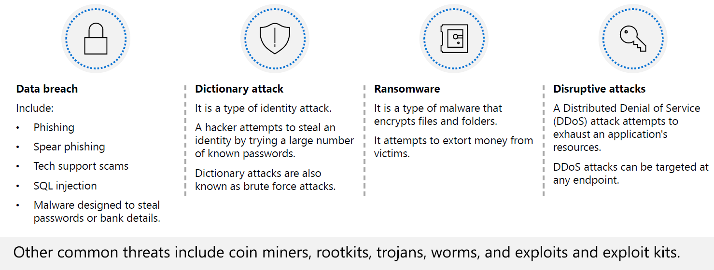
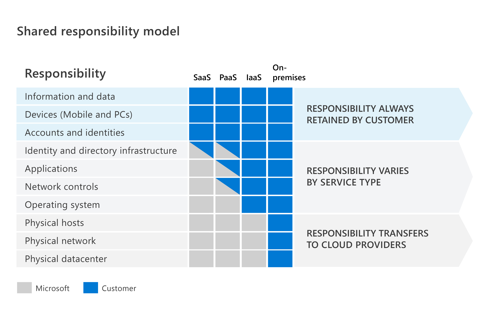
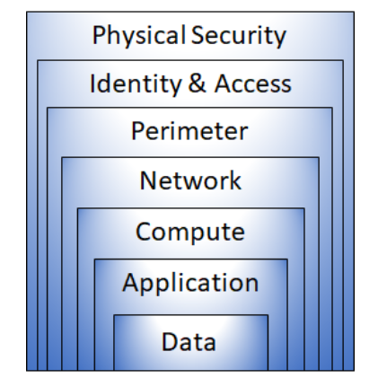
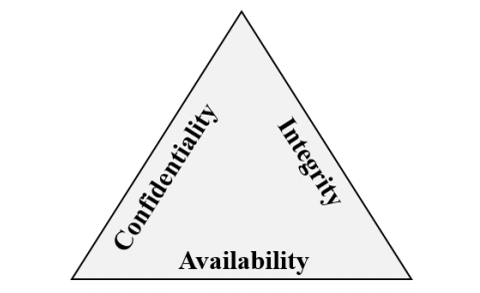
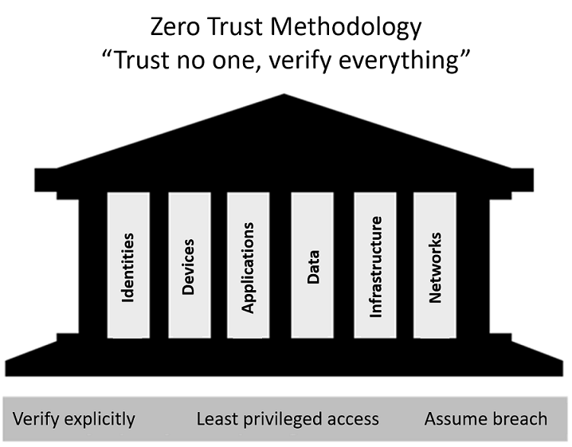
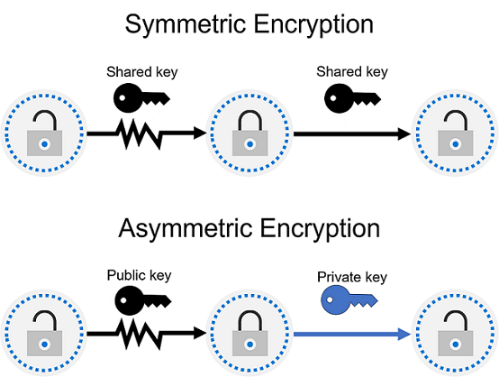
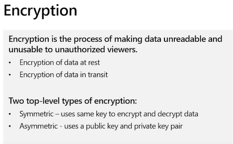
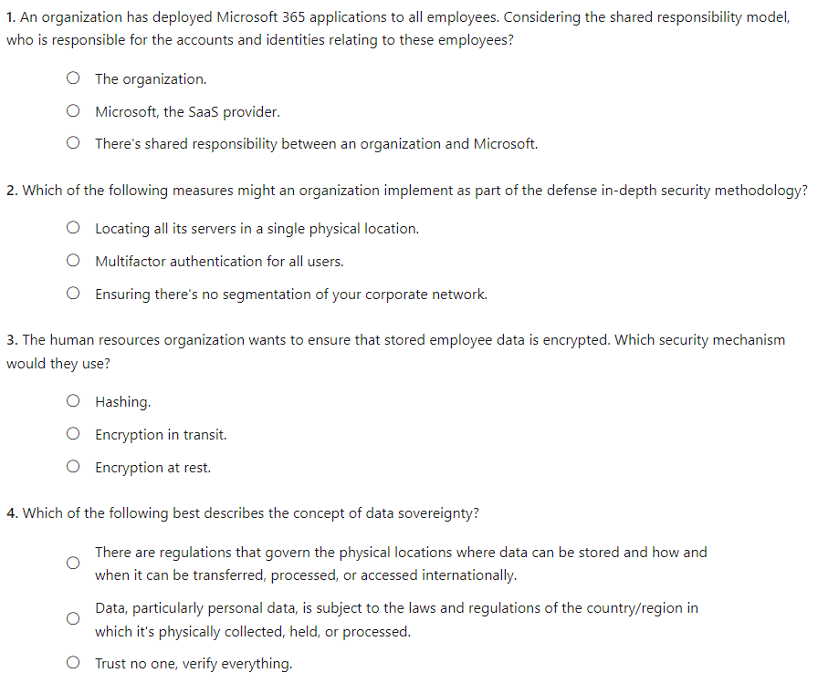
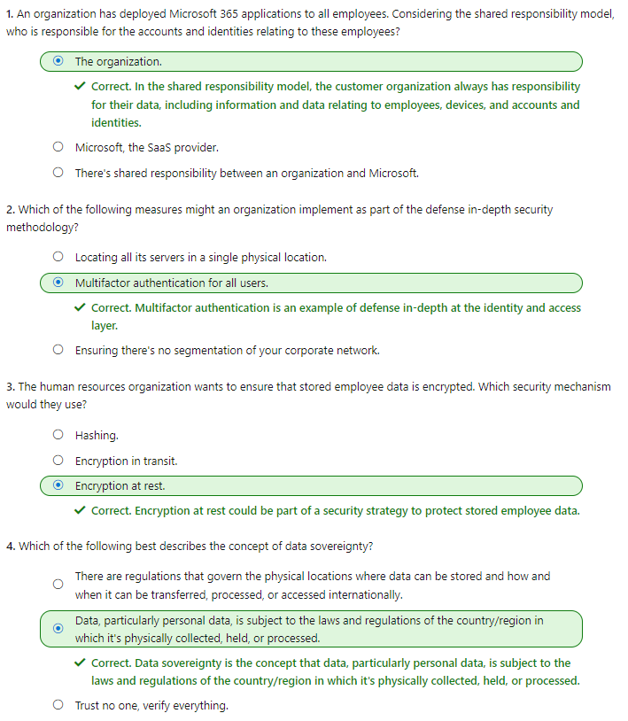

#### Microsoft Security Compliance and Identity Fundamentals | M1 Concepts of Security, Compliance, and Identity 
#### M1-1: Security and Compliance Concepts

> As more business data is being accessed from locations outside of the traditional corporate network, security and compliance have become overriding concerns. Organizations need to understand how they can best protect their data, regardless of where it's accessed from, and whether it sits on their corporate network or in the cloud. In addition, organizations need to ensure they're compliant with industry and regulatory requirements to ensure the protection and privacy of data. 
>
> This module introduces some important security and compliance concepts. You'll learn about the shared responsibility model, defense in depth, and Zero Trust model. You'll be introduced to the concepts of encryption and hashing as ways to protect data. Lastly, you'll learn about concepts that relate to compliance. 
> After completing this module, you'll be able to: 
> - Describe the shared responsibility and the defense in-depth security models. 
> - Describe the Zero-Trust model. 
> - Describe the concepts of encryption and hashing. 
> - Describe some basic compliance concepts 

# Common Threats

# Shared responsibility model 

In organizations running only on-premises hardware and software, the organization is 100 percent responsible for implementing security and compliance. With cloud-based services, that responsibility is shared between the customer and the cloud provider. 
 
The shared responsibility model identifies which security tasks are handled by the cloud provider, and which security tasks are handled by you, the customer. The responsibilities vary depending on where the workload is hosted: 
 
- Software as a Service (SaaS) 
- Platform as a Service (PaaS) 
- Infrastructure as a Service (IaaS) 
- On-premises datacenter 
 
The shared responsibility model makes responsibilities clear. When organizations move to the cloud, some responsibilities transfer to the cloud provider and some to the customer organization. 

- On-premises datacenters. In an on-premises datacenter, you have responsibility for everything from physical security to encrypting sensitive data. 
- Infrastructure as a Service (IaaS). Of all cloud services, IaaS requires the most management by the cloud customer. With IaaS, you're using the cloud provider’s computing infrastructure. The cloud customer isn't responsible for the physical components, such as computers, the network, or the physical security of the datacenter. However, the cloud customer still has responsibility for software components such as operating systems, network controls, applications, and protecting data. 
- Platform as a Service (PaaS). PaaS provides an environment for building, testing, and deploying software applications. The goal of PaaS is to help you create an application quickly without managing the underlying infrastructure. With PaaS, the cloud provider manages the hardware and operating systems, and the customer is responsible for applications and data. 
- Software as a Service (SaaS). SaaS is hosted and managed by the cloud provider, for the customer. It's usually licensed through a monthly or annual subscription. Microsoft 365, Skype, and Dynamics CRM Online are all examples of SaaS software. SaaS requires the least amount of management by the cloud customer. The cloud provider is responsible for managing everything except data, devices, accounts, and identities. 
 
In summary, responsibilities always retained by the customer organization include: 
- Information and data 
- Devices (mobile and PCs) 
- Accounts and identities 

# Defense in Depth

Defense in depth uses a layered approach to security, rather than relying on a single perimeter. A defense in-depth strategy uses a series of mechanisms to slow the advance of an attack. Each layer provides protection so that, if one layer is breached, a subsequent layer will prevent an attacker getting unauthorized access to data. 

Example layers of security might include: 
- Physical security such as limiting access to a datacenter to only authorized personnel. 
- Identity and access security controls, such as multifactor authentication or condition-based access, to control access to infrastructure and change control. 
- Perimeter security of your corporate network includes distributed denial of service (DDoS) protection to filter large-scale attacks before they can cause a denial of service for users. 
- Network security, such as network segmentation and network access controls, to limit communication between resources. 
- Compute layer security such as securing access to virtual machines either on-premises or in the cloud by closing certain ports. 
- Application layer security to ensure applications are secure and free of security vulnerabilities. 
- Data layer security including controls to manage access to business and customer data and encryption to protect data. 

## Confidentiality, Integrity, Availability (CIA) 

As described above, a defense in-depth strategy uses a series of mechanisms to slow the advance of an attack. All the different mechanisms (technologies, processes, and training) are elements of a cybersecurity strategy, whose goals include ensuring confidentiality, integrity, and availability; often referred to as CIA. 
- Confidentiality refers to the need to keep confidential sensitive data such as customer information, passwords, or financial data. You can encrypt data to keep it confidential, but then you also need to keep the encryption keys confidential. Confidentiality is the most visible part of security; we can clearly see need for sensitive data, keys, passwords, and other secrets to be kept confidential. 
- Integrity refers to keeping data or messages correct. When you send an email message, you want to be sure that the message received is the same as the message you sent. When you store data in a database, you want to be sure that the data you retrieve is the same as the data you stored. Encrypting data keeps it confidential, but you must then be able to decrypt it so that it's the same as before it was encrypted. Integrity is about having confidence that data hasn't been tampered with or altered. 
- Availability refers to making data available to those who need it, when they need it. It's important to the organization to keep customer data secure, but at the same time it must also be available to employees who deal with customers. While it might be more secure to store the data in an encrypted format, employees need access to decrypted data. 
 
While the goals of a cybersecurity strategy are to preserve the confidentiality, integrity, and availability of systems, networks, applications, and data; it's the goal of cybercriminals to disrupt these goals. Microsoft’s portfolio includes the solutions and technologies to enable organizations to deliver on the goals of the CIA triad. 

# Zero Trust Model 

Zero Trust assumes everything is on an open and untrusted network, even resources behind the firewalls of the corporate network. The Zero Trust model operates on the principle of “trust no one, verify everything.” 

## Zero Trust guiding principles 
The Zero Trust model has three principles which guide and underpin how security is implemented. These are: verify explicitly, least privilege access, and assume breach. 
- Verify explicitly. Always authenticate and authorize based on the available data points, including user identity, location, device, service or workload, data classification, and anomalies. 
- Least privileged access. Limit user access with just-in-time and just-enough access (JIT/JEA), risk-based adaptive policies, and data protection to protect both data and productivity. 
- Assume breach. Segment access by network, user, devices, and application. Use encryption to protect data, and use analytics to get visibility, detect threats, and improve your security. 
 
## Six foundational pillars 
In the Zero Trust model, all elements work together to provide end-to-end security. These six elements are the foundational pillars of the Zero Trust model: 
- Identities may be users, services, or devices. When an identity attempts to access a resource, it must be verified with strong authentication, and follow least privilege access principles. 
- Devices create a large attack surface as data flows from devices to on-premises workloads and the cloud. Monitoring devices for health and compliance is an important aspect of security. 
- Applications are the way that data is consumed. This includes discovering all applications being used, sometimes called Shadow IT because not all applications are managed centrally. This pillar also includes managing permissions and access. 
- Data should be classified, labeled, and encrypted based on its attributes. Security efforts are ultimately about protecting data, and ensuring it remains safe when it leaves devices, applications, infrastructure, and networks that the organization controls. 
- Infrastructure, whether on-premises or cloud based, represents a threat vector. To improve security, you assess for version, configuration, and JIT access, and use telemetry to detect attacks and anomalies. This allows you to automatically block or flag risky behavior and take protective actions. 
- Networks should be segmented, including deeper in-network micro segmentation. Also, real-time threat protection, end-to-end encryption, monitoring, and analytics should be employed. 

# Encryption and Hashing 

One way to mitigate against common cybersecurity threats is to encrypt sensitive or valuable data. Encryption is the process of making data unreadable and unusable to unauthorized viewers. To use or read encrypted data, it must be decrypted, which requires the use of a secret key. 
There are two top-level types of encryption: symmetric and asymmetric. Symmetric encryption uses the same key to encrypt and decrypt the data. Asymmetric encryption uses a public key and private key pair. Either key can encrypt data, but a single key can’t be used to decrypt encrypted data. To decrypt, you need a paired key. Asymmetric encryption is used for things such accessing sites on the internet using the HTTPS protocol and electronic data signing solutions. Encryption may protect data at rest, or in transit. 

##  Encryption for data at rest 
Data at rest is the data that's stored on a physical device, such as a server. It may be stored in a database or a storage account but, regardless of where it's stored, encryption of data at rest ensures the data is unreadable without the keys and secrets needed to decrypt it. 
If an attacker obtained a hard drive with encrypted data and didn't have access to the encryption keys, they would be unable to read the data. 

## Encryption for data in transit 
Data in transit is the data moving from one location to another, such as across the internet or through a private network. Secure transfer can be handled by several different layers. It could be done by encrypting the data at the application layer before sending it over a network. HTTPS is an example of encryption in transit. 
Encrypting data in transit protects it from outside observers and provides a mechanism to transmit data while limiting the risk of exposure. 

## Encryption for data in use 
A common use case for encryption of data in use involves securing data in nonpersistent storage, such as RAM or CPU caches. This can be achieved through technologies that create an enclave (think of this as a secured lockbox) that protects the data and keeps data encrypted while the CPU processes the data. 

## Hashing 
Hashing uses an algorithm to convert text to a unique fixed-length value called a hash. Each time the same text is hashed using the same algorithm, the same hash value is produced. That hash can then be used as a unique identifier of its associated data. 
Hashing is different to encryption in that it doesn't use keys, and the hashed value isn't subsequently decrypted back to the original. 
Hashing is used to store passwords. When a user enters their password, the same algorithm that created the stored hash creates a hash of the entered password. This is compared to the stored hashed version of the password. If they match, the user has entered their password correctly. This is more secure than storing plain text passwords, but hashing algorithms are also known to hackers. Because hash functions are deterministic (the same input produces the same output), hackers can use brute-force dictionary attacks by hashing the passwords. For every matched hash, they know the actual password. To mitigate this risk, passwords are often “salted”. This refers to adding a fixed-length random value to the input of hash functions to create unique hashes for same input. 

# Compliance Concepts

Data has become more important than ever. Organizations, institutions, and entire societies generate and rely on data to function on a day-to-day basis. The sheer scale of data generated and the increasing reliance on it means that the privacy and protection of that data has become pivotal. As organizations and institutions move their data to service provider clouds, with datacenters all over the world, additional considerations come into play. 
Government agencies and industry groups have issued regulations to help protect and govern the use of data. From personal and financial information to data protection and privacy, organizations can be accountable for meeting dozens of regulations to be compliant. Listed below are some important concepts and terms that relate to data compliance. 
- Data residency - When it comes to compliance, data residency regulations govern the physical locations where data can be stored and how and when it can be transferred, processed, or accessed internationally. These regulations can differ significantly depending on jurisdiction. 
- Data sovereignty - Another important consideration is data sovereignty, the concept that data, particularly personal data, is subject to the laws and regulations of the country/region in which it's physically collected, held, or processed. This can add a layer of complexity when it comes to compliance because the same piece of data can be collected in one location, stored in another, and processed in still another; making it subject to laws from different countries/regions. 
- Data privacy - Providing notice and being transparent about the collection, processing, use, and sharing of personal data are fundamental principles of privacy laws and regulations. Personal data means any information relating to an identified or identifiable natural person. Privacy laws previously referenced "PII" or "personally identifiable information" but the laws have expanded the definition to any data that is directly linked or indirectly linkable back to a person. Organizations are subject to, and must operate consistent with, a multitude of laws, regulations, codes of conduct, industry-specific standards, and compliance standards governing data privacy. 
In most cases, laws and regulations don't define or prescribe specific technologies that organizations must use to protect data. They leave it to an organization to identify compliant technologies, operations, and other appropriate data-protection measures. 

# Knowledge Check 

