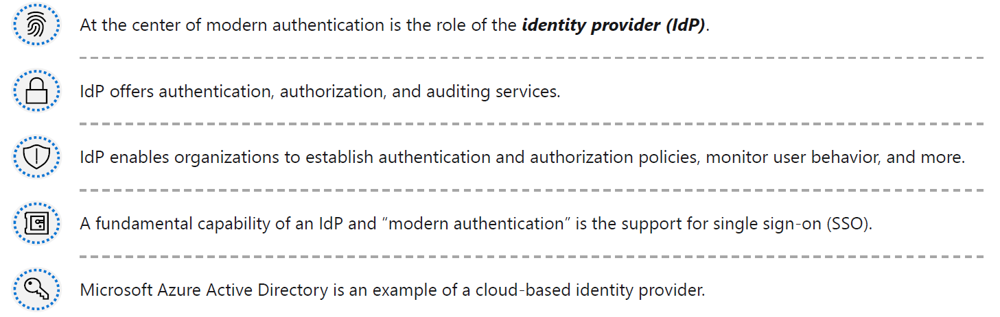

#### Microsoft Security Compliance and Identity Fundamentals | M1 Concepts of Security, Compliance, and Identity 
#### M1-2: Identity Concepts

> Everyone, and every device, has an identity that can be used to access resources. Identity is the way in which people and things are identified on your corporate network, and in the cloud. Being certain about who or what is accessing your organization’s data and other resources is a fundamental part of securing your environment. 

> In this module, you'll learn about the key concepts of authentication and authorization and why identity is important in securing corporate resources. You'll also learn about some identity related services. 

> After completing this module, you'll be able to: 
> - Understand the difference between authentication and authorization. 
> - Describe the concept of identity as a security perimeter. 
> - Describe identity-related services. 

# Authentication and Authorization 

## Authentication 
Authentication is the process of proving that a person is who they say they are. The username and password, together, are a form of authentication. Authentication is sometimes shortened to AuthN. 

## Authorization 
Once you authenticate a user, you'll need to decide where they can go, and what they're allowed to see and touch. This process is called authorization. 
In cybersecurity terms, authorization determines the level of access or the permissions an authenticated person has to your data and resources. Authorization is sometimes shortened to AuthZ. 

# Define Identity as the primary security perimeter 

## Digital collaboration has changed. Your employees and partners now need to collaborate and access organizational resources from anywhere, on any device, and without affecting their productivity. There has also been an acceleration in the number of people working from home. 
 
Enterprise security needs to adapt to this new reality. The security perimeter can no longer be viewed as the on-premises network. It now extends to: 
- SaaS applications for business-critical workloads that might be hosted outside the corporate network. 
- The personal devices that employees are using to access corporate resources (BYOD, or bring your own device) while working from home. 
- The unmanaged devices used by partners or customers when interacting with corporate data or collaborating with employees 
- Internet of things, referred to as IoT devices, installed throughout your corporate network and inside customer locations. 
 
The traditional perimeter-based security model is no longer enough. Identity has become the new security perimeter that enables organizations to secure their assets. 
 
But what do we mean by an identity? An identity is the set of things that define or characterize someone or something. For example, a person’s identity includes the information they use to authenticate themselves, such, as their username and password and their level of authorization. 
An identity may be associated with a user, an application, a device, or something else. 
 
Four pillars of an identity infrastructure 

Identity is a concept that spans an entire environment, so organizations need to think about it broadly. There's a collection of processes, technologies, and policies for managing digital identities and controlling how they're used to access resources. These can be organized into four fundamental pillars that organizations should consider when creating an identity infrastructure. 
- Administration. Administration is about the creation and management/governance of identities for users, devices, and services. As an administrator, you manage how and under what circumstances the characteristics of identities can change (be created, updated, deleted). 
- Authentication. The authentication pillar tells the story of how much an IT system needs to know about an identity to have sufficient proof that they really are who they say they are? It involves the act of challenging a party for legitimate credentials. 
- Authorization. The authorization pillar is about processing the incoming identity data to determine the level of access an authenticated person or service has within the application or service that it wants to access. 
- Auditing. The auditing pillar is about tracking who does what, when, where, and how. Auditing includes having in-depth reporting, alerts, and governance of identities. 

Addressing each of these four pillars is key to a comprehensive and robust identity and access control solution. 

# Role of the identity provider 

Modern authentication is an umbrella term for authentication and authorization methods between a client, such as your laptop or phone, and a server, like a website or application. At the center of modern authentication is the role of the identity provider. An identity provider creates, maintains, and manages identity information while offering authentication, authorization, and auditing services. 
 
With modern authentication, all services, including all authentication services, are supplied by a central identity provider. Information that's used to authenticate the user with the server is stored and managed centrally by the identity provider. 
 
With a central identity provider, organizations can establish authentication and authorization policies, monitor user behavior, identify suspicious activities, and reduce malicious attacks. 
Watch this [video](https://docs.microsoft.com/en-us/learn/modules/describe-identity-principles-concepts/4-describe-role-identity-provider) for more information about modern authentication and how it works with a central identity provider. 

Claims 
- Set of information 
 
Subject 
- Unique Identifier to the person as opposed to a name which will change 
 
Audience 
- Which server can view this token 

As you see in the video, thanks to modern authentication, the client communicates with the identity provider by giving an identity that can be authenticated. When the identity (which can be a user or an application) has been verified, the identity provider issues a security token that the client sends to the server. 
 
The server validates the security token through its trust relationship with the identity provider. By using the security token and the information that's contained within it, the user or application accesses the required resources on the server. In this scenario, the token and the information it contains is stored and managed by the identity provider. The centralized identity provider is supplying the authentication service. 
 
Microsoft Azure Active Directory is an example of a cloud-based identity provider. Other examples include Twitter, Google, Amazon, LinkedIn, and GitHub. 

## Single sign-on 
Another fundamental capability of an identity provider and “modern authentication” is the support for single sign-on (SSO). With SSO, the user logs in once and that credential is used to access multiple applications or resources. When you set up SSO between multiple identity providers, it's called federation. 

# Concept of Directory Services and Active Directory 

Directory 
- Hierarchical structure that stores information about objects on the network. 
- Stores directory data and makes it available to network users, administrators, services, and applications. 
 
Active Directory (AD) 
- A set of directory services developed by Microsoft as part of Windows 2000 for on-premises domain-based networks.  
- E.g., Active Directory Domain Services (AD DS).  
  - Stores information about members of the domain, including devices and users, verifies their credentials, and defines their access rights.  
  - A server running AD DS is a domain controller (DC). 
  - AD DS is a central component in organizations with on-premises IT infrastructure.  
  - AD DS gives organizations the ability to manage multiple on-premises infrastructure components and systems using a single identity per user.  
  - AD DS does not natively support mobile devices, SaaS applications, or line of business apps that require modern authentication methods. 
 
Azure Active Director 
- Next evolution of identity and access management solutions.  
- Provides organizations with an Identity as a Service (IDaaS) solution for all their apps across cloud and on-premises. 

> Active Directory Domain Controller (LEGACY) 
> Azure Active Directory (UPDATED) 
> To provide Identity-as-a-Service (IDaaS) 

# Federation 

Federation enables the access of services across organizational or domain boundaries by establishing trust relationships between the respective domain’s identity provider. With federation, there's no need for a user to maintain a different username and password when accessing resources in other domains. 
 
The simplified way to think about this federation scenario is as follows: 
- The website, in domain A, uses the authentication services of Identity Provider A (IdP-A). 
- The user, in domain B, authenticates with Identity Provider B (IdP-B). 
- IdP-A has a trust relationship configured with IdP-B. 
- When the user, who wants to access the website, provides his/her credentials to the website, the website trusts the user and allows access. This access is allowed because of the trust that is already established between the two identity providers. 
 
With federation, trust isn't always bidirectional. Although IdP-A may trust IdP-B and allow the user in domain B to access the website in domain A, the opposite isn't true, unless that trust relationship is configured. 
 
A common example of federation in practice is when a user logs in to a third-party site with their social media account, such as Twitter. In this scenario, Twitter is an identity provider, and the third-party site might be using a different identity provider, such as Azure AD. There's a trust relationship between Azure AD and Twitter. 

# Knowledge Check 

