#### Microsoft Security Compliance and Identity Fundamentals | M2 Capabilities of Microsoft Identity and Access Management Solutions
#### M2-1: Services and Identity Types of Azure AD

> When it comes to security, your organization can no longer rely on its network boundary. To allow employees, partners, and customers to collaborate securely, organizations need to shift to an approach whereby identity becomes the new security perimeter. Using an identity provider helps organizations manage that shift and all the aspects of identity security. 
>
> This module introduces you to Azure Active Directory (Azure AD), Microsoft’s cloud-based identity and access management service. In this module, you'll learn about the benefits of using a cloud-based identity provider, including single sign-on for users. You'll also find out about the different Azure AD editions, the identity types supported by Azure AD, and how you can use it to support external users. 
> After completing this module, you'll be able to: 
> - Describe what Azure AD does. 
> - Describe the identity types that Azure AD supports. 

# Azure Active Directory

Azure Active Directory (Azure AD) is Microsoft’s cloud-based identity and access management service. 

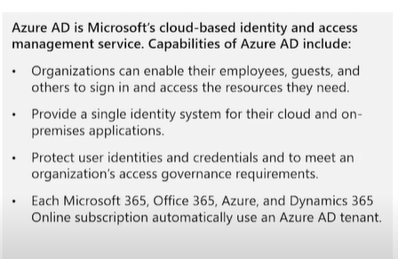

Organizations use Azure AD to enable their employees, guests, and others to sign in and access the resources they need, including: 
- Internal resources, such as apps on your corporate network and intranet, and cloud apps developed by your own organization. 
- External services, such as Microsoft Office 365, the Azure portal, and any SaaS applications used by your organization. 

Azure AD simplifies the way organizations manage authorization and access by providing a single identity system for their cloud and on-premises applications. Azure AD can be synchronized with your existing on-premises Active Directory, synchronized with other directory services, or used as a standalone service. 

Azure AD also allows organizations to securely enable the use of personal devices, such as mobiles and tablets, and enable collaboration with business partners and customers. 

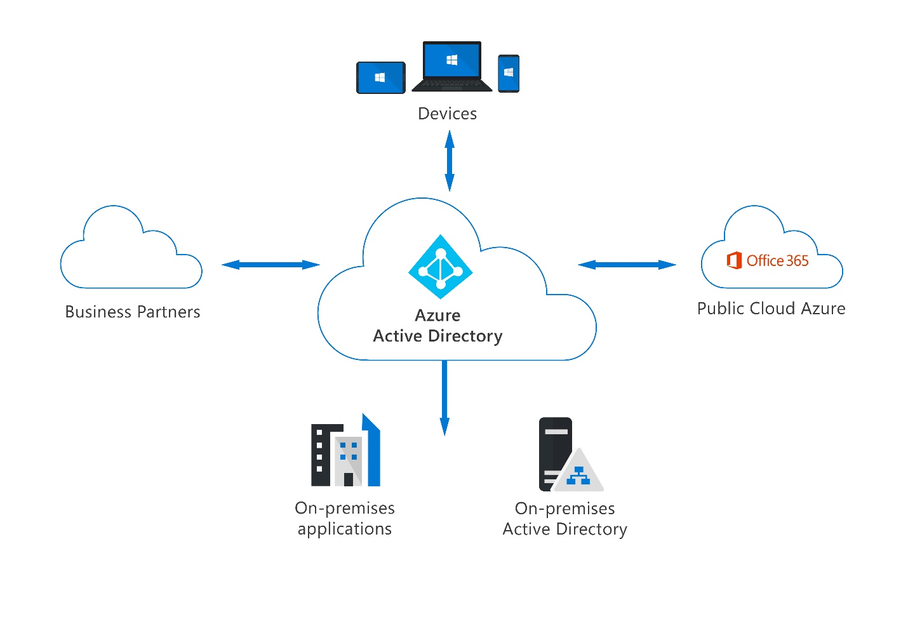

Azure AD is used by IT admins to control access to corporate apps and resources, based on business requirements. It can also be set up to require multi-factor authentication when accessing important      organizational resources. Azure AD can be used to automate user provisioning between an existing Windows Server AD and cloud apps, including Microsoft 365. Finally, Azure AD provides powerful tools to automatically help protect user identities and credentials and to meet an organization’s access governance requirements. 

Developers use Azure AD as a standards-based approach for adding single sign-on (SSO) to their apps, so that users can sign in with their pre-existing credentials. Azure AD also provides APIs that allow developers to build personalized app experiences using existing organizational data. 

Subscribers to Azure services, Microsoft 365, or Dynamics 365 automatically have access to Azure AD. Users of these services can take advantage of included Azure AD services and can also enhance their Azure AD implementation by upgrading to Azure AD Premium licenses. 

# Available Azure AD editions 

Azure AD is available in four editions: Free, Office 365 Apps, Premium P1, and Premium P2. 

- Azure Active Directory Free. The free version allows you to administer users and create groups, synchronize with on-premises Active Directory, create basic reports, configure self-service password change for cloud users, and enable single sign-on across Azure, Microsoft 365, and many popular SaaS apps. The free edition is included with subscriptions to Office 365, Azure, Dynamics 365, Intune, and Power Platform. 
 
- Office 365 Apps. The Office 365 Apps edition allows you to do everything included in the free version, plus self-service password reset for cloud users, and device write-back, which offers two-way synchronization between on-premises directories and Azure AD. The Office 365 Apps edition of Azure Active Directory is included in subscriptions to Office 365 E1, E3, E5, F1, and F3. 
 
- Azure Active Directory Premium P1. The Premium P1 edition includes all the features in the free and Office 365 apps editions. It also supports advanced administration, such as dynamic groups, self-service group management, Microsoft Identity Manager (an on-premises identity and access management suite) and cloud write-back capabilities, which allow self-service password reset for your on-premises users. 
 
- Azure Active Directory Premium P2. P2 offers all the Premium P1 features, and Azure Active Directory Identity Protection to help provide risk-based Conditional Access to your apps and critical company data. P2 also gives you Privileged Identity Management to help discover, restrict, and monitor administrators and their access to resources, and to provide just-in-time access when needed. 
 
For additional information on each of the editions, visit the Azure Active Directory Pricing page. 
There's also an option for "Pay as you go" feature licenses. You can get other feature licenses separately, such as Azure Active Directory Business-to-Customer (B2C). B2C can help you provide identity and access management solutions for your customer-facing apps. For more information, see Azure Active Directory B2C documentation. 

# Azure AD identity types
[Link](https://edxinteractivepage.blob.core.windows.net/edxpages/sc-900/LP02M02-Create-a-New-User-in-Azure-Active-Directory/index.html)

Azure AD manages different types of identities: users, service principals, managed identities, and devices. In this unit, we consider each type of Azure AD identity. 

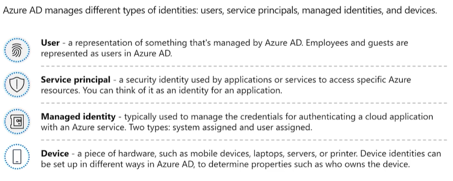

## User

A user identity is a representation of something that's managed by Azure AD. Employees and guests are represented as users in Azure AD. If you have several users with the same access needs, you can create a group. You use groups to give access permissions to all members of the group, instead of having to assign access rights individually. 
 
Azure AD business-to-business (B2B) collaboration, a feature within External Identities, includes the capability to add guest users. With B2B collaboration, an organization can securely share applications and services with guest users from another organization. 
 
In the following interactive guide, you'll add a new user to Azure Active Directory. Select the image below to get started and follow the prompts on the screen. 

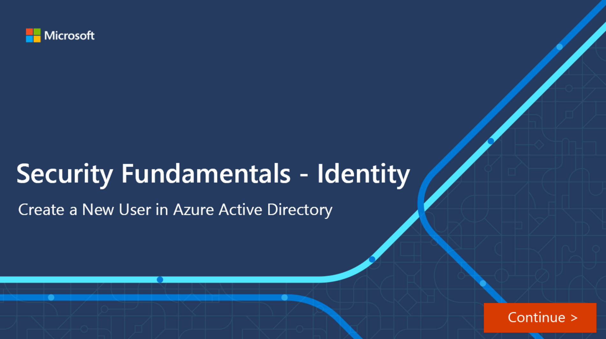

## Service Principal

A service principal is, essentially, an identity for an application. For an application to delegate its identity and access functions to Azure AD, the application must first be registered with Azure AD to enable its integration. Once registered, a service principal is created in each Azure AD tenant where the application is used. The service principal enables core features such as authentication and authorization of the application to resources that are secured by the Azure AD tenant. 
 
For the service principals to be able to access resources secured by the Azure AD tenant, application developers must manage and protect the credentials. 

## Managed Identity 

Managed identities are a type of service principal that are automatically managed in Azure AD and eliminate the need for developers to manage credentials. Managed identities provide an identity for applications to use when connecting to Azure resources that support Azure AD authentication and can be used without any extra cost.

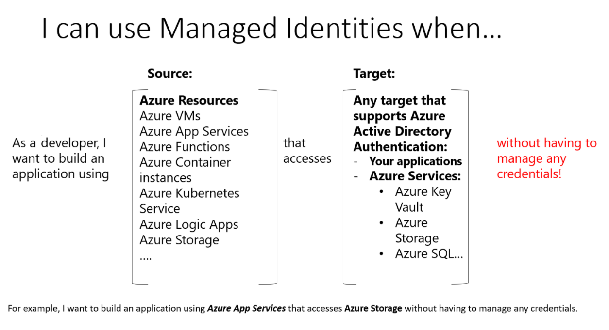

For a list of Azure Services that support managed identities, refer to the Learn more section of the Summary and resources unit. 
 
There are two types of managed identities: system-assigned and user-assigned. 
- System-assigned.  
> Some Azure services allow you to enable a managed identity directly on a service instance. When you enable a system-assigned managed identity, an identity is created in Azure AD that's tied to the lifecycle of that service instance. When the resource is deleted, Azure automatically deletes the identity for you. By design, only that Azure resource can use this identity to request tokens from Azure AD. 
- User-assigned.  
> You may also create a managed identity as a standalone Azure resource. Once you create a user-assigned managed identity you can assign it to one or more instances of an Azure service. With user-assigned managed identities, the identity is managed separately from the resources that use it. 

The following table summarizes the differences between system-assigned and user-assigned managed identities: 

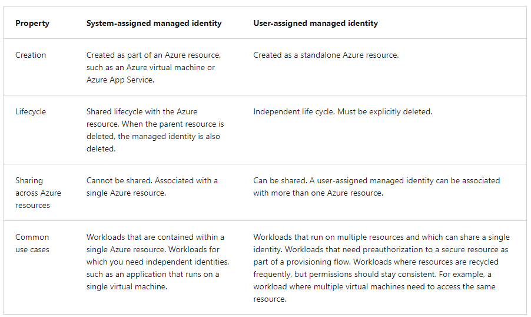

## Device

A device is a piece of hardware, such as mobile devices, laptops, servers, or printers. A device identity gives administrators information they can use when making access or configuration decisions. Device identities can be set up in different ways in Azure AD. 
- Azure AD registered devices. The goal of Azure AD registered devices is to provide users with support for bring your own device (BYOD) or mobile device scenarios. In these scenarios, a user can access your organization’s resources using a personal device. Azure AD registered devices register to Azure AD without requiring an organizational account to sign in to the device. Supported operating systems for Azure AD registered devices include Windows 10 and above, iOS, Android, and macOS. 
- Azure AD joined. An Azure AD joined device is a device joined to Azure AD through an organizational account, which is then used to sign in to the device. Azure AD joined devices are generally owned by the organization. Supported operating systems for Azure AD joined devices include Windows 10 or greater (except Home edition) and Windows Server 2019 Virtual Machines running in Azure. 
- Hybrid Azure AD joined devices. Organizations with existing on-premises Active Directory implementations can benefit from the functionality provided by Azure AD by implementing hybrid Azure AD joined devices. These devices are joined to your on-premises Active Directory and Azure AD requiring organizational account to sign in to the device 
Registering and joining devices to Azure AD gives users Single Sign-on (SSO) to cloud-based resources. Additionally, devices that are Azure AD joined benefit from the SSO experience to resources and applications that rely on on-premises Active Directory. 

> Note: Azure AD registered devices seem to be personal and don't need organisation login. Support for non-window devices as well. 
> Meanwhile, Azure AD joined is for organisational device and need organisational login. 
> Whereas Hybrid Azure AD Joined is with on-premises AD and need organisational login. 

IT admins can use tools like Microsoft Intune, a cloud-based service that focuses on mobile device management (MDM) and mobile application management (MAM), to control how an organization’s devices are used. 

# Types of external identities 

Today’s world is about collaboration, working with people both inside and outside of your organization. That means you'll sometimes need to provide access to your organization’s applications or data to external users. 
Azure AD External Identities is a set of capabilities that enable organizations to allow access to external users, such as customers or partners. Your customers, partners, and other guest users can "bring their own identities" to sign in. It is a feature of Premium P1 and P2 Azure AD editions, and pricing is based on Monthly Active Users.  
 
This ability for external users is enabled through Azure AD support of external identity providers like other Azure AD tenants, Facebook, Google, or enterprise identity providers. Admins can set up federation with identity providers so your external users can sign in with their existing social or enterprise accounts instead of creating a new account just for your application. 

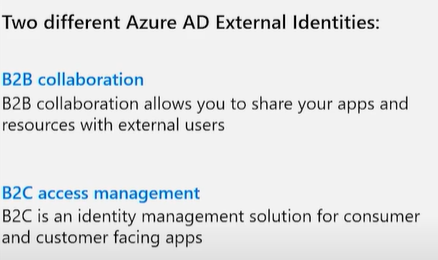

There are two different Azure AD External Identities: B2B and B2C. 
- B2B collaboration allows you to share your apps and resources with external users. 
- B2C is an identity management solution for consumer and customer facing apps. 

## B2B Collaboration 
B2B collaboration allows you to share your organization’s applications and services with guest users from other organizations, while maintaining control over your own data. B2B collaboration uses an invitation and redemption process. You can also enable self-service sign-up user flows to let external users sign up for apps or resources themselves. Once the external user has redeemed their invitation or completed sign-up, they're represented in the same directory as employees but with a user type of guest. As a guest, they can now access your resources with their credentials. 
Guest users can be managed in the same way as employees, added to the same groups, and so on. With B2B, SSO to all Azure AD-connected apps are supported. 
 
## B2C Access Management 
Azure AD B2C is a customer identity access management (CIAM) solution. Azure AD B2C allows external users to sign in with their preferred social, enterprise, or local account identities to get single sign-on to your applications. Azure AD B2C supports millions of users and billions of authentications per day. It takes care of the scaling and safety of the authentication platform, monitoring, and automatically handling threats like denial-of-service, password spray, or brute force attacks. 
 
With Azure AD B2C, external users are managed in the Azure AD B2C directory, separately from the organization's employee and partner directory. SSO to customer owned apps within the Azure AD B2C tenant is also supported. 

Azure AD B2C is an authentication solution that you can customize with your brand so that it blends with your web and mobile applications. 

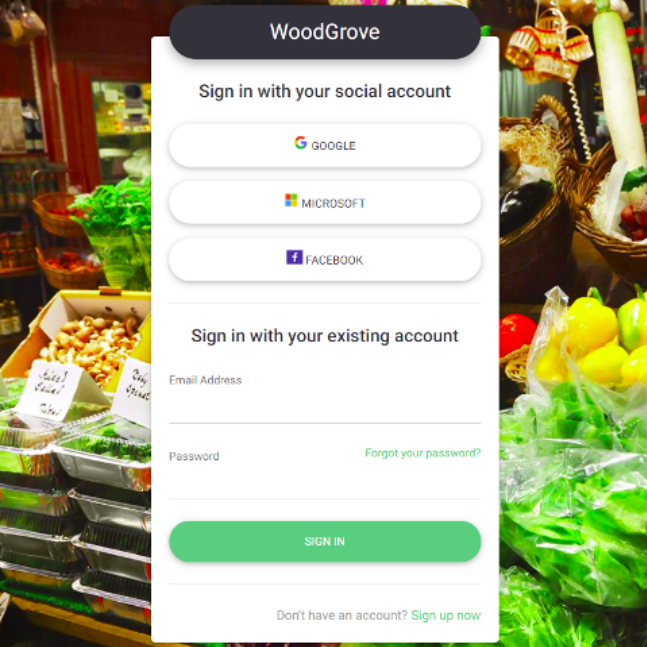

# Concept of Hybrid Identity

Many organizations are a mixture of both cloud and on-premises applications. Regardless of whether an application is hosted on-premises or in the cloud, users expect and require easy access. Microsoft’s identity solutions span on-premises and cloud-based capabilities. These solutions create a common user identity for authentication and authorization to all resources, regardless of location. We call this hybrid identity. 
 
An important consideration for organizations that operate in a mixed cloud and on-premises environment (hybrid model) is determining the right authentication method for their Azure AD solution, for their organization. This is an important decision in an organization’s journey to the cloud and how users will sign in and access applications. It's the foundation for the organization’s modern IT infrastructure on top of which organizations will build their security, identity, and access management solution using Azure AD. Lastly, once an authentication method is established it becomes more difficult to change because it can disrupt users’ sign-in experience. When it comes to authentication of hybrid identities, Microsoft offers several ways to authenticate. 
- Azure AD Password hash synchronization. 
- Azure AD Pass-through authentication 
- Federated authentication

These hybrid authentication options, described below, require an on-premises active directory. Additionally, Azure AD Connect, an on-premises Microsoft application that runs on a server, is required, and serves as a bridge between Azure AD and the on-premises Active Directory. 

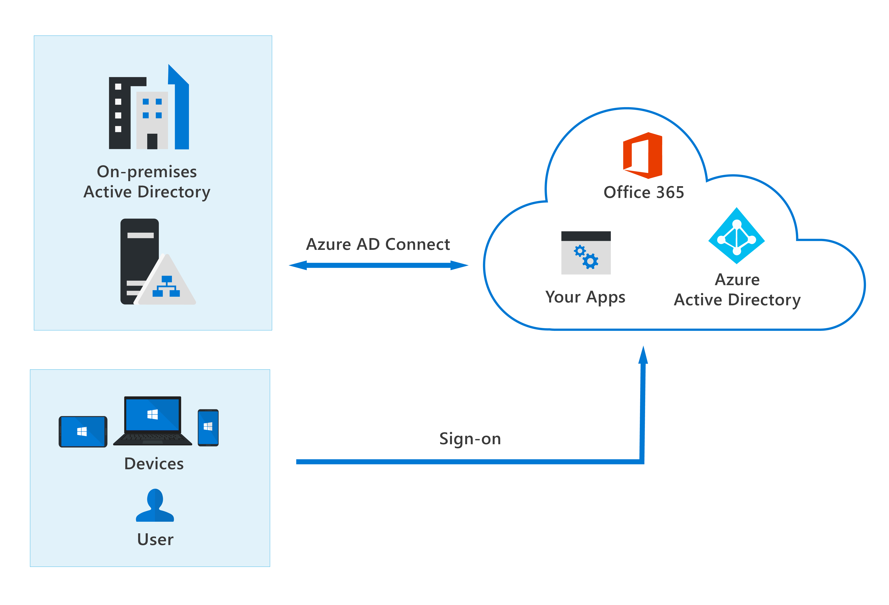
 
Azure AD Password hash synchronization. Azure AD password hash synchronization is the simplest way to enable authentication for on-premises directory objects in Azure AD. Users can sign in to Azure AD services by using the same username and password that they use to sign in to their on-premises Active Directory instance. Azure AD handles users' sign-in process. 
 
The Active Directory domain service (AD DS) stores passwords in the form of a hash value representation, of the actual user password. With Azure AD password hash synchronization, the password hash is extracted from the on-premises Active Directory instance using Azure AD Connect. Some extra security is applied to the password hash and then it's synchronized to the Azure Active Directory authentication service. When a user attempts to sign in to Azure AD and enters their password, the password is run through the same hashing algorithm and additional security that was applied to the version stored in Azure AD, as part of the synchronization. If the result matches the hash value stored in Azure AD, the user has entered the correct password and is authenticated. 
 
With password hash synchronization, Azure AD Connect ensures the password hash is sync'ed between the on-premises Active Directory and Azure AD. This enables user authentication to take place against Azure AD rather than against the organization's own Active Directory instance. A benefit of this approach is that password hash synchronization provides highly available cloud authentication. On-premise users can authenticate with Azure AD to access cloud-based applications, even if the on-premise Active Directory goes down. 

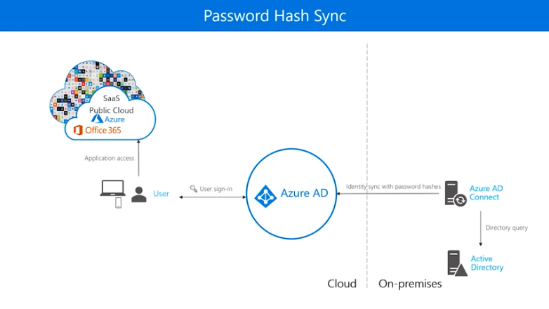

Azure AD pass-through authentication. Azure AD pass-through authentication allows users to sign in to both on-premises and cloud-based applications using the same passwords, like password hash synch. A key difference, however, is when users sign in using Azure AD, pass-through authentication validates users' passwords directly against your on-premises Active Directory. Password validation doesn't happen in the cloud. This can be an important factor for organizations wanting to enforce their on-premises Active Directory security and password policies. 
 
Azure AD pass-through authentication also uses Azure AD Connect but has the additional requirement of running one or more authentication agents. These agents serve as intermediary between Azure AD and the on-premises Active Directory in the process of authenticating users. 
 
When a user tries to access an application to which they aren't already signed in, they get redirected to the Azure AD sign-in page to enter their username and password. Azure AD will encrypt the user password with the public key of the Authentication Agent. The on-premises Authentication Agent retrieves the username and encrypted password from Azure AD, decrypts the password with its private key, and validates the username and password against Active Directory. Active Directory evaluates the request and provides a response (success, failure, password expired, or user locked out) back to the agent, who then notifies Azure AD. If the response indicates success, then Azure AD will respond by authenticating the user. 
 
The use of authentication agents running on a server, means a larger infrastructure footprint is required, when compared to password hash synchronization. Also, because pass-through authentication validates against the on-premises Active Directory with dependency on authentication agents running on servers, consideration should be given to distributed, redundant software and hardware to provide high availability of sign-in requests. Otherwise, if your datacenter suffers outage, authentication to Microsoft 365 services would no longer be possible. 

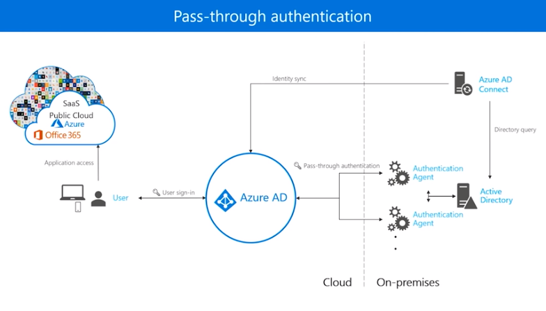

Federated authentication. Federation is recommended as an authentication for organizations that have advanced features not currently supported in Azure AD, including sign-on using smart cards or certificates, sign-on using on-premises multi-factor authentication (MFA) server, and sign-on using a third party authentication solution. 
 
In federated authentication, Azure AD hands off the authentication process to a separate trusted authentication system, such as on-premises Active Directory Federation Services (AD FS), to validate the user’s password. This sign-in method ensures that all user authentication occurs on-premises. 

Federated authentication uses Azure AD Connect but also requires additional servers to support federation, resulting in a larger infrastructure footprint. 
 
Organizations that decide to use Federation with Active Directory Federation Services (AD FS), can optionally set up password hash synchronization as a backup in case their AD FS infrastructure fails. 

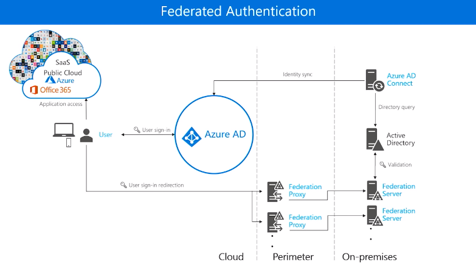

# Knowledge Check 

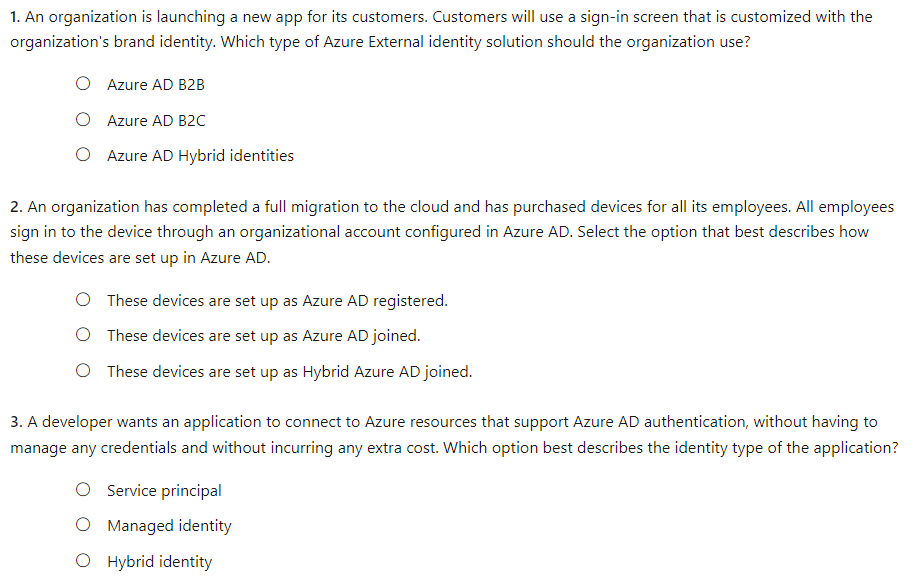

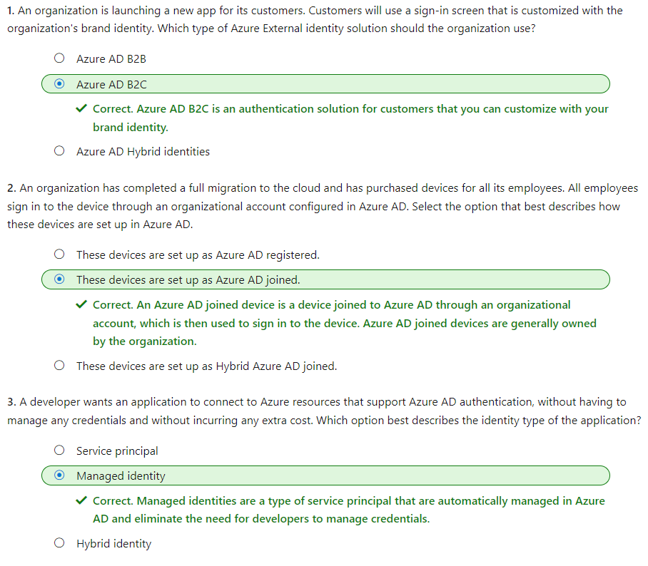
