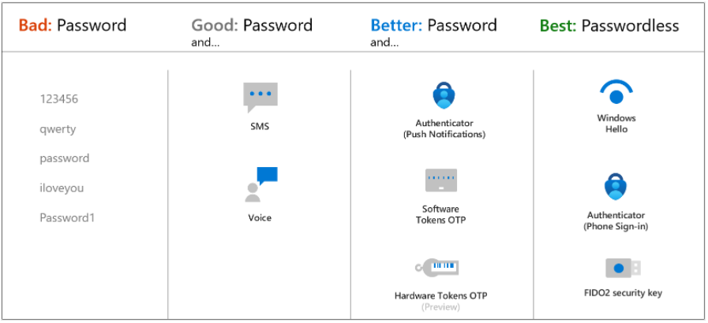
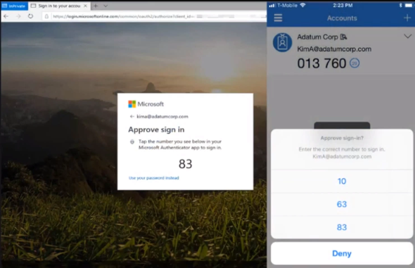
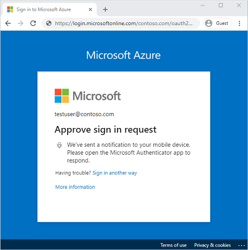
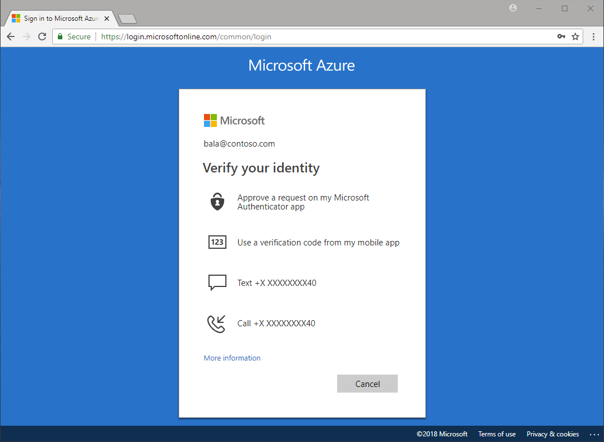
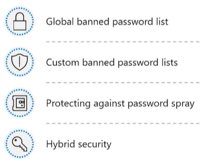
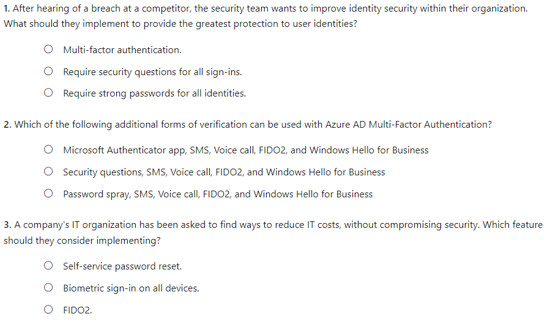
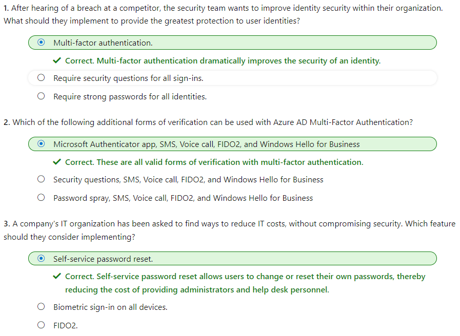

#### Microsoft Security Compliance and Identity Fundamentals | M2 Capabilities of Microsoft Identity and Access Management Solutions
#### M2-2: Authentication Capabilities of Azure AD

> Authentication is the process of verifying an identity to be legitimate. Passwords are commonly used to authenticate users, but there are better and more secure ways to authenticate. 
> 
> In this module, you'll learn about the authentication capabilities of Azure AD, multi-factor authentication, and how it improves security. You'll also find out about the password protection and management capabilities of Azure AD. 
> After completing this module, you'll be able to: 
> - Describe the authentication methods of Azure AD. 
> - Describe multi-factor authentication in Azure AD 
> - Describe the password protection and management capabilities of Azure AD. 

# Authentication and Authorization 

One of the main features of an identity platform is to verify, or authenticate, credentials when a user signs in to a device, application, or service. Azure AD offers different methods of authentication. 

## Passwords 
Passwords are the most common form of authentication, but they have many problems, especially if used in single-factor authentication, where only one form of authentication is used. If they're easy enough to remember, they're easy for a hacker to compromise. Strong passwords that aren't easily hacked are difficult to remember and affect user productivity when forgotten. 

The use of passwords should be supplemented or replaced with more secure authentication methods available in Azure AD. 

## Phone 

Azure AD supports two options for phone-based authentication. 
- SMS-based authentication. Short message service (SMS) used in mobile device text messaging can be used as a primary form of authentication. With SMS-based sign-in, users don't need to know a username and password to access applications and services. The user instead enters their registered mobile phone number, receives a text message with a verification code, and enters that in the sign-in interface. 
Users can also choose to verify their identity through SMS text messaging on a mobile phone, as a secondary form of authentication during self-service password reset (SSPR) or Azure AD Multi-Factor Authentication. For example, users can supplement their password by using SMS text messaging. An SMS is sent to the mobile phone number containing a verification code. To complete the sign-in process, the verification code provided is entered into the sign-in interface. 
- Voice call verification. Users can use voice calls as a secondary form of authentication, to verify their identity, during self-service password reset (SSPR) or Azure AD Multi-Factor Authentication. With phone call verification, an automated voice call is made to the phone number registered by the user. To complete the sign-in process, the user is prompted to press # on their keypad. Voice calls are not supported as a primary form of authentication, in Azure AD. 

## OATH 

OATH (Open Authentication) is an open standard that specifies how time-based, one-time password (TOTP) codes are generated. One-time password codes can be used to authenticate a user. OATH TOTP is implemented using either software or hardware to generate the codes. 
- Software OATH tokens are typically applications. Azure AD generates the secret key, or seed, that's input into the app and used to generate each OTP. 
- OATH TOTP hardware tokens (supported in public preview) are small hardware devices that look like a key fob that displays a code that refreshes every 30 or 60 seconds. OATH TOTP hardware tokens typically come with a secret key, or seed, pre-programmed in the token. These keys and other information specific to each token must be input into Azure AD and then activated for use by end-users. 
OATH software and hardware tokens, are only supported as secondary forms of authentication in Azure AD, to verify an identity during self-service password reset (SSPR) or Azure AD Multi-Factor Authentication. 

## Passwordless authentication 

The end-goal for many organizations is to remove the use of passwords as part of sign-in events. When a user signs in with a passwordless method, credentials are provided by using methods like biometrics with Windows Hello for Business, or a FIDO2 security key. These authentication methods can't be easily duplicated by an attacker. 
Azure AD provides ways to natively authenticate using passwordless methods to simplify the sign-in experience for users and reduce the risk of attacks. 
The following [video](https://docs.microsoft.com/en-us/learn/modules/explore-authentication-capabilities/2-describe-authentication-methods) explains the problem with passwords, and why passwordless authentication is so important. 

### Windows Hello for Business 
Windows Hello for Business replaces passwords with strong two-factor authentication on devices. This two-factor authentication is a combination of a key or certificate tied to a device and something that the person knows (a PIN) or something that the person is (biometrics). PIN entry and biometric gesture both trigger the use of the private key to cryptographically sign data that is sent to the identity provider. The identity provider verifies the user's identity and authenticates the user. 

Windows Hello for Business helps protect against credential theft, because an attacker must have both the device and the biometric info or PIN, making it more difficult to gain access without the employee's knowledge. 

As a passwordless authentication method, Windows Hello for Business serves as a primary form of authentication. In addition, Windows Hello for Business can be used as a secondary form of authentication to verify an identity during multi-factor authentication. 

### FIDO2 
Fast Identity Online (FIDO) is an open standard for passwordless authentication. FIDO allows users and organizations to leverage the standard to sign in to their resources using an external security key or a platform key built into a device, eliminating the need for a username and password. 

FIDO2 is the latest standard that incorporates the web authentication (WebAuthn) standard and is supported by Azure AD. FIDO2 security keys are an unphishable standards-based passwordless authentication method that can come in any form factor. These FIDO2 security keys are typically USB devices, but could also be Bluetooth or Near Field Communication (NFC) based devices, which are used for short-range wireless data transfer. With a hardware device that handles the authentication, the security of an account is increased as there's no password that could be exposed or guessed. 

With FIDO2 security keys, users can sign in to Azure AD or hybrid Azure AD joined Windows 10 devices and get single-sign on to their cloud and on-premises resources. Users can also sign in to supported browsers. FIDO2 security keys are a great option for enterprises who are very security sensitive or have scenarios or employees who aren't willing or able to use their phone as a second factor. 

As a passwordless authentication method, FIDO2 serves as a primary form of authentication. In addition, FIDO2 can be used as a secondary form of authentication to verify an identity during multi-factor authentication. 

## Microsoft Authenticator app 

As a passwordless authentication method, the Microsoft Authenticator app can be used as a primary form of authentication to sign in to any Azure AD account or as an additional verification option during self-service password reset (SSPR) or Azure AD Multi-Factor Authentication events. 
To use Microsoft Authenticator, a user must download the phone app from the Microsoft store and register their account. Microsoft Authenticator is available for Android and iOS. 
With Passwordless sign-in, the Authenticator App turns any iOS or Android phone into a strong, passwordless credential. To sign in to their Azure AD account, a user enters their username, matches a number displayed on the screen to the one on their phone, then uses their biometric or PIN to confirm. 

When a user chooses Authenticator as secondary form of authentication, to verify their identity, a notification is pushed to the phone or tablet. If the notification is legitimate, the user selects Approve, otherwise, they select Deny. 

# Multi-factor authentication (MFA) in Azure AD 

Multi-factor authentication requires more than one form of verification, such as a trusted device or a fingerprint scan, to prove that an identity is legitimate. It means that, even when an identity’s password has been compromised, a hacker can't access a resource. 

Multi-factor authentication dramatically improves the security of an identity, while still being simple for users. The extra authentication factor must be something that's difficult for an attacker to obtain or duplicate. 

Azure Active Directory Multi-Factor Authentication works by requiring: 
- Something you know – typically a password or PIN and 
- Something you have – such as a trusted device that's not easily duplicated, like a phone or hardware key or 
- Something you are – biometrics like a fingerprint or face scan. 

Multi-factor authentication verification prompts are configured to be part of the Azure AD sign-in event. Azure AD automatically requests and processes multi-factor authentication, without you making any changes to your applications or services. When a user signs in, they receive a multi-factor authentication prompt, and can choose from one of the additional verification forms that they've registered. 

An administrator can require certain verification methods, or the user can access their MyAccount to edit or add verification methods. 

The following additional forms of verification, described in the previous unit, can be used with Azure AD Multi-Factor Authentication: 
- Microsoft Authenticator app 
- Windows Hello for Business 
- FIDO2 security key 
- OATH hardware token (preview) 
- OATH software token 
- SMS 
- Voice call 

## Security defaults and multi-factor authentication

Security defaults are a set of basic identity security mechanisms recommended by Microsoft. When enabled, these recommendations will be automatically enforced in your organization. The goal is to ensure that all organizations have a basic level of security enabled at no extra cost. These defaults enable some of the most common security features and controls, including: 
- Enforcing Azure Active Directory Multi-Factor Authentication registration for all users. 
- Forcing administrators to use multi-factor authentication. 
- Requiring all users to complete multi-factor authentication when needed. 
Security defaults are a great option for organizations that want to increase their security posture but don’t know where to start, or for organizations using the free tier of Azure AD licensing. Security defaults may not be appropriate for organizations with Azure AD premium licenses or more complex security requirements. To learn more, visit What are [security defaults](https://learn.microsoft.com/en-us/entra/fundamentals/security-defaults)?

# Self-Service password reset (SSPR) in Azure AD

Self-service password reset ([SSPR](https://edxinteractivepage.blob.core.windows.net/edxpages/sc-900/LP02M03-Enable-SSPR-in-Azure-Active-Directory/index.html) is a feature of Azure AD that allows users to change or reset their password, without administrator or help desk involvement. 
If a user's account is locked or they forget the password, they can follow a prompt to reset it and get back to work. This ability reduces help desk calls and loss of productivity when a user can't sign in to their device or an application. 

Self-service password reset works in the following scenarios: 
- Password change: when a user knows their password but wants to change it to something new. 
- Password reset: when a user can't sign in, such as when they forget the password, and want to reset it. 
- Account unlock: when a user can't sign in because their account is locked out. 

To use self-service password reset, users must be: 
- Assigned an Azure AD license. Refer to the Learn More section of the summary and resources unit for a link to the Licensing requirements for Azure Active Directory self-service password reset. 
- Enabled for SSPR by an administrator. 
- Registered, with the authentication methods they want to use. Two or more authentication methods are recommended in case one is unavailable. 
 
The following authentication methods are available for SSPR: 
- Mobile app notification 
- Mobile app code 
- Email 
- Mobile phone 
- Office phone 
- Security questions 
 
When users register for SSPR, they're prompted to choose the authentication methods to use. If they choose to use security questions, they pick from a set of questions to prompt for and then provide their own answers. Security questions can only be used during the self-service password reset (SSPR) process to confirm who you are. Security questions aren't used as an authentication method during a sign-in event. Administrator accounts can't use security questions as verification method with SSPR. 

Note:
By default, administrator accounts are enabled for self-service password reset and are required to use two authentication methods to reset their password, such as an email address, authenticator app, or a phone number. Administrators don't have the ability to use security questions. 
When a user resets their password using self-service password reset, it can also be written back to an on-premises Active Directory. Password write-back allows users to use their updated credentials with on-premises devices and applications without a delay. 
To keep users informed about account activity, admins can configure email notifications to be sent when an SSPR event happens. These notifications can cover both regular user accounts and admin accounts. For admin accounts, this notification provides an extra layer of awareness when a privileged administrator account password is reset using SSPR. All global admins would be notified when SSPR is used on an admin account. 
In this interactive guide, you'll enable self-service password reset for users in Azure Active Directory. Select the image below to get started and follow the prompts on the screen. 

# Password protection and management capabilities of Azure AD

Password Protection is a feature of Azure AD that reduces the risk of users setting weak passwords. Azure AD Password Protection detects and blocks known weak passwords and their variants, and can also block other weak terms that are specific to your organization. 

With Azure AD Password Protection, default global banned password lists are automatically applied to all users in an Azure AD tenant. To support your own business and security needs, you can define entries in a custom banned password list. When users change or reset their passwords, these lists are checked to enforce the use of strong passwords. 

You should use extra features like Azure Active Directory multi-factor authentication, not just rely on strong passwords enforced by Azure AD Password Protection. 

## Global banned password list 

A global banned password list with known weak passwords is automatically updated and enforced by Microsoft. This list is maintained by the Azure AD Identity Protection team, who analyzes security telemetry data to find weak or compromised passwords. Examples of passwords that might be blocked are P@$$w0rd or Passw0rd1 and all variations. 

Variations are created using an algorithm that transposes text case and letters to numbers such as "1" to an "l". Variations on Password1 might include Passw0rd1, Pass0rd1, and others. These passwords are then checked and added to the global banned password list and made available to all Azure AD users. The global banned password list is automatically applied and can't be disabled. 

If an Azure AD user tries to set their password to one of these weak passwords, they receive a notification to choose a more secure one. The global banned list is sourced from real-world, actual password spray attacks. This approach improves the overall security and effectiveness, and the password validation algorithm also uses smart fuzzy-matching techniques used to find strings that approximately match a pattern. Azure AD Password Protection efficiently detects and blocks millions of the most common weak passwords from being used in your enterprise. 

## Custom banned password lists 

Admins can also create custom banned password lists to support specific business security needs. The custom banned password list prohibits passwords such as the organization name or location. Passwords added to the custom banned password list should be focused on organizational-specific terms such as: 
- Brand names 
- Product names 
- Locations, such as company headquarters 
- Company-specific internal terms 
- Abbreviations that have specific company meaning 

The custom banned password list is combined with the global banned password list to block variations of all the passwords. 

Banned password lists are a feature of Azure AD Premium 1 or 2. 

## Protecting against password spray 

Azure AD Password Protection helps you defend against password spray attacks. Most password spray attacks submit only a few of the known weakest passwords against each of the accounts in an enterprise. This technique allows the attacker to quickly search for an easily compromised account and avoid potential detection thresholds. 

Azure AD Password Protection efficiently blocks all known weak passwords likely to be used in password spray attacks. This protection is based on real-world security telemetry data from Azure AD, which is used to build the global banned password list. 

## Hybrid security 
For hybrid security, admins can integrate Azure AD Password Protection within an on-premises Active Directory environment. A component installed in the on-premises environment receives the global banned password list and custom password protection policies from Azure AD. Domain controllers then use them to process password change events. This hybrid approach makes sure that, wherever a user changes their password, Azure AD Password Protection is applied. 
Although password protection improves the strength of passwords, you should still use best practice features like Azure Active Directory multi-factor authentication. Passwords alone, even strong ones, are not as secure as multiple layers of security. 

# Knowledge Check

