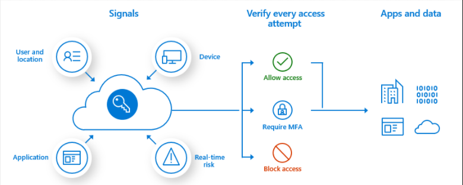
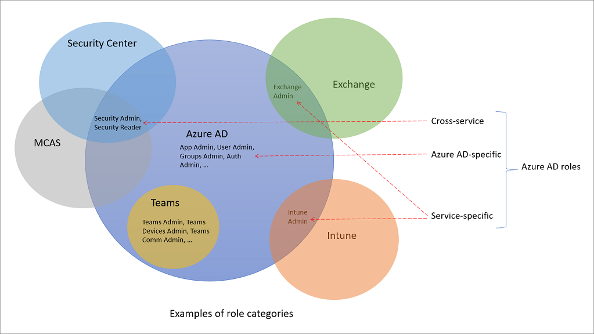
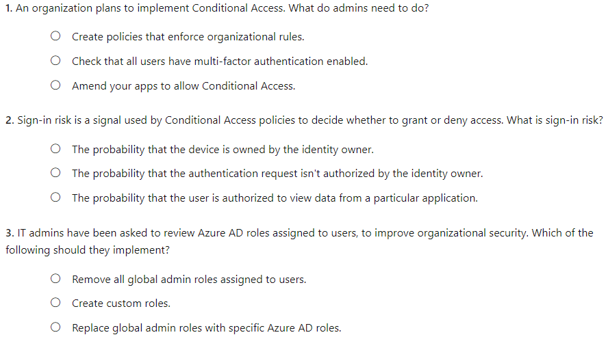
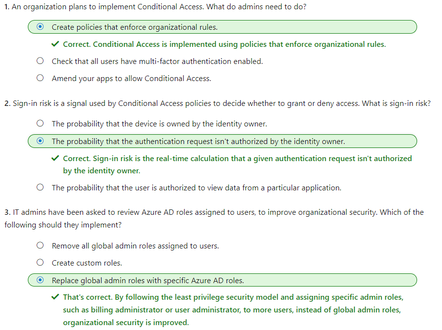

#### Microsoft Security Compliance and Identity Fundamentals | M2 Capabilities of Microsoft Identity and Access Management Solutions
#### M2-3: Access Management Capabilities of Azure AD

> One of the main purposes of Azure AD is to manage access. The security perimeter has shifted away from organizational boundaries to user, device, and service identities. In this module, you'll learn how Azure AD uses intelligent access management capabilities to protect organizational assets. This module describes how Conditional Access helps organization improve security. It also describes the benefits of Azure AD roles, role-based access control, and how they're used to control access to Azure AD resources. 
> In this module, you'll learn how to: 
> - Describe Conditional Access in Azure AD. 
> - Describe the benefits of Azure AD roles and role-based access control. 

# Conditional Access in Azure AD 

[Conditional Access](https://edxinteractivepage.blob.core.windows.net/edxpages/sc-900/LP02M04-Create-a-Conditional-Access-Policy/index.html) is a feature of Azure AD that provides an extra layer of security before allowing authenticated users to access data or other assets. Conditional Access is implemented through policies that are created and managed in Azure AD. A Conditional Access policy analyses signals including user, location, device, application, and risk to automate decisions for authorizing access to resources (apps and data). 

A Conditional Access policy might state that if a user belongs to a certain group, then they're required to provide multi-factor authentication to sign in to an application. 

Watch the video to see how Conditional Access policies work.

## Conditional Access signals 

Some of the common signals that Conditional Access can take in to account when making a policy decision may include: 
•	User or group membership. Policies can be targeted to all users, specific groups of users, directory roles, or external guest users, giving administrators fine-grained control over access. 
•	Named location information. Named location information can be created using IP address ranges, and used when making policy decisions. Also, administrators can opt to block or allow traffic from an entire country/region's IP range. 
•	Device. Users with devices of specific platforms or marked with a specific state can be used. 
•	Application. Users attempting to access specific applications can trigger different Conditional Access policies. 
•	Real-time sign-in risk detection. Signals integration with Azure AD Identity Protection allows Conditional Access policies to identify risky sign-in behavior - the probability that a given sign-in, or authentication request, isn't authorized by the identity owner. Policies can then force users to perform password changes or multi factor authentication to reduce their risk level or be blocked from access until an administrator takes manual action. 
•	Cloud apps or actions. Cloud apps or actions can include or exclude cloud applications or user actions that will be subject to the policy. 
•	User risk. For customers with access to Identity Protection, user risk can be evaluated as part of a Conditional Access policy. User risk represents the probability that a given identity or account is compromised. User risk can be configured for high, medium, or low probability. 

When creating a conditional access policy, admins can determine which signals to use through assignments. The assignments portion of the policy controls the who, what, and where of the Conditional Access policy. All assignments are logically ANDed. If you have more than one assignment configured, all assignments must be satisfied to trigger a policy. 

## Access controls 

When the Conditional Access policy has been applied, an informed decision is reached on whether to grant access, block access, or require extra verification. The decision is referred to as the access controls portion of the Conditional Access policy and defines how a policy is enforced. Common decisions are: 
•	Block access 
•	Grant access 
•	Require one or more conditions to be met before granting access: 
•	Require multi-factor authentication. 
•	Require device to be marked as compliant. 
•	Require hybrid Azure AD joined device. 
•	Require approved client app. 
•	Require app protection policy. 
•	Require password change. 
•	Control user access based on session controls to enable limited experiences within specific cloud applications. As an example, Conditional Access App Control uses signals from Microsoft Defender for Cloud Apps to block the download, cut, copy, and print capabilities for sensitive documents, or to require labeling of sensitive files. Other session controls include sign-in frequency and application enforced restrictions that, for selected applications, use the device information to provide users with a limited or full experience, depending on the device state. 

Conditional Access policies can be targeted to members of specific groups or guests. For example, you can create a policy to exclude all guest accounts from accessing sensitive resources. Conditional Access is a feature of paid Azure AD editions. 

# Benefits of Azure AD roles and role-based access control 

Azure AD roles control permissions to manage Azure AD resources. For example, allowing user accounts to be created, or billing information to be viewed. Azure AD supports built-in and custom roles. 

Managing access using roles is known as role-based access control (RBAC). Azure AD built-in and custom roles are a form of RBAC in that Azure AD roles control access to Azure AD resources. This is referred to as Azure AD RBAC. 

## Built-in roles 
There are many Azure AD built-in roles, which are roles with a fixed set of permissions. A few of the most common built-in roles are: 
•	Global administrator: users with this role have access to all administrative features in Azure Active Directory. The person who signs up for the Azure Active Directory tenant automatically becomes a global administrator. 
•	User administrator: users with this role can create and manage all aspects of users and groups. This role also includes the ability to manage support tickets and monitor service health. 
•	Billing administrator: users with this role make purchases, manage subscriptions and support tickets, and monitor service health. 

All built-in roles are preconfigured bundles of permissions designed for specific tasks. The fixed set of permissions included in the built-in roles can't be modified. 

## Custom roles 
Although there are many built-in admin roles in Azure AD, custom roles give flexibility when granting access. A custom role definition is a collection of permissions that you choose from a preset list. The list of permissions to choose from are the same permissions used by the built-in roles. The difference is that you get to choose which permissions you want to include in a custom role. 

Granting permission using custom Azure AD roles is a two-step process. The first step involves creating a custom role definition, consisting of a collection of permissions that you add from a preset list. Once you’ve created your custom role definition, the second step is to assign that role to users or groups by creating a role assignment. 

A role assignment grants the user the permissions in a role definition, at a specified scope. A scope defines the set of Azure AD resources the role member has access to. A custom role can be assigned at organization-wide scope, meaning the role member has the role permissions over all resources. A custom role can also be assigned at an object scope. An example of an object scope would be a single application. The same role can be assigned to one user over all applications in the organization and then to another user with a scope of only the Contoso Expense Reports app. 

Custom roles require an Azure AD Premium P1 or P2 license. 

## Only grant the access users need 
It's best practice, and more secure, to grant users the least privilege to get their work done. It means that if someone mostly manages users, you should assign the user administrator role, and not global administrator. By assigning least privileges, you limit the damage that could be done with a compromised account. 
Categories of Azure AD roles 
As previously defined, Azure Active Directory (Azure AD) is Microsoft’s cloud-based identity and access management service. Azure AD is an available service, if you subscribe to any Microsoft Online business offer, such as Microsoft 365 and Azure. 
Available Microsoft 365 services include Azure AD, Exchange, SharePoint, Microsoft Defender, Teams, Intune, and many more. 

Over time, some Microsoft 365 services, such as Exchange and Intune, have developed their own role-based access control systems, just like the Azure AD service has Azure AD roles to control access to Azure AD resources (Azure AD RBAC). Other services such as Teams and SharePoint don’t have separate role-based access control systems, they use Azure AD roles for their administrative access. 

To make it convenient to manage identity across Microsoft 365 services, Azure AD has added some service-specific, built-in roles, each of which grants administrative access to a Microsoft 365 service. This means that Azure AD built-in roles differ in where they can be used. There are three broad categories. 
•	Azure AD-specific roles: These roles grant permissions to manage resources within Azure AD only. For example, User Administrator, Application Administrator, Groups Administrator all grant permissions to manage resources that live in Azure AD. 
•	Service-specific roles: For major Microsoft 365 services, Azure AD includes built-in, service-specific roles that grant permissions to manage features within the service. For example, Azure AD includes built-in roles for Exchange Administrator, Intune Administrator, SharePoint Administrator, and Teams Administrator roles that can manage features with their respective services. 
•	Cross-service roles: There are some roles within Azure AD that span services. For example, Azure AD has security-related roles, like Security Administrator, that grant access across multiple security services within Microsoft 365. Similarly the Compliance Administrator role you can manage Compliance-related settings in Microsoft 365 Compliance Center, Exchange, and so on. 

[Difference](https://docs.microsoft.com/en-us/learn/modules/explore-access-management-capabilities/3-describe-azure-role-based-access-control>
) between Azure AD RBAC and Azure RBAC 

As described above, Azure AD built-in and custom roles are a form of RBAC in that Azure AD roles control access to Azure AD resources. This is referred to as Azure AD RBAC. In the same way that Azure AD roles can control access to Azure AD resources, so too can Azure roles control access to Azure resources. This is referred to as Azure RBAC. Although the concept of RBAC applies to both Azure AD RBAC and Azure RBAC, what they control are different. 
+ There are different data stores where role definitions and role assignments are stored. Similarly, there are different policy decision points where access checks happen. 

# Knowledge Check

