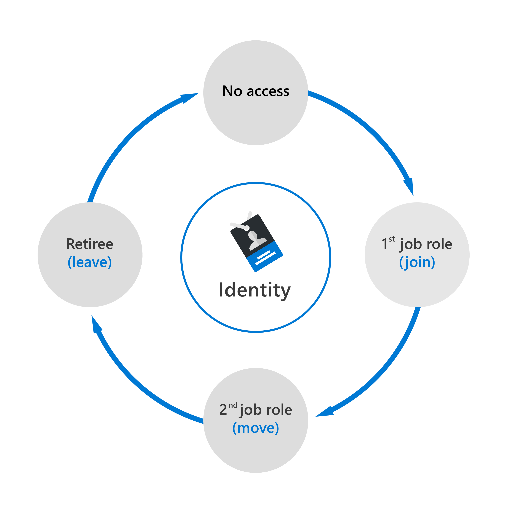
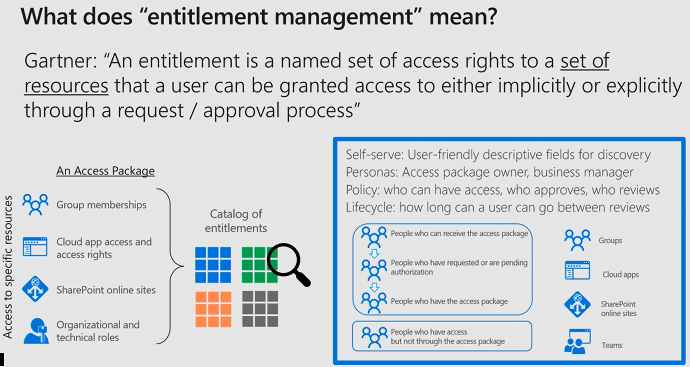
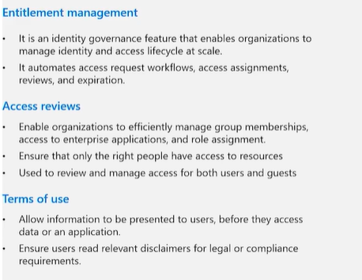
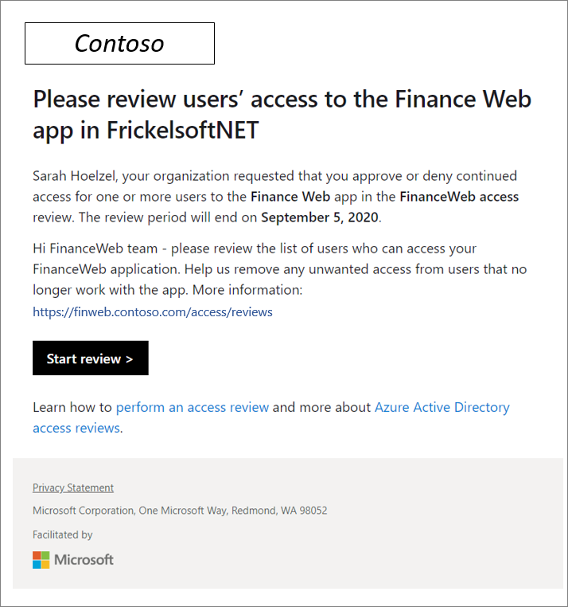
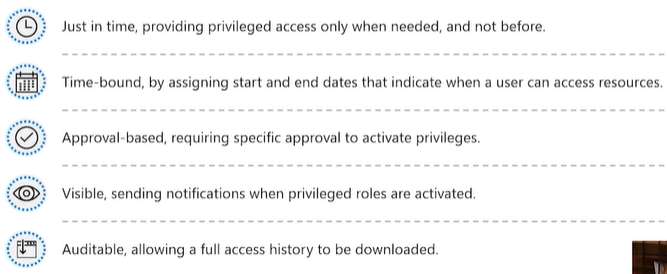
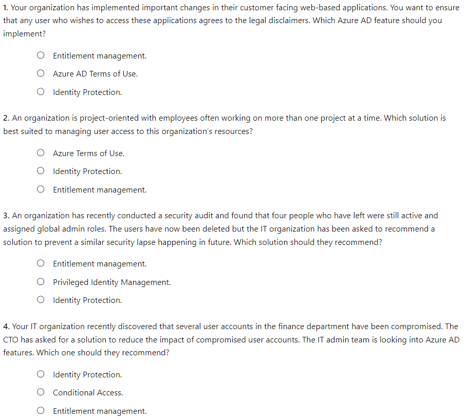
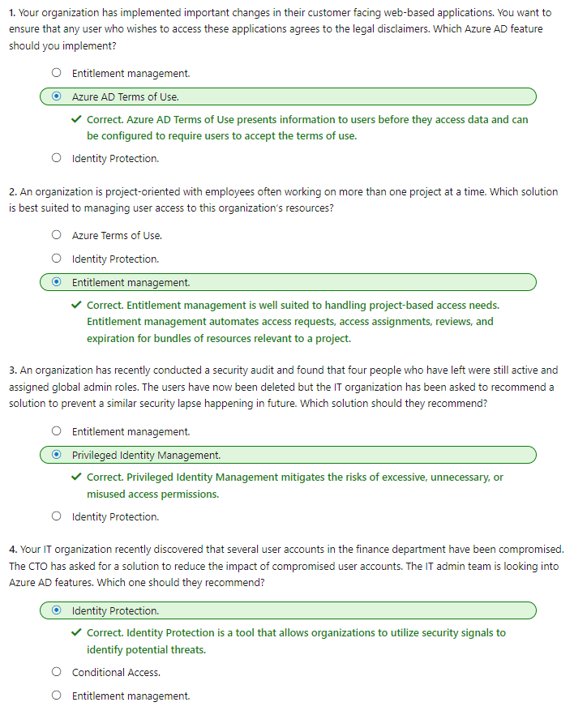

#### Microsoft Security Compliance and Identity Fundamentals | M2 Capabilities of Microsoft Identity and Access Management Solutions
#### M2-4: Identity Protection and Governance Capabilities of Azure AD

> Identity governance is about balancing identity security with user productivity in a way that can be justified and audited. Azure AD provides many identity protection and governance capabilities, including Privileged Identity Management (PIM), Identity Protection, and terms of use statements. 
> In this module, you'll learn how to: 
> - Describe the identity governance capabilities of Azure AD. 
> - Describe Privileged Identity Management (PIM). 
> - Describe the capabilities of Azure AD Identity Protection. 

# Identity governance in Azure AD

Azure AD identity governance gives organizations the ability to do the following tasks: 
- Govern the identity lifecycle. 
- Govern access lifecycle. 
- Secure privileged access for administration.

These actions can be completed for employees, business partners and vendors, and across services and applications, both on-premises and in the cloud. 

It's intended to help organizations address these four key questions: 
- Which users should have access to which resources? 
- What are those users doing with that access? 
- Are there effective organizational controls for managing access? 
- Can auditors verify that the controls are working? 

## Identity lifecycle 

Managing users’ identity lifecycle is at the heart of identity governance. 

When planning identity lifecycle management for employees, for example, many organizations model the "join, move, and leave" process. When an individual first joins an organization, a new digital identity is created if one isn't already available. When an individual moves between organizational boundaries, more access authorizations may need to be added or removed to their digital identity. When an individual leaves, access may need to be removed, and the identity might no longer be required, other than for audit purposes. 

The diagram below shows a simplified version of the identity lifecycle. 

For many organizations, this identity lifecycle for employees is tied to the representation of that user in a human resources (HR) system such as Workday or SuccessFactors. The HR system is authoritative for providing the current list of employees, and some of their properties, such as name or department. 

Azure AD Premium offers integration with cloud-based HR systems. When a new employee is added to an HR system, Azure AD can create a corresponding user account. Similarly, when their properties, such as department or employment status, change in the HR system, synchronization of those updates to Azure AD ensures consistency. 

Azure AD Premium also includes Microsoft Identity Manager, which can import records from on-premises HR systems such as SAP HCM, Oracle eBusiness, and Oracle PeopleSoft. For more information, refer to the Microsoft Identity Manager documentation that is listed in the Learn More section of the Summary and resources unit. 

In general, managing the lifecycle of an identity is about updating the access that users need, whether through integration with an HR system, or through the user provisioning applications. 

## Access lifecycle 

Access lifecycle is the process of managing access throughout the user’s organizational life. Users require different levels of access from the point at which they join an organization to when they leave it. At various stages in between, they'll need access rights to different resources depending on their role and responsibilities. 

Organizations can automate the access lifecycle process through technologies such as dynamic groups. Dynamic groups enable admins to create attribute-based rules to determine membership of groups. When any attributes of a user or device change, the system evaluates all dynamic group rules in a directory to see if the change would trigger any users to be added or removed from a group. If a user or device satisfies a rule for a group, they're added as a member of that group. If they no longer satisfy the rule, they're removed. 

## Privileged access lifecycle 

Monitoring privileged access is a key part of identity governance. When employees, vendors, and contractors are assigned administrative rights, there should be a governance process because of the potential for misuse. 

Azure AD Privileged Identity Management (PIM) provides extra controls tailored to securing access rights. PIM helps you minimize the number of people who have access to resources across Azure AD, Azure, and other Microsoft online services. PIM provides a comprehensive set of governance controls to help secure your company's resources. PIM is a feature of Azure AD Premium P2. 

# Entitlement management and access reviews

Entitlement management is an identity governance feature that enables organizations to manage the identity and access lifecycle at scale. Entitlement management automates access request workflows, access assignments, reviews, and expiration. 

The following video introduces entitlement management, and looks at how access packages are used for resources. 
As discussed in the video, enterprise organizations often face challenges when managing employee access to resources such as: 
- Users may not know what access they should have, and even if they do, they might have difficulty locating the right individuals to approve it. 
- When users find and receive access to a resource, they may hold on to access longer than is required for business purposes. 
- Managing access for external users. 
Entitlement management includes the following capabilities to address these challenges: 
- Delegate the creation of access packages to non-administrators. These access packages contain resources that users can request. The delegated access package managers then define policies that include rules such as which users can request access, who must approve their access, and when access expires. 
- Managing external users. When a user who isn't yet in your directory requests access, and is approved, they're automatically invited into your directory and assigned access. When their access expires, if they have no other access package assignments, their B2B account in your directory can be automatically removed. 
 
Entitlement management, a feature of Azure AD Premium P2, uses access packages to manage access to resources. 
Azure AD access reviews 
Azure Active Directory (AD) access reviews enable organizations to efficiently manage group memberships, access to enterprise applications, and role assignment. Regular access reviews ensure that only the right people have access to resources. Excessive access rights are a known security risk. However, when people move between teams, or take on or relinquish responsibilities, access rights can be difficult to control. 
 
Access reviews are helpful when: 
- You have too many users in privileged roles, such as global administrator. 
- When automation isn't possible, such as when HR data isn't in Azure AD. 
- You want to control business critical data access. 
- Your governance policies require periodic reviews of access permissions. 
 
Access reviews can be created through Azure AD access reviews, or Azure AD Privileged Identity Management (PIM). Access reviews can be used to review and manage access for both users and guests. When an access review is created, it can be set up so that each user reviews their own access, or to have one or more users review everyone's access. Similarly, all guests can be asked to review their own access, or have it looked at by one or more users. 
 

Admins who create access reviews can track progress as the reviewers complete their process. No access rights are changed until the review is finished. You can, however, stop a review before it reaches its scheduled end. 
 
When the review is complete, it can be set to manually or auto-apply changes to remove access from a group membership or application assignment, except for a dynamic group or a group that originates on-premises. In those cases, the changes must be applied directly to the group. 

Access reviews are a feature of Azure AD Premium P2. 

## Azure AD terms of use 

Azure AD terms of use allow information to be presented to users, before they access data or an application. Terms of use ensure users read relevant disclaimers for legal or compliance requirements. 

Example use cases where employees or guests may be required to accept terms of use include: 
- Before they access sensitive data or an application. 
- On a recurring schedule, so they're reminded of regulations. 
- Based on user attributes, such as terms applicable to certain roles. 
- Presenting terms for all users in your organization. 

Terms of use are presented in a PDF format, using content that you create, such as an existing contract document. Terms of use can also be presented to users on mobile devices. 

Conditional Access policies are used to require a terms of use statement being displayed, and ensuring the user has agreed to those terms before accessing an application. Admins can then view who has agreed to terms of use, and who has declined. 

# Capabilities of Privileged identity Management 

Privileged Identity Management (PIM) is a service in Azure Active Directory (Azure AD) that enables you to manage, control, and monitor access to important resources in your organization. These include resources in Azure AD, Azure, and other Microsoft online services such as Microsoft 365 or Microsoft Intune. PIM mitigates the risks of excessive, unnecessary, or misused access permissions. It requires justification to understand why users want permissions, and enforces multifactor authentication to activate any role. 

PIM is: 
- Just in time, providing privileged access only when needed, and not before. 
- Time-bound, by assigning start and end dates that indicate when a user can access resources. 
- Approval-based, requiring specific approval to activate privileges. 
- Visible, sending notifications when privileged roles are activated. 
- Auditable, allowing a full access history to be downloaded. 

Privileged Identity Management is a feature of Azure AD Premium P2. 

## Why use PIM? 

PIM reduces the chance of a malicious actor getting access by minimizing the number of people who have access to secure information or resources. By time-limiting authorized users, it reduces the risk of an authorized user inadvertently affecting sensitive resources. PIM also provides oversight for what users are doing with their administrator privileges. 

In this video, you'll find out what PIM is, and why you might use it: 

The video showed how PIM mitigates the risk to organizations of elevated privileges. It also discussed the specific benefits of using PIM features, and when an organization would use them. 

# Azure Identity Protection 

Identity Protection is a tool that allows organizations to accomplish three key tasks: 
- Automate the detection and remediation of identity-based risks. 
- Investigate risks using data in the portal. 
- Export risk detection data to third-party utilities for further analysis. 
 
Microsoft analyses 6.5 trillion signals per day to identify potential threats. These signals come from learnings Microsoft has acquired from their position in organizations with Azure AD, the consumer space with Microsoft Accounts, and in gaming with Xbox. 
The signals generated by these services are fed to Identity Protection. These signals can then be used by tools such as Conditional Access, which uses them to make access decisions. Signals are also fed to security information and event management (SIEM) tools, such as Microsoft Sentinel, for further investigation. 
 
Identity Protection categorizes risk into three tiers: low, medium, and high. It can also calculate the sign-in risk, and user identity risk. 
 
A sign-in risk represents the probability that a given authentication request isn't authorized by the identity owner. Sign-in risk can be calculated in real-time or calculated offline using Microsoft's internal and external threat intelligence sources. Listed below are some of the sign-in risks that Identity Protection in Azure AD is able to identify: 
- Anonymous IP address. This risk detection type indicates a sign-in from an anonymous IP address; for example, a Tor browser or anonymized VPNs. 
- Atypical travel. This risk detection type identifies two sign-ins originating from geographically distant locations, where at least one of the locations may also be atypical for the user, given past behavior. 
- Malware linked IP address. This risk detection type indicates sign-ins from IP addresses infected with malware that is known to actively communicate with a bot server. 
- Unfamiliar sign-in properties. This risk detection type considers past sign-in history to look for anomalous sign-ins. The system stores information about previous locations used by a user, and considers these "familiar" locations. The risk detection is triggered when the sign-in occurs from a location that's not already in the list of familiar locations. 
- Password spray. This risk detection is triggered when a password spray attack has been performed. 
- Azure AD threat intelligence. This risk detection type indicates sign-in activity that is unusual for the given user or is consistent with known attack patterns based on Microsoft's internal and external threat intelligence sources. 
 
A user risk represents the probability that a given identity or account is compromised. These risks are calculated offline using Microsoft's internal and external threat intelligence sources. Listed below are some of the user risks that Identity Protection in Azure AD is able to identify: 
- Leaked credentials. This risk detection type indicates that the user's valid credentials have been leaked. When cybercriminals compromise valid passwords of legitimate users, they often share those credentials. This sharing is typically done by posting publicly on the dark web, paste sites, or by trading and selling the credentials on the black market. When the Microsoft leaked credentials service acquires user credentials from the dark web, paste sites, or other sources, they're checked against Azure AD users' current valid credentials to find valid matches. 
- Azure AD threat intelligence. This risk detection type indicates user activity that is unusual for the given user or is consistent with known attack patterns based on Microsoft's internal and external threat intelligence sources. 
 
Identity Protection only generates risk detections when correct credentials are used in the authentication request. If a user uses incorrect credentials, it will not be flagged by Identity Protection since there isn't a risk of credential compromise unless a bad actor uses the correct credentials. Risk detections can then trigger actions such as requiring users to provide multi-factor authentication, reset their password, or block access until an administrator takes action. 
 
Identity Protection provides organizations with three reports that they can use to investigate identity risks in their environment. These reports are the risky users, risky sign-ins, and risk detections. Investigation of events is key to understanding and identifying any weak points in your security strategy. 
 
After completing an investigation, admins will want to take action to remediate the risk or unblock users. Organizations can also enable automated remediation using their risk policies. Microsoft recommends closing events quickly because time matters when working with risk. 

Identity Protection is a feature of Azure AD Premium P2. 

# Knowledge Check

