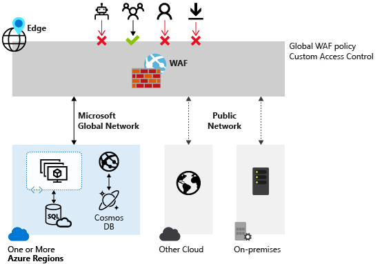

#### Microsoft Security Compliance and Identity Fundamentals | M3 Capabilities of Microsoft security solutions  
#### M3-1: Basic Security Capabilities in Azure

# Azure DDoS protection

Any company, large or small, can be the target of a serious network attack. The nature of these attacks might be to make a statement, or simply happen because the attacker wanted a challenge. 

## Distributed Denial of Service attacks 

The aim of a Distributed Denial of Service (DDoS) attack is to overwhelm the resources on your applications and servers, making them unresponsive or slow for genuine users. A DDoS attack will usually target any public-facing device that can be accessed through the internet. 

The three most frequent types of DDoS attack are: 
- Volumetric attacks: These are volume-based attacks that flood the network with seemingly legitimate traffic, overwhelming the available bandwidth. Legitimate traffic can't get through. These types of attacks are measured in bits per second. 
- Protocol attacks: Protocol attacks render a target inaccessible by exhausting server resources with false protocol requests that exploit weaknesses in layer 3 (network) and layer 4 (transport) protocols. These types of attacks are typically measured in packets per second. 
- Resource (application) layer attacks: These attacks target web application packets, to disrupt the transmission of data between hosts. 

## What is Azure DDoS Protection? 

The Azure DDoS Protection service is designed to help protect your applications and servers by analyzing network traffic and discarding anything that looks like a DDoS attack. 

In the diagram above, Azure DDoS Protection identifies an attacker's attempt to overwhelm the network. It blocks traffic from the attacker, ensuring that it doesn't reach Azure resources. Legitimate traffic from customers still flows into Azure without any interruption of service. 

Azure DDoS Protection uses the scale and elasticity of Microsoft's global network to bring DDoS mitigation capacity to every Azure region. During a DDoS attack, Azure can scale your computing needs to meet demand. DDoS Protection manages cloud consumption by ensuring that your network load only reflects actual customer usage. 

Azure DDoS Protection comes in two tiers: 
- Basic: The Basic service tier is automatically enabled for every property in Azure, at no extra cost, as part of the Azure platform. Always-on traffic monitoring and real-time mitigation of common network-level attacks provide the same defenses that Microsoft’s online services use. Azure’s global network is used to distribute and mitigate attack traffic across regions. 
- Standard: The Standard service tier provides extra mitigation capabilities that are tuned specifically to Microsoft Azure Virtual Network resources. DDoS Protection Standard is simple to enable and requires no application changes. Protection policies are tuned through dedicated traffic monitoring and machine learning algorithms. Policies are applied to public IP addresses, which are associated with resources deployed in virtual networks, such as Azure Load Balancer and Application Gateway 
- The DDoS Standard Protection service has a fixed monthly charge that includes protection for 100 resources. Protection for additional resources are charged on a monthly per-resource basis. 

Use Azure DDoS to protect your devices and applications by analyzing traffic across your network, and taking appropriate action on suspicious traffic. 

## Azure Firewall 

Azure Firewall is a managed, cloud-based network security service that protects your Azure virtual network (VNet) resources from attackers. You can deploy Azure Firewall on any virtual network but the best approach is to use it on a centralized virtual network. All your other virtual and on-premises networks will then route through it. The advantage of this model is the ability to centrally exert control of network traffic for all your VNets across different subscriptions. 

With Azure Firewall, you can scale up the usage to accommodate changing network traffic flows, so you don't need to budget for peak traffic. Network traffic is subjected to the configured firewall rules when you route it to the firewall as the subnet default gateway. 

## Key features of Azure Firewall 
Azure Firewall comes with many features, including but not limited to: 
- Built-in high availability and availability zones: High availability is built in so there's nothing to configure. Also, Azure Firewall can be configured to span multiple availability zones for increased availability. 
- Network and application level filtering: Use IP address, port, and protocol to support fully qualified domain name filtering for outbound HTTP(s) traffic and network filtering controls. 
- Outbound SNAT and inbound DNAT to communicate with internet resources: Translate the private IP address of network resources to an Azure public IP address (source network address translation or SNAT) to identify and allow traffic originating from the virtual network to internet destinations. Similarly, inbound internet traffic to the firewall public IP address is translated (Destination Network Address Translation or DNAT) and filtered to the private IP addresses of resources on the virtual network. 
- Multiple public IP addresses: These addresses can be associated with Azure Firewall. 
- Threat intelligence: Threat intelligence-based filtering can be enabled for your firewall to alert and deny traffic from/to known malicious IP addresses and domains. 
- Integration with Azure Monitor: Integrated with Azure Monitor to enable collecting, analyzing, and acting on telemetry from Azure Firewall logs. 
Use Azure Firewall to help protect the Azure resources you've connected to Azure Virtual Networks. 

# Web Application Firewall

Web applications are increasingly targeted by malicious attacks that exploit commonly known vulnerabilities. Preventing such attacks in application code is challenging. It can require rigorous maintenance, patching, and monitoring. 

Web Application Firewall (WAF) provides centralized protection of your web applications from common exploits and vulnerabilities. A centralized WAF helps make security management simpler, improves the response time to a security threat, and allows patching a known vulnerability in one place, instead of securing each individual web application. A WAF also gives application administrators better assurance of protection against threats and intrusions. 

# Network Segmentation in Azure

Segmentation is about dividing something into smaller pieces. An organization, for example, will typically consist of smaller business groups such as human resources, sales, customer service, and more. In an office environment, it's common to see each business group have their own dedicated office space, while members of the same group share an office. This enables members of the same business group to collaborate, while maintaining separation from other groups to address the confidentiality requirements of each business. 

The same concept applies with corporate IT networks. The main reasons for network segmentation are: 
- The ability to group related assets that are a part of (or support) workload operations. 
- Isolation of resources. 
- Governance policies set by the organization. 

Network segmentation also supports the Zero Trust model and a layered approach to security that is part of a defense in depth strategy. 

Assume breach is a principle of the Zero Trust model so the ability to contain an attacker is vital in protecting information systems. When workloads (or parts of a given workload) are placed into separate segments, you can control traffic from/to those segments to secure communication paths. If one segment is compromised, you'll be able to better contain the impact and prevent it from laterally spreading through the rest of your network. 

Network segmentation can secure interactions between perimeters. This approach can strengthen an organization's security posture, contain risks in a breach, and stop attackers from gaining access to an entire workload. 

## Azure Virtual Network 

Azure Virtual Network (VNet) is the fundamental building block for your organization's private network in Azure. VNet is similar to a traditional network that you'd operate in your own data center, but brings with it additional benefits of Azure's infrastructure such as scale, availability, and isolation. 

Azure VNet enables organizations to segment their network. Organizations can create multiple VNets per region per subscription, and multiple smaller networks (subnets) can be created within each VNet. 

VNets provide network level containment of resources with no traffic allowed across VNets or inbound to the VNet, by default. Communication needs to be explicitly provisioned. This enables more control over how Azure resources in a VNet communicate with other Azure resources, the internet, and on-premises networks. 

# Azure Network Security Groups

Network security groups (NSGs) let you filter network traffic to and from Azure resources in an Azure virtual network; for example, a virtual machine. An NSG consists of rules that define how the traffic is filtered. You can associate only one network security group to each virtual network subnet and network interface in a virtual machine. The same network security group, however, can be associated to as many different subnets and network interfaces as you choose. 

In the highly simplified diagram, shown below, you can see an Azure virtual network with two subnets that are connected to the internet, and each subnet has a virtual machine. Subnet 1 has an NSG assigned to it that's filtering inbound and outbound access to VM1, which needs a higher level of access. In contrast, VM2 could represent a public-facing machine that doesn't require an NSG. 

Inbound and outbound security rules 

An NSG is made up of inbound and outbound security rules. NSG security rules are evaluated by priority using five information points: source, source port, destination, destination port, and protocol to either allow or deny the traffic. By default, Azure creates a series of rules, three inbound and three outbound rules, to provide a baseline level of security. You can't remove the default rules, but you can override them by creating new rules with higher priorities. 

Each rule specifies one or more of the following properties: 
- Name: Every NSG rule needs to have a unique name that describes its purpose. For example, AdminAccessOnlyFilter. 
- Priority: Rules are processed in priority order, with lower numbers processed before higher numbers. When traffic matches a rule, processing stops. This means that any other rules with a lower priority (higher numbers) won't be processed. 
- Source or destination: Specify either individual IP address or an IP address range, service tag (a group of IP address prefixes from a given Azure service), or application security group. Specifying a range, a service tag, or application security group, enables you to create fewer security rules. 
- Protocol: What network protocol will the rule check? The protocol can be any of: TCP, UDP, ICMP or Any. 
- Direction: Whether the rule should be applied to inbound or outbound traffic. 
- Port range: You can specify an individual or range of ports. Specifying ranges enables you to be more efficient when creating security rules. 
- Action: Finally, you need to decide what will happen when this rule is triggered. 
 
As an example, the table below shows the default inbound rules, which are included in all NSGs. For this example, assume no other inbound rules have been defined for this NSG. 
 

- The AllowVNetInBound rule is processed first as it has the lowest priority value. Recall that rules with the lowest priority value get processed first. This rule allows traffic from any Virtual Network (as defined by the VirtualNework service tag) on any port to any Virtual Network on any port, using any protocol. If a match is found for this rule, then no other rules are processed. If no match is found, then the next rule gets processed. 
- The AllowAzureLoadBalancerInBound rule is processed second, as its priority value is higher than the AllowVNetInBound rule. This rule allows traffic from any Azure Load Balancer (as defined by the AzureLoadBalancer service tag) on any port to any IP address on any port, using any protocol. If a match is found for this rule, then no other rules are processed. If no match is found, then the next rule gets processed. 
- The last rule in this NSG is the DenyAllInBound rule. This rule denies all traffic from any source IP address on any port to any other IP address on any port, using any protocol. 
 
In summary, any virtual network subnet or network interface card to which this NSG is assigned will only allow inbound traffic from an Azure Virtual Network or an Azure load balancer. All other inbound network traffic is denied. Although not shown in this example, there are also three default outbound rules that are included in all NSGs. You can't remove the default rules, but you can override them by creating new rules with higher priorities (lower priority value). 

##  What is the difference between Network Security Groups (NSGs) and Azure Firewall? 

Now that you've learned about both Network Security Groups and Azure Firewall, you may be wondering how they differ, as they both protect Virtual Network resources. The Azure Firewall service complements network security group functionality. Together, they provide better "defense-in-depth" network security. Network security groups provide distributed network layer traffic filtering to limit traffic to resources within virtual networks in each subscription. Azure Firewall is a fully stateful, centralized network firewall as-a-service, which provides network and application-level protection across different subscriptions and virtual networks. 

# Azure Bastion and JIT Access 

Let’s assume you’ve set up multiple virtual networks that use a combination of NSGs and Azure Firewalls to protect and filter access to the assets and resources, including virtual machines (VMs). You're now protected from external threats, but need to allow your developers and data scientist, who are working remotely, direct access to those VMs. 
In a traditional model, you’d need to expose the Remote Desktop Protocol (RDP) and/or Secure Shell (SSH) ports to the internet. These protocols can be used to gain remote access to your VMs. This process creates a significant surface threat that can be exploited by attackers who actively hunt accessible machines with open management ports, like RDP or SSH. When a VM is successfully compromised, it's used as the entry point to attack further resources within your environment. 

## Azure Bastion 
Azure Bastion is a service you deploy that lets you connect to a virtual machine using your browser and the Azure portal. The Azure Bastion service is a fully platform-managed PaaS service that you provision inside your virtual network. Azure Bastion provides secure and seamless RDP and SSH connectivity to your virtual machines directly from the Azure portal using Transport Layer Security (TLS). When you connect via Azure Bastion, your virtual machines don't need a public IP address, agent, or special client software. 

Bastion provides secure RDP and SSH connectivity to all VMs in the virtual network, and peered virtual networks, in which it's provisioned. Using Azure Bastion protects your virtual machines from exposing RDP/SSH ports to the outside world, while still providing secure access using RDP/SSH. 
Azure Bastion deployment is per virtual network with support for virtual network peering, not per subscription/account or virtual machine. Once you provision the Azure Bastion service in your virtual network, the RDP/SSH experience is available to all your VMs in the same VNet, as well as peered VNets. 

## Key features of Azure Bastion 

The following features are available: 
- RDP and SSH directly in Azure portal: You get to the RDP and SSH session directly in the Azure portal, using a single-click experience. 
- Remote session over TLS and firewall traversal for RDP/SSH: From the Azure portal, a connection to the VM, will open an HTML5 based web client that is automatically streamed to your local device. You'll get your Remote Desktop Protocol (RDP) and Secure Shell (SSH) to traverse the corporate firewalls securely. The connection is made secure by using the Transport Layer Security (TLS) protocol to establish encryption. 
- No Public IP required on the Azure VM: Azure Bastion opens the RDP/SSH connection to your Azure virtual machine using private IP on your VM. You don't need a public IP. 
- No hassle of managing NSGs: A fully managed platform PaaS service from Azure that's hardened internally to provide secure RDP/SSH connectivity. You don't need to apply any NSGs on an Azure Bastion subnet. 
- Protection against port scanning: Because you don't need to expose your virtual machines to the internet, your VMs are protected against port scanning by rogue and malicious users located outside your virtual network. 
- Hardening in one place to protect against zero-day exploits: Azure Bastion is a fully platform-managed PaaS service. Because it sits at the perimeter of your virtual network, you don’t need to worry about hardening each virtual machine in the virtual network. The Azure platform protects against zero-day exploits by keeping the Azure Bastion hardened and always up to date for you. 

Use Azure Bastion to establish secure RDP and SSH connectivity to your virtual machines in Azure. 

## Just-in-time access 
Just-in-time (JIT) access allows lock down of the inbound traffic to your VMs, reducing exposure to attacks while providing easy access to connect to VMs when needed. 
 
When you enable just-in-time VM access, you can select the ports on the VM to which inbound traffic will be blocked. Microsoft Defender for Cloud, a tool for security posture management and threat protection, ensures "deny all inbound traffic" rules exist for your selected ports in the network security group (NSG) and Azure Firewall rules. These rules restrict access to your Azure VMs’ management ports and defend them from attack. 
 
If other rules already exist for the selected ports, then those existing rules take priority over the new "deny all inbound traffic" rules. If there are no existing rules on the selected ports, then the new rules take top priority in the NSG and Azure Firewall. 
 
When a user requests access to a VM, Defender for Cloud checks that the user has Azure role-based access control (Azure RBAC) permissions for that VM. If the request is approved, Defender for Cloud configures the NSGs and Azure Firewall to allow inbound traffic to the selected ports from the relevant IP address (or range), for the amount of time that was specified. After the time has expired, Defender for Cloud restores the NSGs to their previous states. Connections that are already established are not interrupted. 
 
JIT requires Microsoft Defender for servers to be enabled on the subscription. 

# Ways Azure Encrypts data 

Espionage, data theft, and data exfiltration are a real threat to any company. The loss of sensitive data can be crippling and have legal implications. For most organizations, data is their most valuable asset. In a layered security strategy, the use of encryption serves as the last and strongest line of defense. 

## Encryption on Azure 

Microsoft Azure provides many different ways to secure your data, each depending on the service or usage required. 
- Azure Storage Service Encryption helps to protect data at rest by automatically encrypting before persisting it to Azure-managed disks, Azure Blob Storage, Azure Files, or Azure Queue Storage, and decrypts the data before retrieval. 
- Azure Disk Encryption helps you encrypt Windows and Linux IaaS virtual machine disks. Azure Disk Encryption uses the industry-standard BitLocker feature of Windows and the dm-crypt feature of Linux to provide volume encryption for the OS and data disks. 
- Transparent data encryption (TDE) helps protect Azure SQL Database and Azure Data Warehouse against the threat of malicious activity. It performs real-time encryption and decryption of the database, associated backups, and transaction log files at rest without requiring changes to the application. 

## What is Azure Key Vault? 

Azure Key Vault is a centralized cloud service for storing your application secrets. Key Vault helps you control your applications' secrets by keeping them in a single, central location and by providing secure access, permissions control, and access logging capabilities. It's useful for different kinds of scenarios: 
- Secrets management. You can use Key Vault to store securely and tightly control access to tokens, passwords, certificates, Application Programming Interface (API) keys, and other secrets. 
- Key management. You can use Key Vault as a key management solution. Key Vault makes it easier to create and control the encryption keys used to encrypt your data. 
- Certificate management. Key Vault lets you provision, manage, and deploy your public and private Secure Sockets Layer/ Transport Layer Security (SSL/ TLS) certificates for Azure, and internally connected, resources more easily. 
- Store secrets backed by hardware security modules (HSMs). The secrets and keys can be protected either by software or by FIPS 140-2 Level 2 validated HSMs. 

Use the various ways in which Azure can encrypt your data to help you secure it whatever the location or state. 

# Knowledge Check

