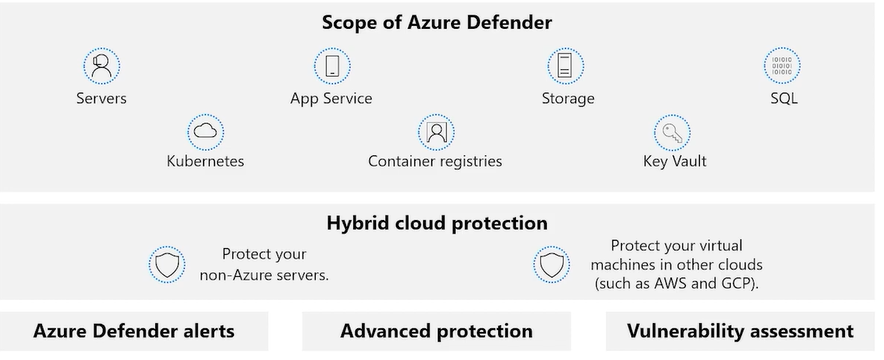

#### Microsoft Security Compliance and Identity Fundamentals | M3 Capabilities of Microsoft security solutions  
#### M3-2: Security Management Capabilities of Azure 

> As more companies move their assets and resources into the cloud, keeping them safe is a primary consideration for all IT and security departments. Cybercrime is a multi-billion-dollar business. Failure to protect your organization can be costly because of loss of data and reputation. 
> 
> Microsoft Azure offers a suite of threat protection and detection systems to minimize and mitigate threats across your whole estate and improve the overall cloud security posture. 
> 
> In this module, you’ll learn about cloud security posture management (CSPM), explore the capabilities of Microsoft Defender for Cloud, including secure score. You will also learn about the enhanced security capabilities of Microsoft Defender for Cloud. Finally, you’ll learn about the Azure Security Benchmark and security baseline in Azure. 
>  
> After completing this module, you'll be able to: 
> - Describe cloud security posture management. 
> - Describe the capabilities of Microsoft Defender for Cloud 
> - Understand the Azure Security Benchmark and security baseline in Azure. 

# Cloud security posture management 

Cloud-based systems are continually evolving and changing as companies move away from on-premises to the cloud. This move makes it difficult for any IT department to know if your data, assets, and resources are as fully protected as they used to be. Even a small misconfiguration of a new feature can increase the attack surface available for cybercriminals to exploit. 
 
Cloud security posture management (CSPM) is a relatively new class of tools designed to improve your cloud security management. It assesses your systems and automatically alerts security staff in your IT department when a vulnerability is found. CSPM uses tools and services in your cloud environment to monitor and prioritize security enhancements and features. 

 
CSPM uses a combination of tools and services: 
- Zero Trust-based access control: Considers the active threat level during access control decisions. 
- Real-time risk scoring: To provide visibility into top risks. 
- Threat and vulnerability management (TVM): Establishes a holistic view of the organization's attack surface and risk and integrates it into operations and engineering decision-making. 
- Discover risks: To understand the data exposure of enterprise intellectual property, on sanctioned and unsanctioned cloud services. 
- Technical policy: Apply guardrails to audit and enforce the organization's standards and policies to technical systems. 
- Threat modeling systems and architectures: Used alongside other specific applications. 
 
The main goal for a cloud security team working on posture management is to continuously report on and improve the organization's security posture by focusing on disrupting a potential attacker's return on investment (ROI). 
 
The function of CSPM in your organization might be spread across multiple teams, or there may be a dedicated team. CSPM can be useful to many teams in your organization: 
- Threat intelligence team 
- Information technology 
- Compliance and risk management teams 
- Business leaders and SMEs 
- Security architecture and operations 
- Audit team 

Use CSPM to improve your cloud security management by assessing the environment, and automatically alerting security staff for vulnerabilities. 

# Microsoft Defender for Cloud

Microsoft Defender for Cloud is a tool for security posture management and threat protection. It strengthens the security posture of your cloud resources, and with its integrated Microsoft Defender plans, Defender for Cloud protects workloads running in Azure, hybrid, and other cloud platforms. 

Microsoft Defender for Cloud fills three vital needs as you manage the security of your resources and workloads in the cloud and on-premises: 
- Continuously assess - Know your security posture, identify and track vulnerabilities. 
- Secure - Harden all connected resources and services. 
- Defend - Detect and resolve threats to resources, workloads, and services. 

 
The features of Microsoft Defender for Cloud, that deliver on these requirements, cover two broad pillars of cloud security: cloud security posture management and cloud workload protection. 

## Cloud security posture management (CSPM) 

In Microsoft Defender for Cloud, the posture management features provide: 
- Visibility - to help you understand your current security situation 
- Hardening guidance - to help you efficiently and effectively improve your security 

### Visibility and hardening recommendations 
The central feature in Microsoft Defender for Cloud that enables you to achieve those goals is [secure score](https://edxinteractivepage.blob.core.windows.net/edxpages/sc-900/LP03M02-Use-Azure-secure-score-to-improve-your-security-posture/index.html). Microsoft Defender for Cloud continually assesses your resources, subscriptions, and organization for security issues. It then aggregates all the findings into a single score so that you can tell, at a glance, your current security situation: the higher the score, the lower the identified risk level. 

Microsoft Defender for Cloud also provides hardening recommendations based on any identified security misconfigurations and weaknesses. Recommendations are grouped into security controls. Each control is a logical group of related security recommendations, and reflects your vulnerable attack surfaces. Your score only improves when you remediate all of the recommendations for a single resource within a control. Use these security recommendations to strengthen the security posture of your organization's Azure, hybrid, and multi-cloud resources. 
 

 
The following interactive [click-through](https://docs.microsoft.com/en-us/learn/modules/describe-security-management-capabilities-of-azure/3-describe-defender-cloud) demonstrates how you use secure score and the hardening recommendations in Microsoft Defender for Cloud.  Select the image below to get started and follow the prompts on the screen.   
 
## Cloud workload protection (CWP) 

The second pillar of cloud security is cloud workload protection. Through cloud workload protection capabilities, Microsoft Defender for Cloud is able to detect and resolve threats to resources, workloads, and services. Cloud workload protections are delivered through integrated Microsoft Defender plans, specific to the types of resources in your subscriptions and provide enhanced security features for your workloads. These are described in the next unit. 

# Enhanced security of Microsoft Defender for Cloud

Microsoft Defender for Cloud is offered in two modes: 
- Microsoft Defender for Cloud (Free) - Microsoft Defender for Cloud is enabled for free on all your Azure subscriptions. Using this free mode provides the secure score and its related features: security policy, continuous security assessment, and actionable security recommendations to help you protect your Azure resources. 
- Microsoft Defender for Cloud with enhanced security features - Enabling enhanced security extends the capabilities of the free mode to workloads running in Azure, hybrid, and other cloud platforms, providing unified security management and threat protection across your workloads. Cloud workload protections are delivered through integrated Microsoft Defender plans, specific to the types of resources in your subscriptions and provide enhanced security features for your workloads. 

## Defender plans

 
Microsoft Defender for Cloud includes a range of advanced intelligent protections for your workloads. The workload protections are provided through Microsoft Defender plans specific to the types of resources in your subscriptions. The Microsoft Defender for Cloud plans you can select from are: 
- Microsoft Defender for servers adds threat detection and advanced defenses for your Windows and Linux machines. 
- Microsoft Defender for App Service identifies attacks targeting applications running over App Service. 
- Microsoft Defender for Storage detects potentially harmful activity on your Azure Storage accounts. 
- Microsoft Defender for SQL secures your databases and their data wherever they're located. 
- Microsoft Defender for Kubernetes provides cloud-native Kubernetes security environment hardening, workload protection, and run-time protection. 
- Microsoft Defender for container registries protects all the Azure Resource Manager based registries in your subscription. 
- Microsoft Defender for Key Vault is advanced threat protection for Azure Key Vault. 
- Microsoft Defender for Resource Manager automatically monitors the resource management operations in your organization. 
- Microsoft Defender for DNS provides an additional layer of protection for resources that use Azure DNS's Azure-provided name resolution capability. 
- Microsoft Defender for open-source relational protections brings threat protections for open-source relational databases. 
These different plans can be enabled separately and will run simultaneously to provide a comprehensive defense for compute, data, and service layers in your environment. 

## Enhanced security features 
Microsoft Defender plans specific to the types of resources in your subscriptions provide enhanced security features for your workloads. Listed below are some of the enhanced security features. 
- Comprehensive endpoint detection and response - Microsoft Defender for servers includes Microsoft Defender for Endpoint for comprehensive endpoint detection and response (EDR). 
- Vulnerability scanning for virtual machines, container registries, and SQL resources - Easily deploy a scanner to all of your virtual machines. View, investigate, and remediate the findings directly within Microsoft Defender for Cloud. 
- Multi-cloud security - Connect your accounts from Amazon Web Services (AWS) and Google Cloud Platform (GCP) to protect resources and workloads on those platforms with a range of Microsoft Defender for Cloud security features. 
- Hybrid security – Get a unified view of security across all of your on-premises and cloud workloads. Apply security policies and continuously assess the security of your hybrid cloud workloads to ensure compliance with security standards. Collect, search, and analyze security data from multiple sources, including firewalls and other partner solutions. 
- Threat protection alerts - Monitor networks, machines, and cloud services for incoming attacks and post-breach activity. Streamline investigation with interactive tools and contextual threat intelligence. 
- Track compliance with a range of standards - Microsoft Defender for Cloud continuously assesses your hybrid cloud environment to analyze the risk factors according to the controls and best practices in Azure Security Benchmark. When you enable the enhanced security features, you can apply a range of other industry standards, regulatory standards, and benchmarks according to your organization's needs. Add standards and track your compliance with them from the regulatory compliance dashboard. 
- Access and application controls - Block malware and other unwanted applications by applying machine learning powered recommendations adapted to your specific workloads to create allowlists and blocklists. Reduce the network attack surface with just-in-time, controlled access to management ports on Azure VMs. Access and application controls drastically reduce exposure to brute force and other network attacks. 

Additional benefits include threat protection for the resources connected to the Azure environment and container security features, among others. Some features may be associated with specific defender plans for specific workloads. 

# Azure Security Benchmark and security baselines for Azure

New services and features are released daily in Azure, developers are rapidly publishing new cloud applications built on these services, and attackers are always seeking new ways to exploit misconfigured resources. 

The Azure Security Benchmark (ASB) and security baselines for Azure, which are closely related, help organizations secure their cloud solutions on Azure. 

## The Azure Security Benchmark 

Microsoft has found that using security benchmarks can help organizations quickly secure their cloud deployments and reduce risk to their organization. 
The Azure Security Benchmark (ASB) provides prescriptive best practices and recommendations to help improve the security of workloads, data, and services on Azure. The best way to understand the Azure Security Benchmark is to view it on GitHub Azure Security Benchmark V3. Spoiler alert, it's an excel spreadsheet. Some of the key pieces of information in ASB V3 are: 
- ASB ID - Each line item in the ASB has an identifier that maps to a specific recommendation. 
- Control domain - ASB control domains include network security, data protection, identity management, privileged access, incident response, endpoint security to name just a few. The control domain is best described as high-level feature or activity that isn't specific to a technology or implementation. 
- Mapping to industry frameworks - The recommendations included in the ASB map to existing industry frameworks, such as the Center for Internet Security (CIS), the National Institute of Standards and Technology (NIST), and the Payment Card Industry Data Security Standards (PCI DSS) frameworks. This makes security and compliance easier for customer applications running on Azure services. 
- Recommendation - For each control domain area there can be many distinct recommendations. Each recommendation captures specific functionality associated with the control domain area and is itself a control. For example, the "Network Security" control domain in ASB v3 has 10 distinct recommendations identified as NS-1 through NS-10. Each of these recommendations describes a specific control under network security. 
- Security principle - Each recommendation lists a "Security Principle" that explains the "what" for the control at the technology-agnostic level 
- Azure Guidance - Azure Guidance is focused on the "how", elaborating on the relevant technical features and ways to implement the controls in Azure. 
 
Other pieces of information in the ASB include links to information on implementation, links to information about security stakeholders, and guidance on mapping to Azure policy. These aren't shown in the image below. The image below is an excerpt from the Azure Security Benchmark (ASB v3) and is shown as an example of the type of the content that is included in the ASB v3. The image is not intended to show the complete text for any of the line items. 
 

 
Microsoft Defender for Cloud continuously assesses an organization's hybrid cloud environment to analyze the risk factors according to the controls and best practices in Azure Security Benchmark. Some of the controls used in the ASB include network security, identity and access control, data protection, data recovery, incident response, and more. 
 

## Security baselines for Azure 

Security baselines for Azure apply guidance from the Azure Security Benchmark to the specific service for which it's defined. For example, the security baseline for Azure Active Directory applies guidance from the Azure Security Benchmark version 2.0 to Azure Active Directory. 

Security baselines for Azure help organizations strengthen their security through improved tooling, tracking, and security features. They also provide organizations a consistent experience when securing their environment. Content in the security baseline is grouped by the control domains defined by the Azure Security Benchmark and that are applicable to the service. 

Each Azure security baseline includes the following information: 
- Azure ID: The Azure Security Benchmark ID that corresponds to the recommendation. 
- Azure control: The content is grouped by control domain area, as listed in the Azure Security Benchmark, and that is applicable to the service for which the security baseline is defined. 
- Benchmark Recommendation: This maps to the recommendation for the associated ASB ID (or Azure ID). Each recommendation describes an individual control in a control domain. 
- Customer Guidance: The rationale for the recommendation and links to guidance on how to implement it. 
- Responsibility: Who is responsible for implementing the control? Possible scenarios are customer responsibility, Microsoft responsibility, or shared responsibility. 
- Microsoft Defender for Cloud monitoring: Does Microsoft Defender for Cloud monitor the control? 

The image below is an excerpt from the [security baseline](https://learn.microsoft.com/en-us/security/benchmark/azure/) for Azure AD and is shown as an example of the type of the content that is included in baseline. The image is not intended to show the complete text for any of the line items. 

# Knowledge Check

