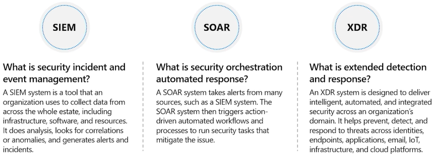
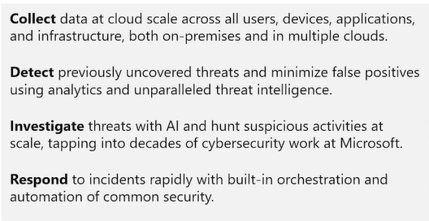
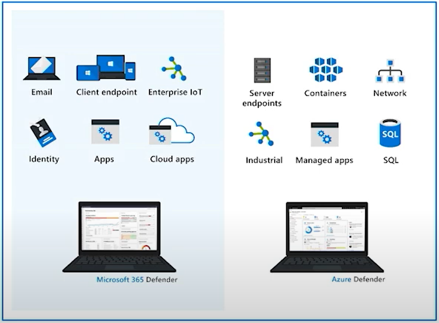
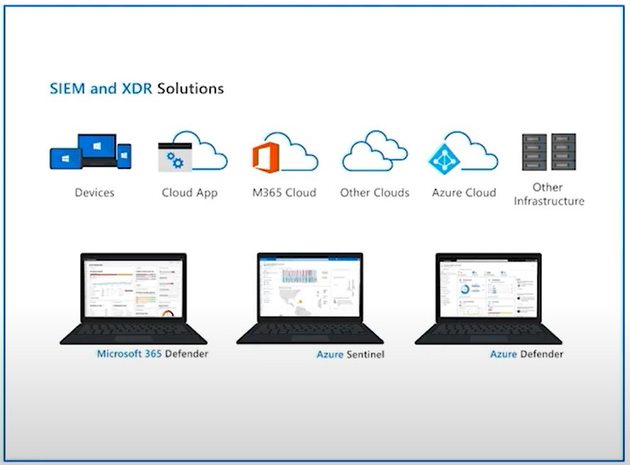
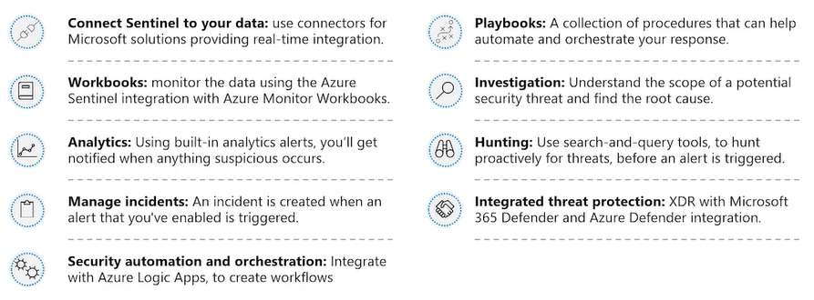
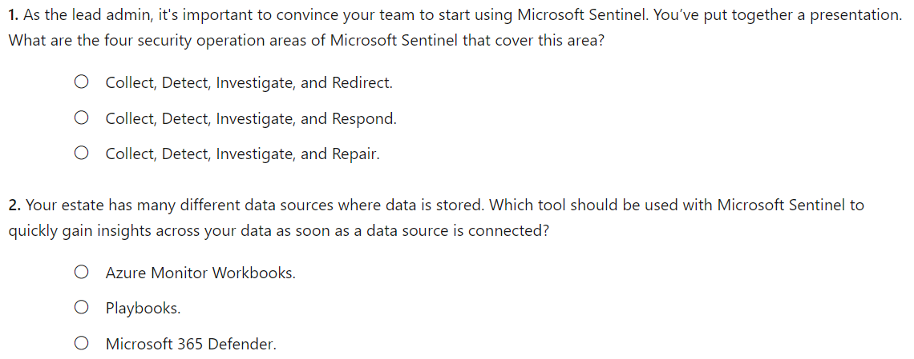
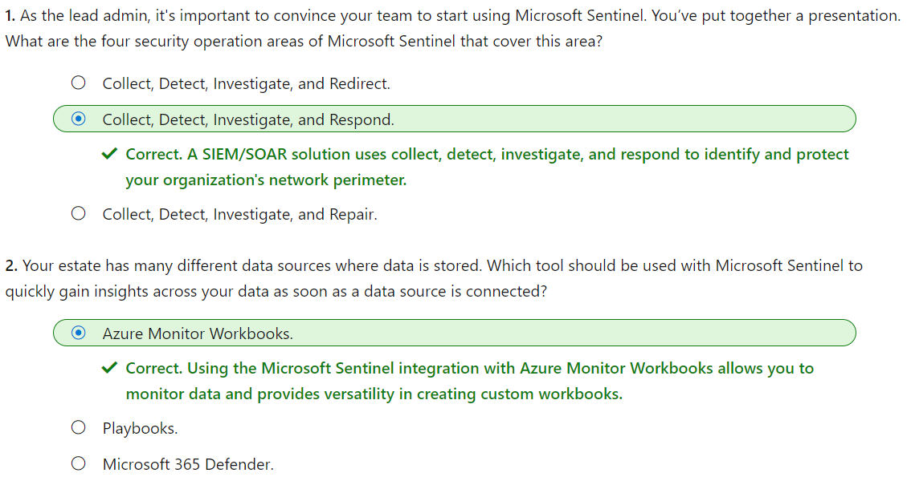

#### Microsoft Security Compliance and Identity Fundamentals | M3 Capabilities of Microsoft security solutions  
#### M3-3: Security Capabilities of Microsoft Sentinel  

> Every organization, whatever its size, is susceptible to security threats and attacks. Being able to collect data to gain visibility into your digital estate and detect, investigate, and respond to threats is central to any network security strategy. 
>
> In this module, you’ll learn about the different security defenses that are available to protect your company’s digital estate. You’ll explore how Microsoft Sentinel provides a single solution for alert detection, threat visibility, proactive hunting, and threat response. Finally, you'll have a high-level understanding of the pricing model of Microsoft Sentinel. 
>
> After completing this module, you’ll be able to: 
> - Describe the security concepts for SIEM and SOAR. 
> - Describe how Microsoft Sentinel provides integrated threat protection. 
> - Describe the pricing models of Microsoft Sentinel. 

# Concepts of SIEM and SOAR 

Protecting an organization’s digital estate, resources, assets, and data from security breaches and attacks is an ongoing and escalating challenge. The business world has large numbers of staff working remotely, creating an exploitable window for cybercriminals. 

Having a resilient and robust, industry-standard set of tools can help mitigate and prevent these exploits. Security information event management (SIEM) and security orchestration automated response (SOAR) provide security insights and security automation that can enhance an organization's threat visibility and response. 

## What is security information and event management (SIEM)? 

A SIEM system is a tool that an organization uses to collect data from across the whole estate, including infrastructure, software, and resources. It does analysis, looks for correlations or anomalies, and generates alerts and incidents. 

## What is security orchestration automated response (SOAR)? 

A SOAR system takes alerts from many sources, such as a SIEM system. The SOAR system then triggers action-driven automated workflows and processes to run security tasks that mitigate the issue. 
To provide a comprehensive approach to security, an organization needs to use a solution that embraces or combines both SIEM and SOAR functionality. 
 
# How Microsoft Sentinel provides integrated threat management 

Effective management of an organization’s network security perimeter requires the right combination of tools and systems. Microsoft Sentinel is a scalable, cloud-native SIEM/SOAR solution that delivers intelligent security analytics and threat intelligence across the enterprise. It provides a single solution for alert detection, threat visibility, proactive hunting, and threat response. 

 
This diagram shows the end-to-end functionality of Microsoft Sentinel. 
- Collect data at cloud scale across all users, devices, applications, and infrastructure, both on-premises and in multiple clouds. 
- Detect previously uncovered threats and minimize false positives using analytics and unparalleled threat intelligence. 
- Investigate threats with artificial intelligence (AI) and hunt suspicious activities at scale, tapping into decades of cybersecurity work at Microsoft. 
- Respond to incidents rapidly with built-in orchestration and automation of common security tasks. 

[Microsoft Sentinel](https://docs.microsoft.com/en-us/learn/modules/describe-security-capabilities-of-azure-sentinel/3-describe-sentinel-provide-integrated-threat-management) helps enable end-to-end security operations, in a modern Security Operations Center (SOC). Listed below are some of the key features of Microsoft Sentinel. 

## Connect Sentinel to your data 

To on-board Microsoft Sentinel, you first need to connect to your security sources. Microsoft Sentinel comes with many connectors for Microsoft solutions, available out of the box and providing real-time integration. Included are Microsoft 365 Defender solutions, and Microsoft 365 sources, including Office 365, Azure AD, and more. In addition, there are built-in connectors to the broader security ecosystem of non-Microsoft solutions. You can also connect your data sources using community-built data connectors listed in the Microsoft Sentinel GitHub repository or by following generic deployment procedures for how to connect your data source to Microsoft Sentinel. Links to information are included in the Learn more section of the summary and resources unit. 

## Workbooks 

After you connect data sources to Microsoft Sentinel, you can monitor the data using the Microsoft Sentinel integration with Azure Monitor Workbooks. You'll see a canvas for data analysis and the creation of rich visual reports within the Azure portal. Through this integration, Microsoft Sentinel allows you to create custom workbooks across your data. It also comes with built-in workbook templates that allow quick insights across your data as soon as you connect a data source. 

## Analytics 

Microsoft Sentinel uses analytics to correlate alerts into incidents. Incidents are groups of related alerts that together create an actionable possible-threat that you can investigate and resolve. With analytics in Microsoft Sentinel, you can use the built-in correlation rules as-is, or use them as a starting point to build your own. Microsoft Sentinel also provides machine learning rules to map your network behavior and then look for anomalies across your resources. These analytics connect the dots, by combining low fidelity alerts about different entities into potential high-fidelity security incidents. 

## Manage incidents in Microsoft Sentinel 

Incident management allows you to manage the lifecycle of the incident. View all related alerts that are aggregated into an incident. You can also triage and investigate. Review all related entities in the incident and additional contextual information meaningful to the triage process. Investigate the alerts and related entities to understand the scope of breach. Trigger playbooks on the alerts grouped in the incident to resolve the threat detected by the alert. You can also do standard incident management tasks like changing status or assigning incidents to individuals for investigation. 

## Security automation and orchestration 

You can use Microsoft Sentinel to automate some of your security operations and make your security operations center (SOC) more productive. Microsoft Sentinel integrates with Azure Logic Apps, so you can create automated workflows, or playbooks, in response to events. A security playbook is a collection of procedures that can help SOC engineers and analysts of all tiers to automate and simplify tasks and orchestrate a response. Playbooks work best with single, repeatable tasks, and require no coding knowledge. 

## Investigation 

Currently in preview, Microsoft Sentinel's deep investigation tools help you to understand the scope of a potential security threat and find the root cause. You choose an entity on the interactive graph to ask specific questions, then drill down into that entity and its connections to get to the root cause of the threat. 

## Hunting 

Use Microsoft Sentinel's powerful hunting search-and-query tools, based on the MITRE framework (a global database of adversary tactics and techniques), to proactively hunt for security threats across your organization’s data sources, before an alert is triggered. After you discover which hunting query provides high-value insights into possible attacks, you can also create custom detection rules based on your query, and surface those insights as alerts to your security incident responders. 
While hunting, you can bookmark interesting events. Bookmarking events enables you to return to them later, share them with others, and group them with other correlating events to create a compelling incident for investigation. 

## Notebooks 

Microsoft Sentinel supports Jupyter notebooks. Jupyter Notebook is an open-source web application that allows you to create and share documents that contain live code, equations, visualizations, and narrative text. You can use Jupyter notebooks in Microsoft Sentinel to extend the scope of what you can do with Microsoft Sentinel data. For example, perform analytics that aren't built in to Microsoft Sentinel, such as some Python machine learning features, create data visualizations that aren't built in to Microsoft Sentinel, such as custom timelines and process trees, or integrate data sources outside of Microsoft Sentinel, such as an on-premises data set. 

## Community 
The Microsoft Sentinel community is a powerful resource for threat detection and automation. Microsoft security analysts constantly create and add new workbooks, playbooks, hunting queries, and more, posting them to the community for you to use in your environment. You can download sample content from the private community GitHub repository to create custom workbooks, hunting queries, notebooks, and playbooks for Microsoft Sentinel. 
Microsoft Sentinel video presentation.

# Understand Sentinel costs 

Microsoft Sentinel provides intelligent security analytics across your enterprise. The data for this analysis is stored in an Azure Monitor Log Analytics workspace. [Billing](https://azure.microsoft.com/en-us/pricing/details/microsoft-sentinel/) is based on the volume of data ingested for analysis in Microsoft Sentinel and stored in the Azure Monitor Log Analytics workspace. There are two ways to pay for the Microsoft Sentinel service: Capacity Reservations and Pay-As-You-Go. 
- Capacity Reservations: With Capacity Reservations, you're billed a fixed fee based on the selected tier, enabling a predictable total cost for Microsoft Sentinel. 
- Pay-As-You-Go: With Pay-As-You-Go pricing, you're billed per gigabyte (GB) for the volume of data ingested for analysis in Microsoft Sentinel and stored in the Azure Monitor Log Analytics workspace. 

# Knowledge Check 

