#### Microsoft Security Compliance and Identity Fundamentals | M3 Capabilities of Microsoft security solutions  
#### M3-4: Threat Protection with Microsoft 365 Defender  

> Security threat prevention is not limited to just network security. It also covers applications, email, collaborations, endpoints, cross SaaS solutions, identity, and more. With the integrated Microsoft 365 Defender solution, security professionals can stitch together the threat signals that each of these products receive and determine the full scope and impact of the threat; how it entered the environment, what it's affected, and how it's currently impacting the organization. 
>
> In this module, you’ll learn how Microsoft 365 Defender can help protect your organization. You’ll explore each of the different Defender services to understand how they can protect: Identity, Office 365, Endpoint, and cloud apps. You'll also explore the capabilities of the Microsoft 365 Defender portal, including Microsoft Secure Score, reports, and incident management. 
>
> After completing this module, you’ll be able to: 
> - Describe the Microsoft 365 Defender service. 
> - Describe how Microsoft 365 Defender provides integrated protection against sophisticated attacks. 
> - Describe and explore Microsoft 365 Defender portal. 

# Microsoft 365 Defender services

Microsoft 365 Defender is an enterprise defense suite that protects against sophisticated cyberattacks. With Microsoft 365 Defender, you can natively coordinate the detection, prevention, investigation, and response to threats across endpoints, identities, email, and applications. 

This short three-minute video provides an essential overview of Microsoft 365 Defender. 

Microsoft 365 Defender allows admins to assess threat signals from endpoints, applications, email, and identities to determine an attack's scope and impact. It gives greater insight into how the threat occurred, and what systems have been affected. Microsoft 365 Defender can then take automated action to prevent or stop the attack. 
 
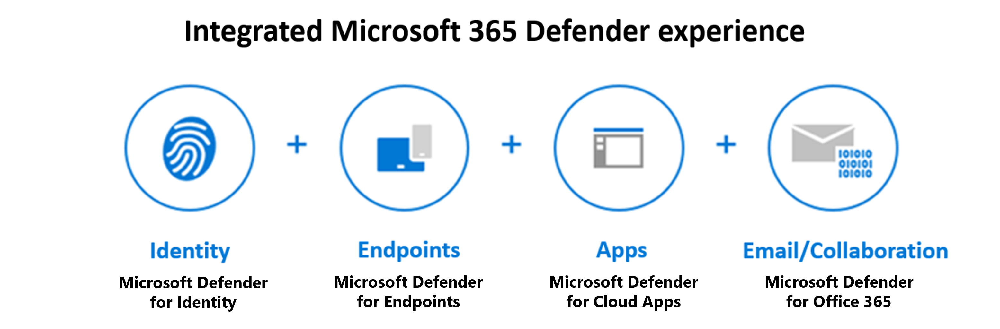

Microsoft 365 Defender suite protects: 
- Identities with Microsoft Defender for Identity and Azure AD Identity Protection - Microsoft Defender for Identity uses Active Directory signals to identify, detect, and investigate advanced threats, compromised identities, and malicious insider actions directed at your organization. 
- Endpoints with Microsoft Defender for Endpoint - Microsoft Defender for Endpoint is a unified endpoint platform for preventative protection, post-breach detection, automated investigation, and response. 
- Applications with Microsoft Defender for Cloud Apps - Microsoft Defender for Cloud Apps is a comprehensive cross-SaaS solution that brings deep visibility, strong data controls, and enhanced threat protection to your cloud apps. 
- Email and collaboration with Microsoft Defender for Office 365 - Defender for Office 365 safeguards your organization against malicious threats posed by email messages, links (URLs), and collaboration tools. 

Use Microsoft Defender to protect your organization against sophisticated cyberattacks. It coordinates your detection, prevention, investigation, and response to threats across endpoints, identities, email, and applications. 

# Microsoft Defender for Office 365 

Microsoft Defender for Office 365 safeguards your organization against malicious threats posed by email messages, links (URLs), and collaboration tools, including Microsoft Teams, SharePoint Online, OneDrive for Business, and other Office clients. 

Microsoft Defender for Office 365 covers these key areas: 
- Threat protection policies: Define threat protection policies to set the appropriate level of protection for your organization. 
- Reports: View real-time reports to monitor Microsoft Defender for Office 365 performance in your organization. 
- Threat investigation and response capabilities: Use leading-edge tools to investigate, understand, simulate, and prevent threats. 
- Automated investigation and response capabilities: Save time and effort investigating and mitigating threats. 

Microsoft Defender for Office 365 is available in two plans. The plan you choose influences the tools you’ll see and use. It's important to make sure you select the best plan to meet your organization's needs. 

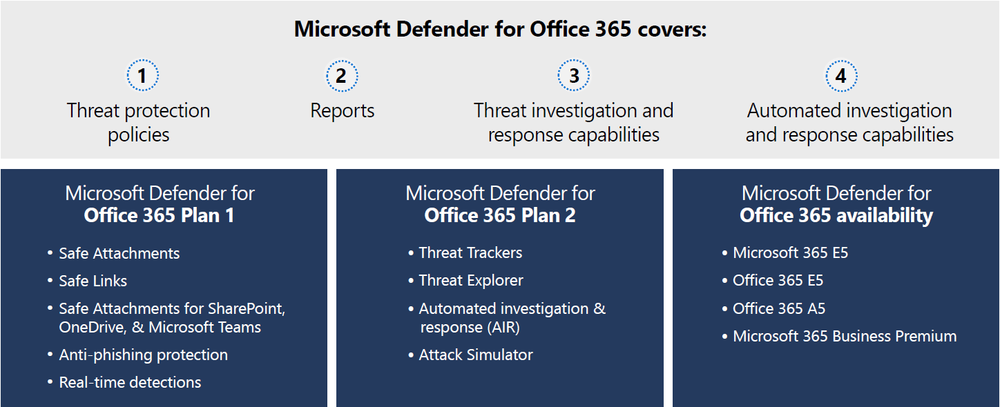

## Microsoft Defender for Office 365 Plan 1 

This plan offers configuration, protection, and detection tools for your Office 365 suite: 
- Safe Attachments: Checks email attachments for malicious content. 
- Safe Links: Links are scanned for each click. A safe link remains accessible, but malicious links are blocked. 
- Safe Attachments for SharePoint, OneDrive, and Microsoft Teams: Protects your organization when users collaborate and share files by identifying and blocking malicious files in team sites and document libraries. 
- Anti-phishing protection: Detects attempts to impersonate your users and internal or custom domains. 
- Real-time detections: A real-time report that allows you to identify and analyze recent threats. 

## Microsoft Defender for Office 365 Plan 2 

This plan includes all the core features of Plan 1, and provides automation, investigation, remediation, and simulation tools to help protect your Office 365 suite: 
- Threat Trackers: Provide the latest intelligence on prevailing cybersecurity issues, and allow an organization to take countermeasures before there's an actual threat. 
- Threat Explorer: A real-time report that allows you to identify and analyze recent threats. 
- Automated investigation and response (AIR): Includes a set of security playbooks that can be launched automatically, such as when an alert is triggered, or manually. A security playbook can start an automated investigation, provide detailed results, and recommend actions that the security team can approve or reject. 
- Attack Simulator: Allows you to run realistic attack scenarios in your organization to identify vulnerabilities. These simulations test your security policies and practices, as well as train your employees to increase their awareness and decrease their susceptibility to attacks. 
- Proactively hunt for threats with advanced hunting in Microsoft 365 Defender: Advanced hunting is a query-based threat hunting tool that lets you explore up to 30 days of raw data. You can proactively inspect events in your network to locate threat indicators and entities. 
- Investigate alerts and incidents in Microsoft 365 Defender: Microsoft Defender for Office 365 P2 customers have access to Microsoft 365 Defender integration to efficiently detect, review, and respond to incidents and alerts. 

## Microsoft Defender for Office 365 availability 

Microsoft Defender for Office 365 is included in certain subscriptions, such as Microsoft 365 E5, Office 365 E5, Office 365 A5, and Microsoft 365 Business Premium. 
If your subscription doesn’t include Defender for Office 365, you can purchase it as an add-on. 
Use Microsoft 365 Defender for Office 365 to protect your organization's collaboration tools and messages. 

# Microsoft Defender for Endpoint 

Microsoft Defender for Endpoint is a platform designed to help enterprise networks protect endpoints. It does so by preventing, detecting, investigating, and responding to advanced threats. Microsoft Defender for Endpoint embeds technology built into Windows 10 and MSFT cloud services. 
 
This technology includes endpoint behavioral sensors that collect and process signals from the operating system, cloud security analytics that turn signals into insights, detections and recommendations, and threat intelligence to identify attacker tools & techniques, and generate alerts. 
 
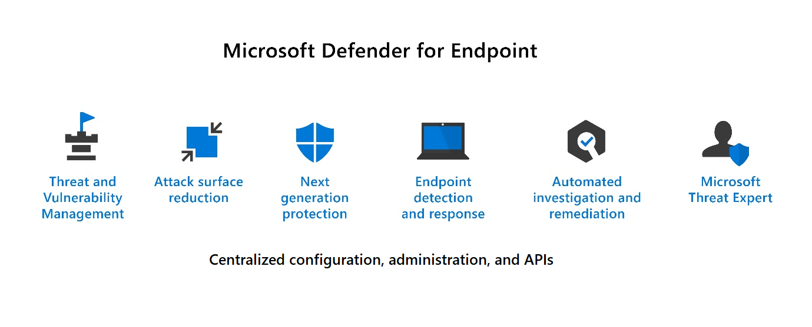

Microsoft Defender for Endpoint includes: 
- Threat and vulnerability management: A risk-based approach to the discovery, prioritization, and remediation of endpoint vulnerabilities and misconfigurations. It uses sensors on devices to avoid the need for agents or scans, and prioritizes vulnerabilities. 
- Attack surface reduction: The attack surface reduction set of capabilities provides the first line of defense in the stack. By ensuring configuration settings are properly set and exploit mitigation techniques are applied, the capabilities resist attacks and exploitation. This set of capabilities also includes network protection and web protection, which regulate access to malicious IP addresses, domains, and URLs; helping prevent apps from accessing dangerous locations 
- Next generation protection: Brings together machine learning, big data analysis, in-depth threat resistance research, and the Microsoft cloud infrastructure to protect devices in your enterprise organization. 
- Endpoint detection and response: Provides advanced attack detections that are near real time and actionable. Security analysts can prioritize alerts, see the full scope of a breach, and take response actions to remediate threats. 
- Automated investigation and remediation: The automated investigation feature uses inspection algorithms and processes used by analysts (such as playbooks) to examine alerts and take quick remediation action to resolve breaches. This process significantly reduces the volume of alerts that must be investigated individually. 
- Microsoft Threat Experts: A managed threat hunting service that provides Security Operation Centers (SOCs) with monitoring and analysis tools to ensure critical threats don’t get missed. 
- Management and APIs: Provides APIs to integrate with other solutions. 

Microsoft Defender for Endpoint includes Microsoft Secure Score for Devices to help you dynamically assess the security state of your enterprise network, identify unprotected systems, and take recommended actions to improve overall security. Microsoft Defender for Endpoint integrates with various components in the Microsoft Defender suite, and with other Microsoft solutions including Intune and Microsoft Defender for Cloud. 

Use Microsoft Defender for Endpoint to protect your organization's endpoints and respond to advanced threats. 

## Microsoft Defender for Cloud Apps 

Moving to the cloud increases flexibility for employees and IT teams. However, it also introduces new challenges and complexities for keeping your organization secure. To get the full benefit of cloud apps and services, an IT team must find the right balance for supporting access while protecting critical data. 
 
Microsoft Defender for Cloud Apps is a Cloud Access Security Broker (CASB). It's a comprehensive cross-SaaS solution that operates as an intermediary between a cloud user and the cloud provider. Microsoft Defender for Cloud Apps provides rich visibility to your cloud services, control over data travel, and sophisticated analytics to identify and combat cyberthreats across all your Microsoft and third-party cloud services. Use this service to gain visibility into Shadow IT by discovering the cloud apps being used. You can control and protect data in the apps after you sanction them to the service. 

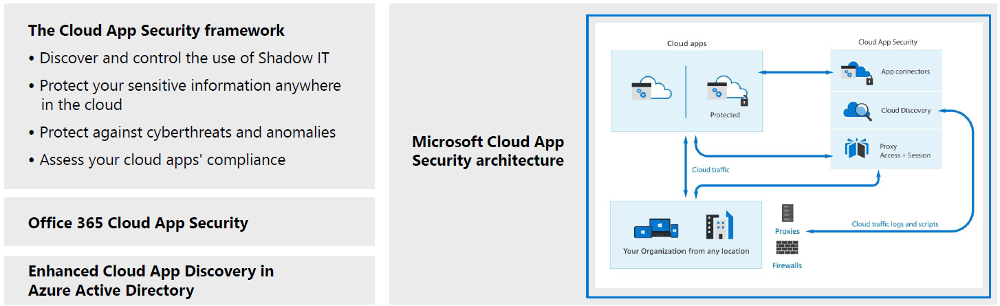
 
## What is a Cloud Access Security Broker? 

A CASB acts as a gatekeeper to broker real-time access between your enterprise users and the cloud resources they use, wherever they're located, and regardless of the device they're using. CASBs help organizations protect their environment by providing a wide range of capabilities across the following pillars: 
- Visibility - Detect cloud services and app use and provide visibility into Shadow IT. 
- Threat protection - Monitor user activities for anomalous behaviors, control access to resources through access controls, and mitigate malware. 
- Data security - Identify, classify and control sensitive information, protecting against malicious actors. 
- Compliance - Assess the compliance of cloud services. 

These capability areas represent the basis of the Defender for Cloud Apps framework described below. 

## The Defender for Cloud Apps framework 

Microsoft Defender for Cloud Apps is built on a framework that provides the following capabilities: 
- Discover and control the use of Shadow IT: Identify the cloud apps, and IaaS and PaaS services used by your organization. Investigate usage patterns, assess the risk levels and business readiness of more than 25,000 SaaS apps against more than 80 risks. 
- Protect against cyberthreats and anomalies: Detect unusual behavior across cloud apps to identify ransomware, compromised users, or rogue applications, analyze high-risk usage, and remediate automatically to limit risks. 
- Protect your sensitive information anywhere in the cloud: Understand, classify, and protect the exposure of sensitive information at rest. Use out-of-the-box policies and automated processes to apply controls in real time across all your cloud apps. 
- Assess your cloud apps' compliance: Assess if your cloud apps meet relevant compliance requirements, including regulatory compliance and industry standards. Prevent data leaks to non-compliant apps and limit access to regulated data. 

## Microsoft Defender for Cloud Apps functionality 

Defender for Cloud Apps Security delivers on the components of the framework through an extensive list of features and functionality. Listed below are some examples. 
- Cloud Discovery maps and identifies your cloud environment and the cloud apps your organization uses. Cloud Discovery uses your traffic logs to dynamically discover and analyze the cloud apps being used. 
- Sanctioning and unsanctioning apps in your organization by using the Cloud apps catalog that includes over 25,000 cloud apps. The apps are ranked and scored based on industry standards. You can use the cloud app catalog to rate the risk for your cloud apps based on regulatory certifications, industry standards, and best practices. 
- Use App connectors to integrate Microsoft and non-Microsoft cloud apps with Microsoft Defender for Cloud Apps, extending control and protection. Defender for Cloud Apps queries the app for activity logs, and it scans data, accounts, and cloud content that can be used to enforce policies, detect threats and provide governance actions to resolve issues. 
- Conditional Access App Control protection provides real-time visibility and control over access and activities within your cloud apps. Avoid data leaks by blocking downloads before they happen, setting rules to require data stored in and downloaded from the cloud to be protected with encryption, and controlling access from non-corporate or risky networks. 
- Use policies to detect risky behavior, violations, or suspicious data points and activities in your cloud environment. You can use policies to integrate remediation processes to achieve risk mitigation. 

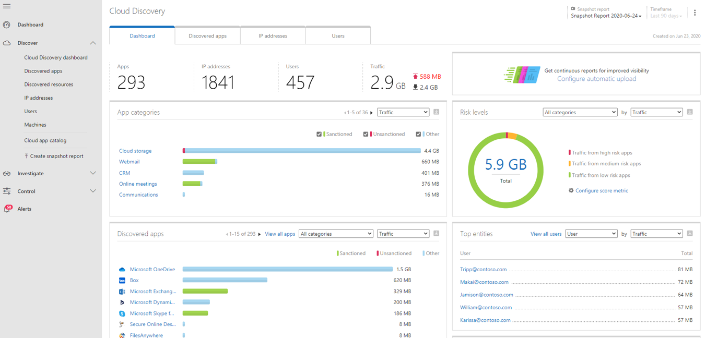

In this interactive guide, you’ll get an introduction to the capabilities available with Microsoft Defender for Cloud Apps. Select the image below to get started and follow the prompts on the screen. 

## Office 365 Cloud App Security 

Office 365 Cloud App Security is a subset of Microsoft Defender for Cloud Apps that provides enhanced visibility and control for Office 365. Office 365 Cloud App Security includes threat detection based on user activity logs, discovery of Shadow IT for apps with similar functionality to Office 365 offerings, control app permissions to Office 365, and apply access and session controls. 

It offers a subset of the core Microsoft Defender for Cloud Apps features. 

## Enhanced Cloud App Discovery in Azure Active Directory 
Azure Active Directory Premium P1 includes Azure Active Directory Cloud App Discovery at no extra cost. This feature is based on the Microsoft Defender for Cloud Apps Cloud Discovery capabilities that provide deeper visibility into cloud app usage in your organization. 
It provides a reduced subset of the Microsoft Defender for Cloud Apps discovery capabilities. 

Use Microsoft Defender for Cloud Apps to intelligently and proactively identify and respond to threats across your organization's Microsoft and non-Microsoft cloud services. 

# Microsoft Defender for Identity

Microsoft Defender for Identity is a cloud-based security solution. It uses your on-premises Active Directory data (called signals) to identify, detect, and investigate advanced threats, compromised identities, and malicious insider actions directed at your organization. 

Microsoft Defender for Identity provides security professionals managing hybrid environments functionality to: 
- Monitor and profile user behavior and activities. 
- Protect user identities and reduce the attack surface. 
- Identify and investigate suspicious activities and advanced attacks across the cyberattack kill-chain. 
- Provide clear incident information on a simple timeline for fast triage 
 
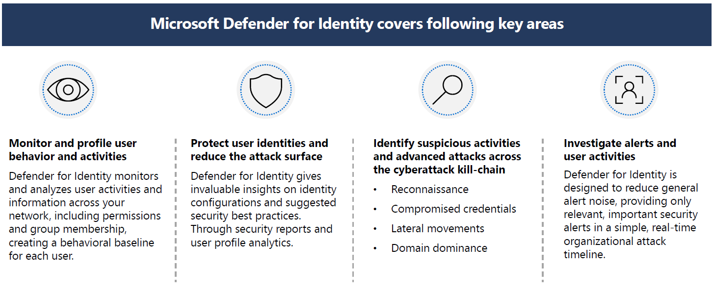

## Monitor and profile user behavior and activities 

Defender for Identity monitors and analyzes user activities and information across your network, including permissions and group membership, creating a behavioral baseline for each user. Defender for Identity then identifies anomalies with adaptive built-in intelligence. It gives insights into suspicious activities and events, revealing the advanced threats, compromised users, and insider threats facing your organization. 

## Protect user identities and reduce the attack surface 

Defender for Identity provides insights on identity configurations and suggested security best practices. Through security reports and user profile analytics, Defender for Identity helps reduce your organizational attack surface, making it harder to compromise user credentials and advance an attack. 

Defender for Identity security reports, help identify users and devices that authenticate using clear-text passwords. It also provides extra insights into how to improve security posture and policies. 

For hybrid environments in which Active Directory Federation Services (AD FS) is present, Defender for Identity protects the AD FS by detecting on-premises attacks and providing visibility into authentication events generated by the AD FS. 

## Identify suspicious activities and advanced attacks across the cyberattack kill-chain 

Typically, attacks are launched against any accessible entity, such as a low-privileged user. Attacks then quickly move laterally until the attacker accesses valuable assets. These assets might include sensitive accounts, domain administrators, and highly sensitive data. Defender for Identity identifies these advanced threats at the source throughout the entire cyberattack kill-chain: 
- Reconnaissance 
- Compromised credentials 
- Lateral movements 
- Domain dominance 

## Investigate alerts and user activities 

Defender for Identity is designed to reduce general alert noise, providing only relevant, important security alerts in a simple, real-time organizational attack timeline. 
Use the Defender for Identity attack timeline view and the intelligence of smart analytics to stay focused on what matters. Also, you can use Defender for Identity to quickly investigate threats, and gain insights across the organization for users, devices, and network resources. 
Microsoft Defender for Identity protects your organization from compromised identities, advanced threats, and malicious insider actions. 

# Microsoft 365 Defender portal

Microsoft 365 Defender natively coordinates detection, prevention, investigation, and response across endpoints, identities, email, and applications to provide integrated protection against sophisticated attacks. The Microsoft 365 Defender portal brings this functionality together into a central place that is designed to meet the needs of security teams and emphasizes quick access to information, simpler layouts. Through the Microsoft 365 Defender portal you can view the security health of your organization. 

The Microsoft 365 Defender portal home page shows many of the common cards that security teams need. The composition of cards and data depends on the user role. Because the Microsoft 365 Defender portal uses role-based access control, different roles will see cards that are more meaningful to their day-to-day jobs. 

The cards fall into these categories: 
- Identities- Monitor the identities in your organization and keep track of suspicious or risky behaviors. 
- Data - Help track user activity that could lead to unauthorized data disclosure. 
- Devices - Get up-to-date information on alerts, breach activity, and other threats on your devices. 
- Apps - Gain insight into how cloud apps are being used in your organization. 
 
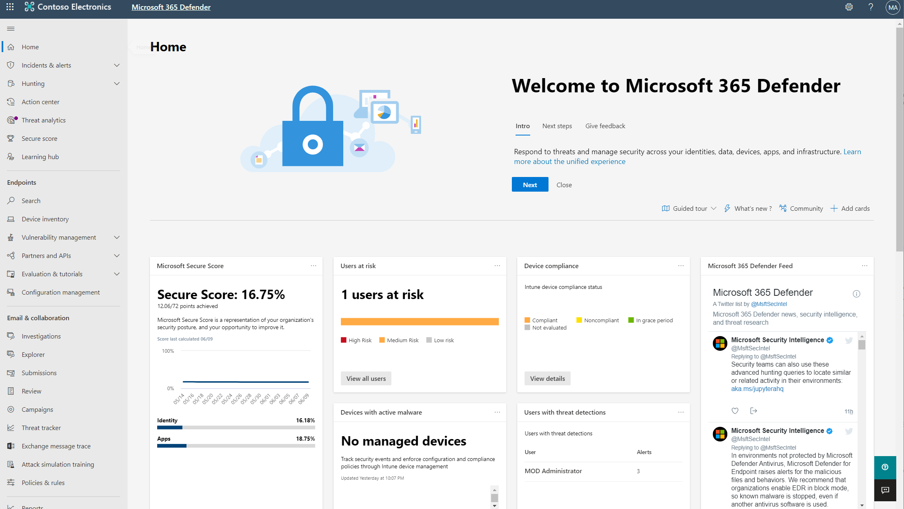

The Microsoft 365 Defender portal allows admins to tailor the navigation pane to meet daily operational needs. Admins can customize the navigation pane to show or hide functions and services based on their specific preferences. Customization is specific to the individual admin, so other admins won’t see these changes. 

Note:
You must be assigned an appropriate role, such as Global Administrator, Security Administrator, Security Operator, or Security Reader in Azure Active Directory to access the Microsoft 365 Defender portal. 
The left navigation pane provides security professionals easy access to the email and collaboration capabilities of Microsoft Defender for Office 365 and the capabilities for Microsoft Defender for Endpoint which were described in the previous units. Listed below we describe a few of the other capabilities accessible from the left navigation bar in the Microsoft 365 Defender portal. 

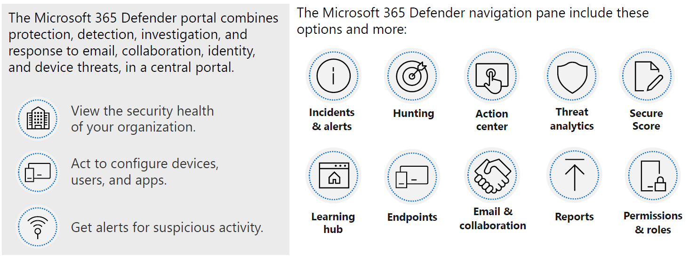

## Incidents and alerts 

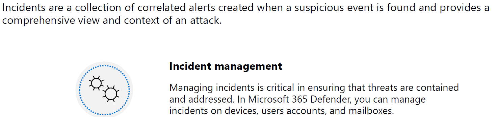

Microsoft 365 services and apps create alerts when they detect a suspicious or malicious event or activity. Individual alerts provide valuable clues about a completed or ongoing attack. These alerts are automatically aggregated by Microsoft 365 Defender. It's the grouping of these related alerts that form an incident. The incident provides a comprehensive view and context of an attack. 

The incidents queue is a central location lists each incident by severity. Selecting an incident name displays a summary of the incident and provides access to tabs with additional information, including: 
- All the alerts related to the incident. 
- All the users that have been identified to be part of or related to the incident. 
- All the mailboxes that have been identified to be part of or related to the incident. 
- All the automated investigations triggered by the alerts in the incident. 
- All the supported evidence and response. 

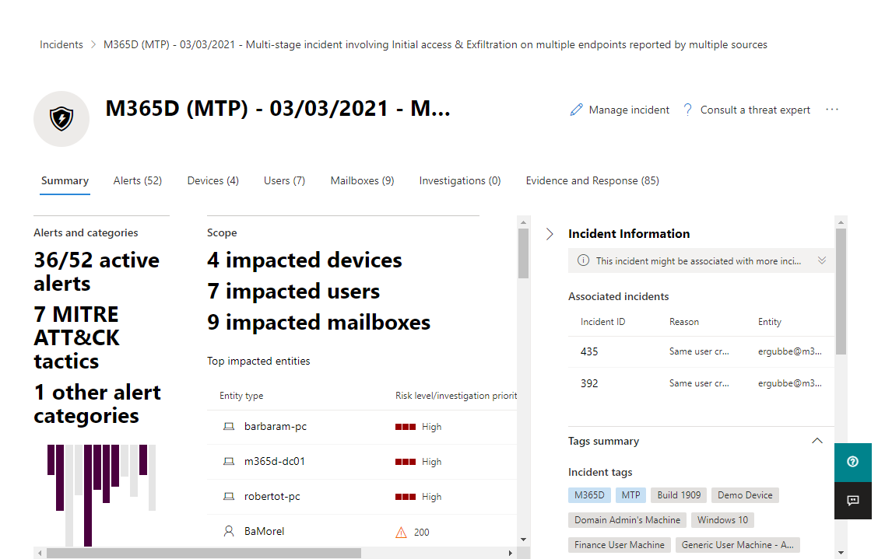

### Hunting 

Advanced hunting is a query-based threat-hunting tool that lets security professionals explore up to 30 days of raw data. Advanced hunting queries enable security professionals to proactively search for threats, malware, and malicious activity across your endpoints, Office 365 mailboxes, and more. Threat-hunting queries can be used to build custom detection rules. These rules run automatically to check for and then respond to suspected breach activity, misconfigured machines, and other findings. 

## Threat analytics 

Threat analytics is our in-product threat intelligence solution from expert Microsoft security researchers. It's designed to assist security teams track and respond to emerging threats. The threat analytics dashboard highlights the reports that are most relevant to your organization. It includes the latest threats, high impact threats (threats with the most active alerts affecting your organization), and high exposure threats. 
Selecting a specific threat from the dashboard provides a threat analytics report that provides more detailed information that includes detailed analyst report, impacted assets, mitigations, and much more. 

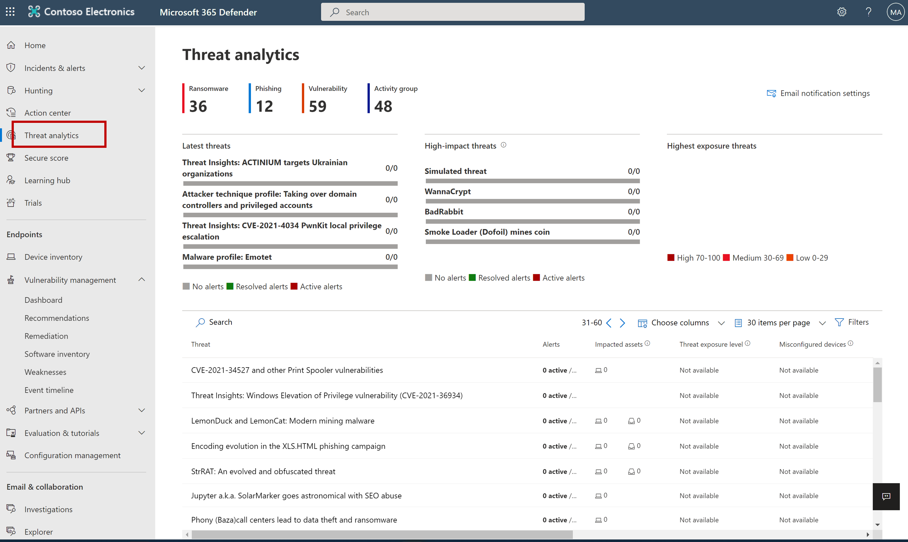

## Secure Score 

Microsoft Secure Score, one of the tools in the Microsoft 365 Defender portal, is a representation of a company's security posture. The higher the score, the better your protection. From a centralized dashboard in the Microsoft 365 Defender portal, organizations can monitor and work on the security of their Microsoft 365 identities, apps, and devices. 
Secure Score helps organizations: 
- Report on the current state of their security posture. 
- Improve their security posture by providing discoverability, visibility, guidance, and control. 
- Compare benchmarks and establish key performance indicators (KPIs). 
Currently Microsoft Secure Score supports recommendations for Microsoft 365 (including Exchange Online), Azure Active Directory, Microsoft Defender for Endpoint, Microsoft Defender for Identity, Microsoft Defender Cloud Apps, and Microsoft Teams. New recommendations are being added to Secure Score all the time. 
The image below shows an organization's Secure Score, a breakdown of the score by points, and the improvement actions that can boost the organization's score. Finally, it provides an indication of how well the organization's Secure Score compares to other similar organizations. 

To explore Microsoft Secure Score, select the interactive guide below and follow the prompts on the screen. 

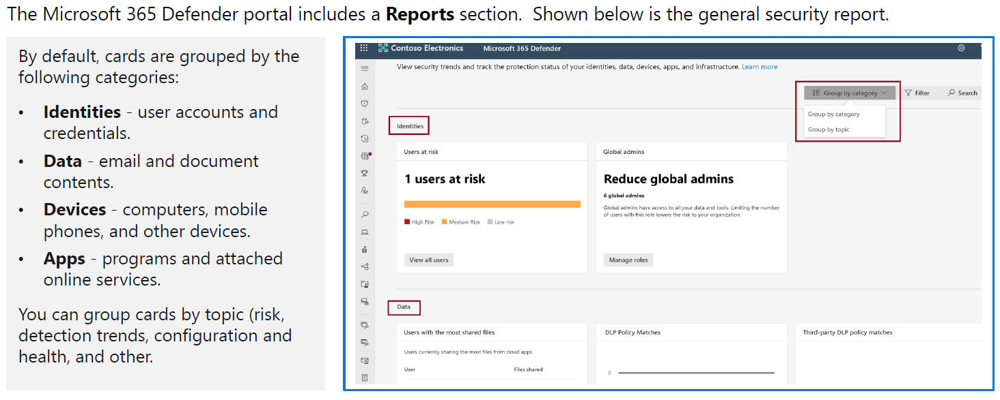

### Differences between secure score in Microsoft 365 Defender and Microsoft Defender for Cloud 

There's a secure score for both Microsoft 365 Defender and Microsoft Defender for Cloud, but they're subtly different. Secure score in Microsoft Defender for Cloud is a measure of the security posture of your Azure subscriptions. Secure score in the Microsoft 365 Defender portal is a measure of the security posture of the organization across your apps, devices, and identities. 

## Learning hub 

The Microsoft 365 Defender portal includes a learning hub that bubbles up official guidance from resources such as the Microsoft security blog, the Microsoft security community on YouTube, and the official documentation at docs.microsoft.com. 

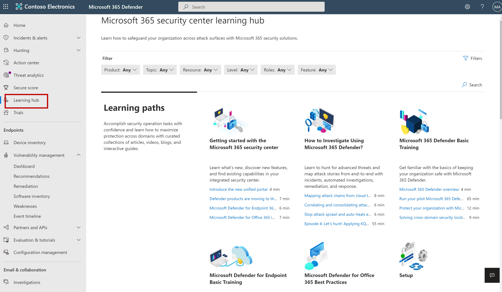

## Reports

Reports are unified in Microsoft 365 Defender. Admins can start with a general security report, and branch into specific reports about endpoints, email & collaboration. The links here are dynamically generated based upon workload configuration. 

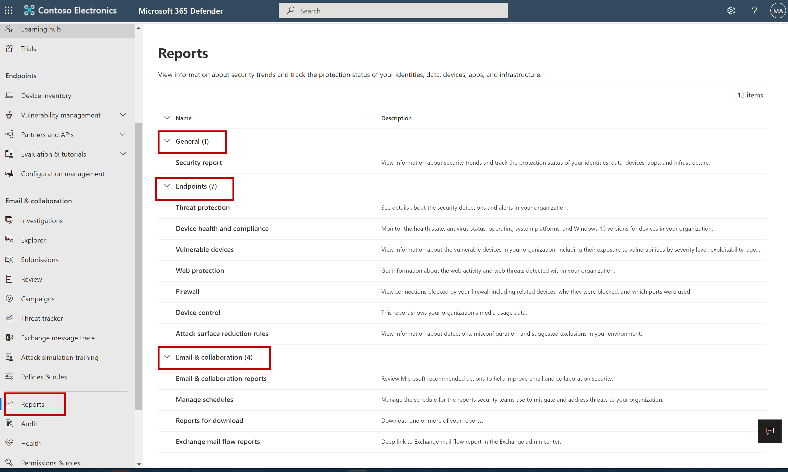

## Permissions & roles 

Access to Microsoft 365 Defender is configured with Azure Active Directory global roles or by using custom roles. 

# Intune

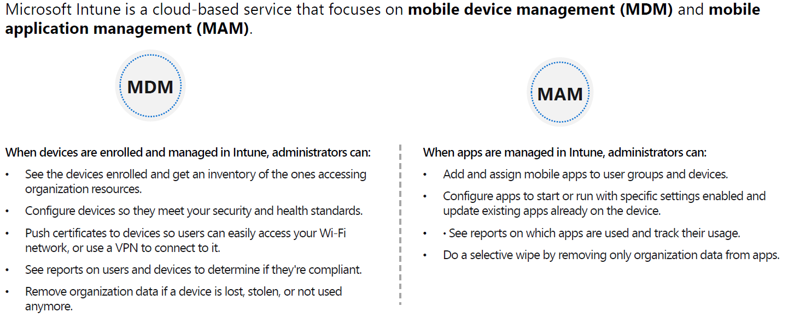

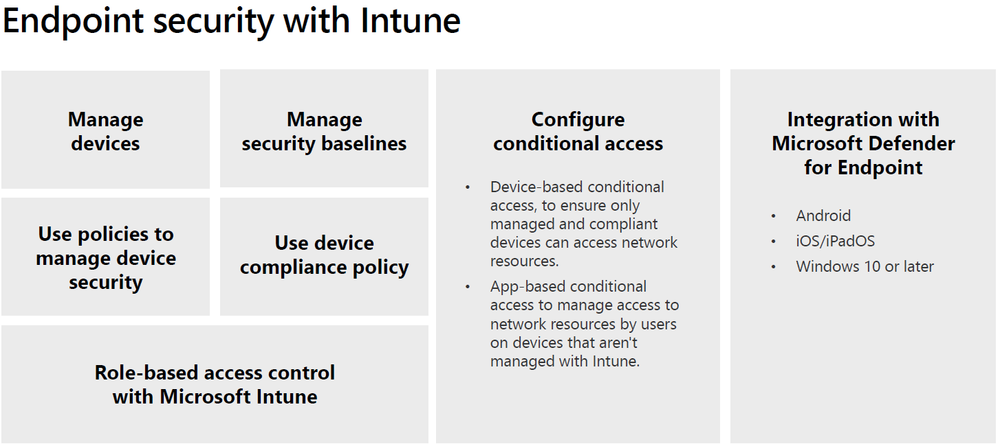

# Knowledge Check

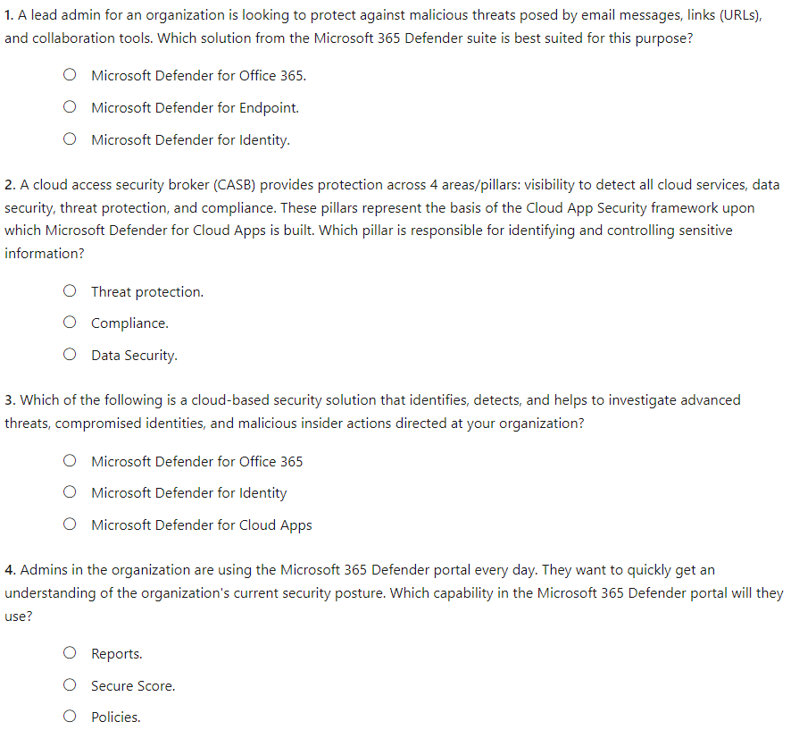

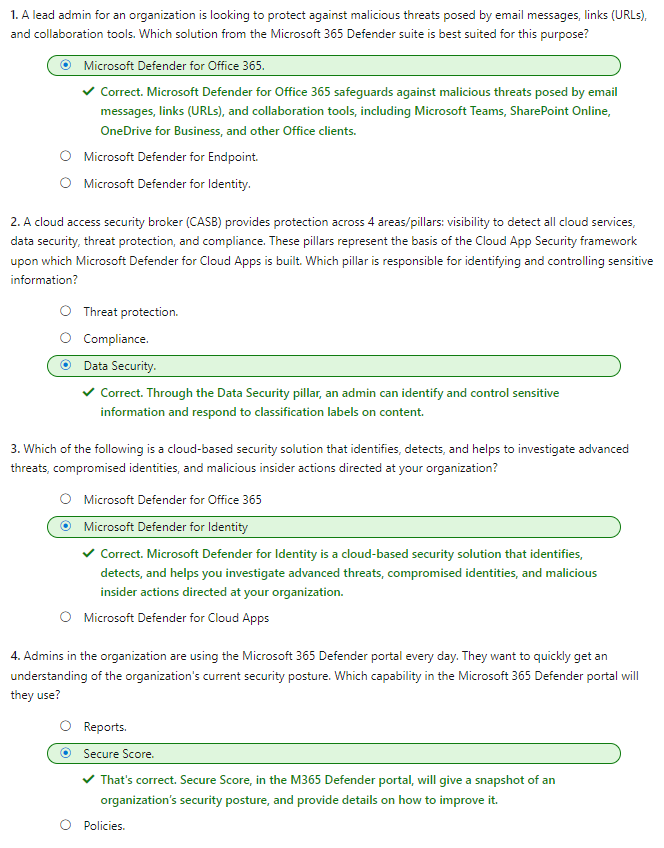
