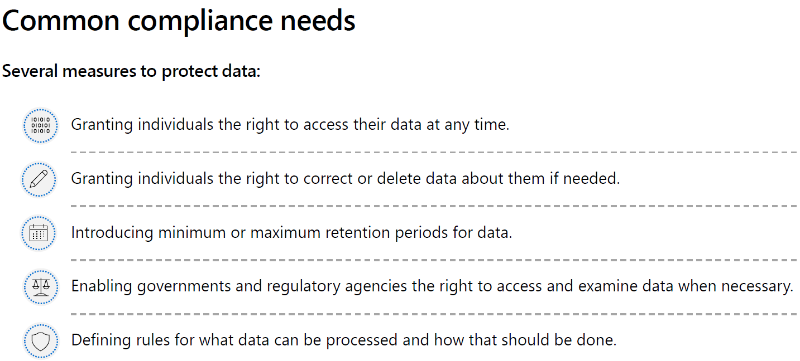
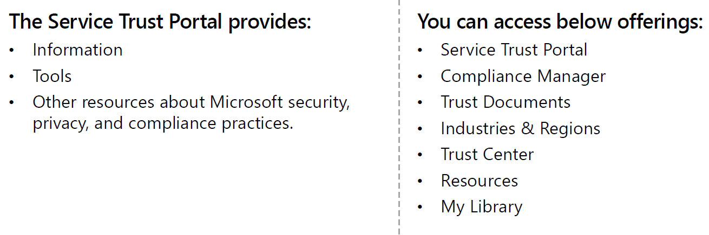
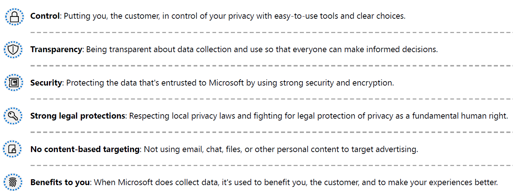
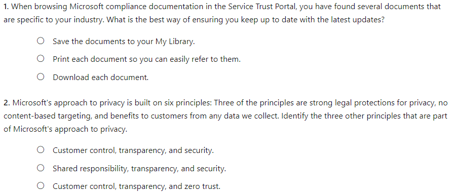
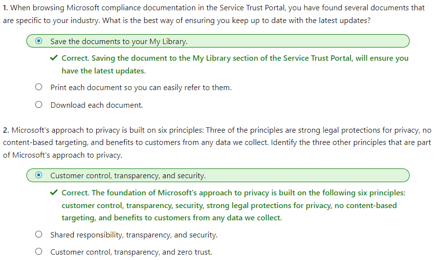

#### Microsoft Security Compliance and Identity Fundamentals | M4 Capabilities of Microsoft compliance solutions 
#### M4-1: Compliance Management Capabilities at Microsoft 

> Microsoft Cloud services are built on a foundation of trust, security, and compliance. The Microsoft Service Trust Portal provides a variety of content, tools, and other resources about Microsoft security, privacy, and compliance practices. 
> In this module you'll learn about the Service Trust Portal and resources it provides, including audit reports, security assessments, and compliance guides that enable organizations to manage compliance. You'll also learn about Microsoft's commitment to privacy and its privacy principles.
> After completing this module, you'll be able to: 
> - Describe the offerings of the Service Trust Portal. 
> - Describe Microsoft’s privacy principles. 

# Common Compliance Needs 

# Service Trust Portal 

The Service Trust Portal provides information, tools, and other resources about Microsoft security, privacy, and compliance practices. Sign in with your Microsoft cloud services account to access all the available documentation. 

From the main menu, you access: 

- Service Trust Portal – This link provides a quick way to get back to the home page for the Service Trust Portal. 
- Compliance Manager – This link currently directs users to Compliance Manager in the Microsoft 365 compliance center. Users are encouraged to use the Microsoft 365 Compliance Center for access to Compliance Manager and other compliance management capabilities in Microsoft 365. To find out more, see the Microsoft Compliance Manager documentation in the Learn More section of the Summary and resources unit. 
- Trust Documents – Trust Documents provides a wealth of security implementation and design information with the goal of making it easier for organizations to meet regulatory compliance objectives, by understanding how Microsoft Cloud services keep customer data secure. To review content, select one of the following options on the Trust Documents pull-down menu. 
- Audit Reports provides a list of independent audit and assessment reports on Microsoft's Cloud services is displayed. These reports provide information about Microsoft Cloud services compliance with data protection standards and regulatory requirements. 
- Data Protection contains a wealth of resources such as audited controls, white papers, FAQs, penetration tests, risk assessment tools, and compliance guides. 
- Azure Stack contains documents that provide security and compliance solutions and support, tailored to the needs of Azure Stack customers. 
- Industries & Regions – This link provides access to compliance information about Microsoft Cloud services organized by industry and region. 
- Industry Solutions directs users to the landing page for the Financial Services industry. This contains information such as compliance offerings, FAQs, and success stories. Resources for more industries will be released in the future, however you can find resources for more industries by going to the Trust Documents > Data Protection page in the STP. 
- Regional Solutions provides documents on Microsoft Cloud services compliance with the laws of various countries/regions. Specific countries/regions include Australia, Canada, Czech Republic, Denmark, Germany, Poland, Romania, Spain, and the United Kingdom. links currently have information for: Australia, Canada, Czech Republic, Denmark, Germany, Poland, Romania, Spain, and the United Kingdom. 
- Trust Center – The option links to the Microsoft Trust Center, which provides more information about privacy, security, and compliance in the Microsoft Cloud. 
- Resources – This option links to The Office 365 Security & Compliance Center which includes a variety of features and tools for data governance and protection. The resources option also links to information about the Microsoft Global Datacenters and Frequently Asked Questions. 
- My Library – This feature lets you save documents so that you can quickly access them on your My Library page. You can also set up notifications so that Microsoft sends you an email message when documents in your My Library are updated. 
- More - This option provides an admin selection which is available only to Global Administrators and relates to options associated with Compliance Manager. Admins, however, are encouraged to use the Microsoft 365 Compliance Center. 

# Microsoft's privacy principles 

Microsoft’s products and services run on trust. At Microsoft, we value, protect, and defend privacy. We believe in transparency, so that people and organizations can control their data and have meaningful choices in how it's used. We empower and defend the privacy choices of every person who uses our products and services. 

Microsoft's approach to privacy is built on the following six principles: 
- Control: Putting you, the customer, in control of your data and your privacy with easy-to-use tools and clear choices. Your data is your business, and you can access, modify, or delete it at any time. Microsoft will not use your data without your agreement, and when we have your agreement, we use your data to provide only the services you have chosen. Your control over your data is reinforced by Microsoft compliance with broadly applicable privacy laws and privacy standards. 
- Transparency: Being transparent about data collection and use so that everyone can make informed decisions. We only process your data based on your agreement and in accordance with the strict policies and procedures that we've contractually agreed to. When we deploy subcontractors or subprocessors to perform work that requires access to your data, they can perform only the functions that Microsoft has hired them to provide, and they're bound by the same contractual privacy commitments that Microsoft makes to you. The Microsoft Online Services Subprocessor List identifies authorized, subprocessors, who have been audited against a stringent set of security and privacy requirements in advance. This document is available as one of the data protection resources in the Service Trust Portal. 
- Security: Protecting the data that's entrusted to Microsoft by using strong security and encryption. With state-of-the-art encryption, Microsoft protects your data both at rest and in transit. Our encryption protocols erect barriers against unauthorized access to the data, including two or more independent encryption layers to protect against compromises of any one layer. All Microsoft-managed encryption keys are properly secured and offer the use of technologies such as Azure Key Vault to help you control access to passwords, encryption keys, and other secrets. 
- Strong legal protections: Respecting local privacy laws and fighting for legal protection of privacy as a fundamental human right. Microsoft defends your data through clearly defined and well-established response policies and processes, strong contractual commitments, and if necessary, the courts. We believe all government requests for your data should be directed to you. We don’t give any government direct or unfettered access to customer data. We will not disclose data to a government or law enforcement agency, except as you direct or where required by law. Microsoft scrutinizes all government demands to ensure they're legally valid and appropriate. If Microsoft receives a request for your data, we'll promptly notify you and provide a copy of the request unless legally prohibited from doing so. Moreover, we'll direct the requesting party to seek the data directly from you. Our contractual commitments to our enterprise and public sector customers include defending your data, which builds on our existing protections. We'll challenge every government request for commercial and public sector customer data where we can lawfully do so. 
- No content-based targeting: Not using email, chat, files, or other personal content to target advertising. We do not share your data with advertiser-supported services, nor do we mine it for any purposes like marketing research or advertising. 
- Benefits to you: When Microsoft does collect data, it's used to benefit you, the customer, and to make your experiences better. For example: 
- Troubleshooting: Troubleshooting for preventing, detecting, and repairing problems affecting operations of services. 
- Feature improvement: Ongoing improvement of features including increasing reliability and protection of services and data. 
- Personalized customer experience: Data is used to provide personalized improvements and better customer experiences. 
These principles form Microsoft’s privacy foundation, and they shape the way that products and services are designed. 

# Knowledge Check

