#### Microsoft Security Compliance and Identity Fundamentals | M4 Capabilities of Microsoft compliance solutions 
#### M4-2: Compliance Management Capabilities in Microsoft 365 

> Organizations must stay in line with compliance-related legal, regulatory, and privacy standards to protect their customers, partners, and themselves. Microsoft 365 provides tools and capabilities to enable organizations to manage compliance. 
>
> The Microsoft Purview compliance portal is the portal for organizations to manage their compliance needs using integrated solutions for information protection, information governance, insider risk management, discovery, and more. 
>
> In this module, you’ll learn about the Microsoft Purview compliance portal. You'll learn about the Compliance Manager and compliance score, which can help organizations manage, simplify, and improve compliance across their organization. 
> After completing this module, you'll be able to: 
> - Describe the Microsoft Purview compliance portal. 
> - Describe Compliance Manager. 
> - Describe the use and benefits of compliance score. 

# Microsoft 365 Compliance Center 

The Microsoft Purview compliance portal brings together all of the tools and data that are needed to help understand and manage an organization’s compliance needs. 

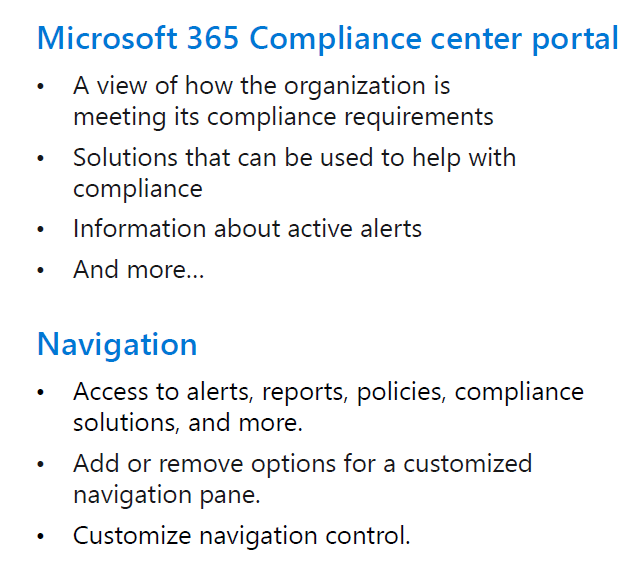

The compliance portal is available to customers with a Microsoft 365 SKU with one of the following roles: 
•	Global administrator 
•	Compliance administrator 
•	Compliance data administrator 
 
When an admin signs in to the Microsoft Purview compliance portal, the card section on the home page shows, at a glance, how your organization is doing with data compliance, what solutions are available for your organization, and a summary of any active alerts. Admins can customize the card section by moving cards around or adding/removing cards that are displayed on the home screen. 

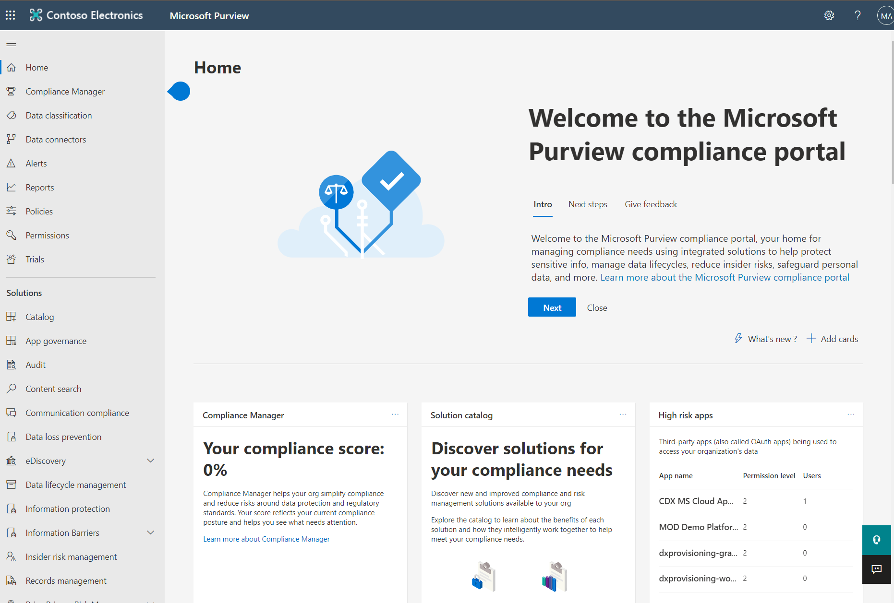

The default compliance portal home page contains several cards including: 
•	The Compliance Manager card. This card leads you to the Compliance Manager solution. Compliance Manager helps simplify the way you manage compliance. It calculates a risk-based compliance score that measures progress toward completing recommended actions to reduce risks associated with data protection and regulatory standards. The Compliance Manager solution also provides workflow capabilities and built-in control mapping to help you efficiently carry out improvement actions. 
o	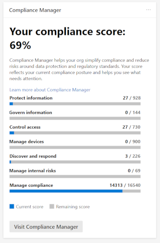
•	The Solution catalog card, links to collections of integrated solutions to help you manage end-to-end compliance scenarios. Solutions areas included: 
o	Information protection & governance. These solutions help organizations classify, protect, and retain your data where it lives and wherever it goes. Included are data lifecycle management, data loss prevention, information protection, and records management. 
o	Privacy. Build a more privacy-resilient workplace. Privacy management gives actionable insights on your organization's personal data to help you spot issues and reduce risks. 
o	Insider risk management. These solutions help organizations identify, analyze, and remediate internal risks before they cause harm. Included are communication compliance, information barriers, and insider risk management. 
o	Discovery & respond. These solutions help organizations quickly find, investigate, and respond with relevant data. Included are Audit, data subject requests, and eDiscovery. 
o	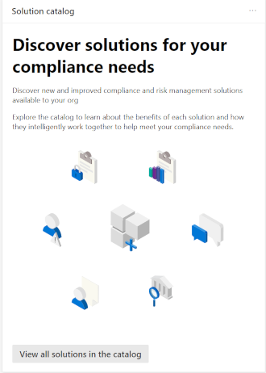
•	The Active alerts card includes a summary of the most active alerts and a link where admins can view more detailed information, such as alert severity, status, category, and more. 
o	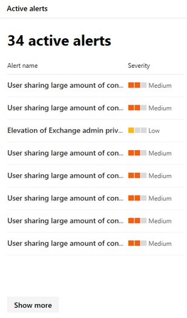
 
## Navigation 
In addition to the cards on the home page, there’s a navigation pane on the left of the screen that gives easy access to the Compliance Manager and the Data Classification page where you can get snapshots of how sensitive information and labels are being used across your organization's locations. You can access alerts, reports, policies, and all the solutions that are included in the solutions catalog. There's access to data connectors that you can use to import non-Microsoft data to Microsoft 365 so it can be covered by your compliance solutions. The Customize navigation control allows customization of which items appear in the navigation pane. 

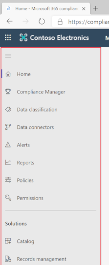

## Interactive guide 
In this interactive guide, you'll explore some of the capabilities of the Microsoft Purview compliance portal, your home for managing compliance needs using integrated solutions for information protection, information governance, insider risk management, discovery, and more. Select the image below to get started and follow the prompts on the screen. 

# Compliance Manager

Microsoft Purview Compliance Manager is a feature in the Microsoft Purview compliance portal that helps admins to manage an organization’s compliance requirements with greater ease and convenience. Compliance Manager can help organizations throughout their compliance journey, from taking inventory of data protection risks, to managing the complexities of implementing controls, staying current with regulations and certifications, and reporting to auditors. 
The following video provides a quick overview of Compliance Manager. 

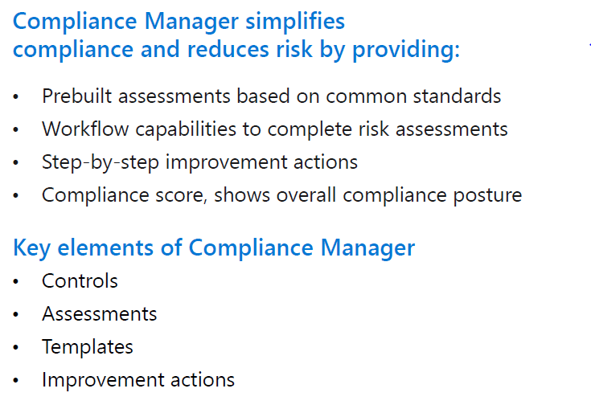

Compliance Manager helps simplify compliance and reduce risk by providing: 
•	Prebuilt assessments based on common regional and industry regulations and standards. Admins can also use custom assessment to help with compliance needs unique to the organization. 
•	Workflow capabilities that enable admins to efficiently complete risk assessments for the organization. 
•	Step-by-step improvement actions that admins can take to help meet regulations and standards relevant to the organization. Some actions will also be managed for the organization by Microsoft. Admins will get implementation details and audit results for those actions. 
•	Compliance score, which is a calculation that helps an organization understand its overall compliance posture by measuring how it's progressing with improvement actions. 
The Compliance Manager dashboard shows the current compliance score, helps admins to see what needs attention, and guides them to key improvement actions. 
 
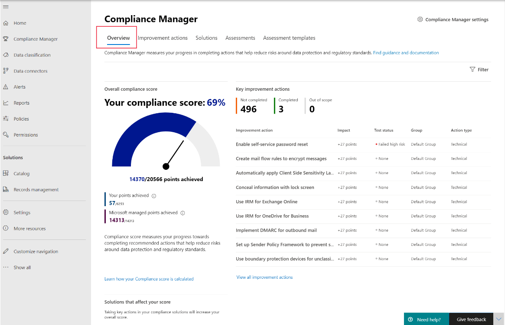

Compliance Manager uses several data elements to help manage compliance activities. As admins use Compliance Manager to assign, test, and monitor compliance activities, it’s helpful to have a basic understanding of the key elements: controls, assessments, templates, and improvement actions. 

## Controls 
A control is a requirement of a regulation, standard, or policy. It defines how to assess and manage system configuration, organizational process, and people responsible for meeting a specific requirement of a regulation, standard, or policy. 

Compliance Manager tracks the following types of controls: 
•	Microsoft-managed controls: controls for Microsoft cloud services, which Microsoft is responsible for implementing. 
•	Your controls: sometimes referred to as customer-managed controls, these are implemented and managed by the organization. 
•	Shared controls: responsibility for implementing these controls is shared by the organization and Microsoft. 

Compliance Manager continuously assesses controls by scanning through your Microsoft 365 environment and detecting your system settings, continuously and automatically updating your technical action status. 

## Assessments 
An assessment is a grouping of controls from a specific regulation, standard, or policy. Completing the actions within an assessment helps to meet the requirements of a standard, regulation, or law. For example, an organization may have an assessment that, when completed, helps to bring the organization’s Microsoft 365 settings in line with ISO 27001 requirements. 

An assessment consists of several components including the services that are in-scope, the controls, and an assessment score that shows progress towards completing the actions needed for compliance. 

## Templates 

Compliance Manager provides templates to help admins to quickly create assessments. They can modify these templates to create an assessment optimized for their needs. Admins can also build a custom assessment by creating a template with their own controls and actions. For example, the admin may want a template to cover an internal business process control, or a regional data protection standard that isn’t covered by one of Microsoft’s 150-plus prebuilt assessment templates. 

## Improvement actions 
Improvement actions help centralize compliance activities. Each improvement action provides recommended guidance that's intended to help organizations to align with data protection regulations and standards. Improvement actions can be assigned to users in the organization to do implementation and testing work. Admins can also store documentation, notes, and record status updates within the improvement action. 

## Benefits of Compliance Manager 

Compliance Manager provides many benefits, including: 
•	Translating complicated regulations, standards, company policies, or other control frameworks into a simple language. 
•	Providing access to a large variety of out-of-the-box assessments and custom assessments to help organizations with their unique compliance needs. 
•	Mapping regulatory controls against recommended improvement actions. 
•	Providing step-by-step guidance on how to implement the solutions to meet regulatory requirements. 
•	Helping admins and users to prioritize actions that will have the highest impact on their organizational compliance by associating a score with each action. 

# Use and Benefits of Compliance Score

Compliance score measures progress in completing recommended improvement actions within controls. The score can help an organization to understand its current compliance posture. It also helps organizations to prioritize actions based on their potential to reduce risk. 

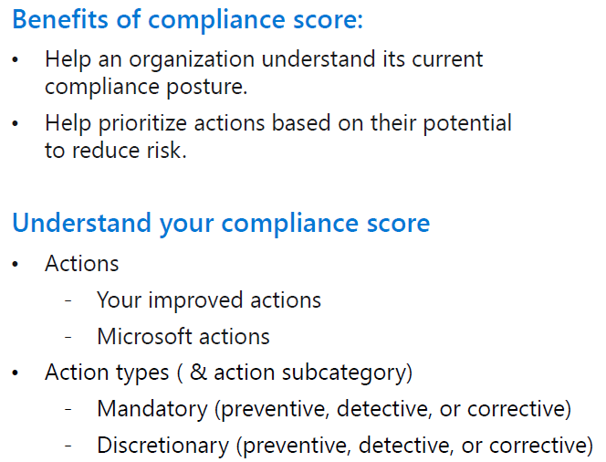

Admins can get a breakdown of the compliance score in the Compliance Manager overview pane. 

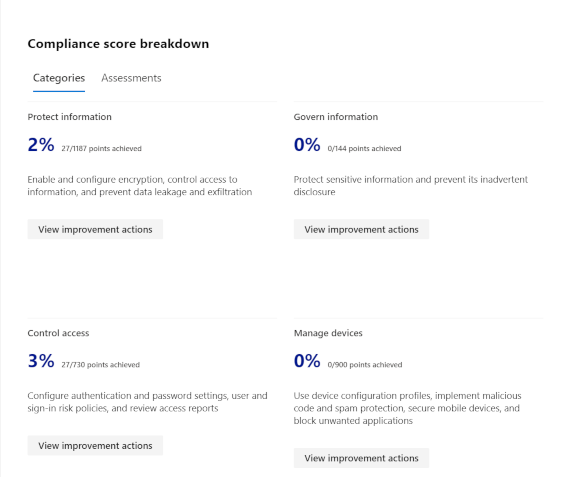
 
## How to understand the compliance score 

The overall compliance score is calculated using scores that are assigned to actions. Actions come in two types: 
•	Your improved actions: actions that the organization is expected to manage. 
•	Microsoft actions: actions that Microsoft manages for the organization. 

Actions are categorized as mandatory, discretionary, preventative, detective, or corrective: 
•	Mandatory – these actions shouldn’t be bypassed. For example, creating a policy to set requirements for password length or expiration. 
•	Discretionary – these actions depend on the users understanding and adhering to a policy. For example, a policy where users are required to ensure their devices are locked before they leave them. 

The following are subcategories of actions that can be classified as mandatory or discretionary: 
•	Preventative actions are designed to handle specific risks, like using encryption to protect data at rest if there were breaches or attacks. 
•	Detective actions actively monitor systems to identify irregularities that could represent risks, or that can be used to detect breaches or intrusions. Examples of these types of actions are system access audits, or regulatory compliance audits. 
•	Corrective actions help admins to minimize the adverse effects of security incidents, by undertaking corrective measures to reduce their immediate effect or possibly even reverse damage. 

Organizations accumulate points for every action completed. And the compliance score is shown as a percentage representing all the actions completed, compared with the ones outstanding. 
 
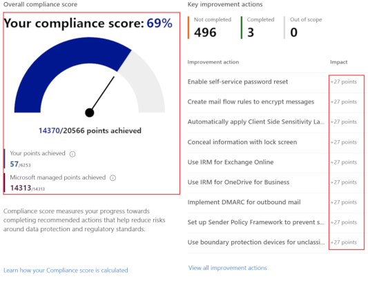

## What is the difference between Compliance Manager and compliance score? 

Compliance Manager is an end-to-end solution in the Microsoft Purview compliance portal to enable admins to manage and track compliance activities. Compliance score is a calculation of the overall compliance posture across the organization. The compliance score is available through Compliance Manager. 

Compliance Manager gives admins the capabilities to understand and increase their compliance score, so they can ultimately improve the organization’s compliance posture and help it to stay in line with compliance requirements. 

# Knowledge Check

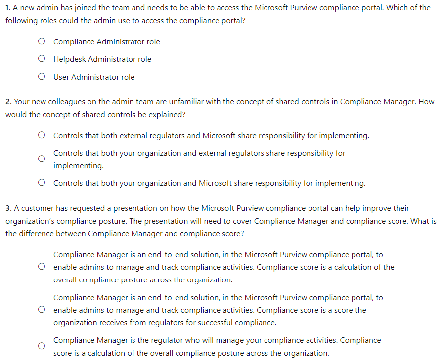

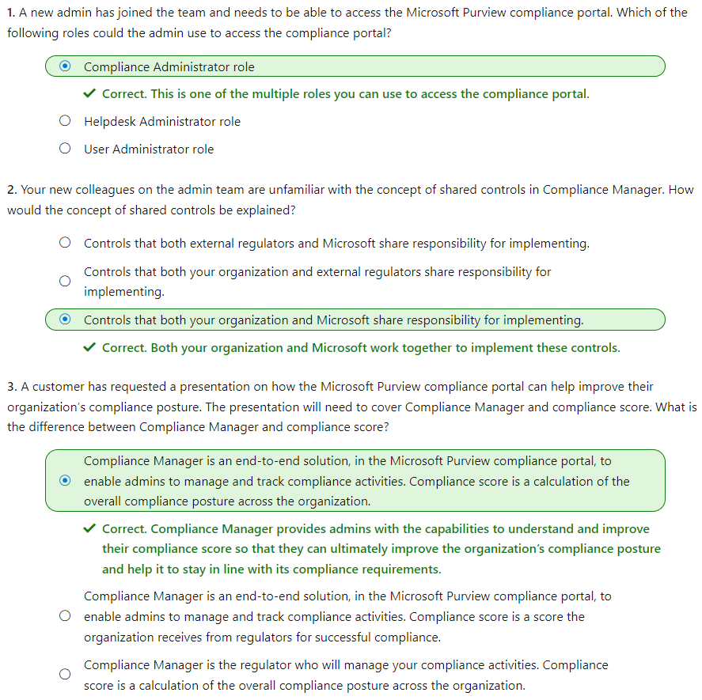
