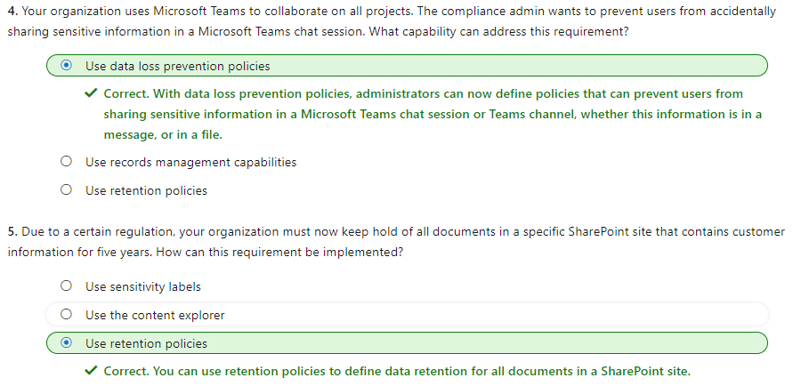

#### Microsoft Security Compliance and Identity Fundamentals | M4 Capabilities of Microsoft compliance solutions 
#### M4-3: Information protection and governance capabilities of Microsoft 365 

> Organizations need to protect all sorts of information, including financial and personal information. This must be done to ensure customers, employees, and the organization are protected from risks. The organization needs to stay in line with compliance standards wherever it operates. 
>
> Information protection and data lifecycle management in Microsoft Purview helps organizations classify, protect, and retain their data where it lives and wherever it goes. 
>
> In this module, you’ll learn about how Microsoft Purview solutions and capabilities like data classification, records management, and data loss prevention, can help organizations with their information protection and data lifecycle management needs. 
> After completing this module, you'll be able to: Eve
> - Describe data classification capabilities. 
> - Describe records management. 
> - Describe data loss prevention. 

# Know your data, protect your data, and govern your data 

Microsoft Purview Information Protection discovers, classifies, and protects sensitive and business-critical content throughout its lifecycle across your organization. It provides the tools to know your data, protect your data, and prevent data loss. 
 
Microsoft Purview Data Lifecycle Management manages your content lifecycle using solutions to import, store, and classify business-critical data so you can keep what you need and delete what you don't. It gives organizations the capabilities to govern their data, for compliance or regulatory requirements. 
 
Information protection and data lifecycle management work together to classify, protect, and govern your data where it lives, and wherever it goes. 
 

- Know your data: Organizations can understand their data landscape and identify important data across on-premises, cloud, and hybrid environments. Capabilities and tools such as trainable classifiers, activity explorer, and content explorer allow organizations to know their data. 
- Protect your data: Organizations can apply flexible protection actions including encryption, access restrictions, and visual markings. 
- Prevent data loss: Organizations can detect risky behavior and prevent accidental oversharing of sensitive information. Capabilities such as data loss prevention policies and endpoint data loss prevention enable organizations to avoid data loss. 
- Govern your data: Organizations can automatically keep, delete, and store data and records in a compliant manner. Capabilities like retention policies, retention labels, and records management enable organizations to govern their data. 

# Data classification capabilities in the Microsoft 365 Compliance Center 

Organizations need to know their data to identify important information across the estate and ensure that data is handled in line with compliance requirements. Admins can enable their organization to know its data through data classification capabilities and tools in the Microsoft Purview compliance portal, such as sensitive information types, trainable classifiers, content explorer, and activity explorer. 

Identifying and classifying sensitive items that are under your organization's control is the first step in the Information Protection discipline. Microsoft Purview provides three ways of identifying items so that they can be classified: 
- manually by users 
- automated pattern recognition, like sensitive information types 
- machine learning 

## Sensitive information types 

Sensitive information types (SIT) are pattern-based classifiers. They have set patterns that can be used to identify them. For example, an identification number in a country/region may be based on a specific pattern, like this: 123-456-789-ABC 

Microsoft Purview includes many built-in sensitive information types based on patterns that are defined by a regular expression (regex) or a function. 

Examples include: 
- Credit card numbers 
- Passport or identification numbers 
- Bank account numbers 
- Health service numbers 

Refer to [Sensitive information type entity definitions](https://learn.microsoft.com/en-us/purview/sit-sensitive-information-type-entity-definitions?view=o365-worldwide) for a listing of available built-in sensitive information types. 

Data classification in Microsoft Purview also supports the ability to create custom sensitive information types to address organization-specific requirements. For example, an organization may need to create sensitive information types to represent employee IDs or project numbers. 

Also supported is exact data match (EDM) classification. EDM-based classification enables you to create custom sensitive information types that refer to exact values in a database of sensitive information. 

## Trainable classifiers 

Trainable classifiers use artificial intelligence and machine learning to intelligently classify your data. They're most useful classifying data unique to an organization like specific kinds of contracts, invoices, or customer records. This method of classification is more about training a classifier to identify an item based on what the item is, not by elements that are in the item (pattern matching). Two types of classifier are available: 
- Pre-trained classifiers - Microsoft has created and pretrained many classifiers that you can start using without training them. These classifiers will appear with the status of Ready to use. Microsoft Purview comes with five pretrained classifiers that detect and classify things like resumes, source code, harassment, profanity, and threat (relates to committing violence or doing physical harm). 
- Custom trainable classifiers - Microsoft supports the ability to create and train custom classifiers. They're most useful when classifying data unique to an organization, like specific kinds of contracts, invoices, or customer records. 

To get a custom trainable classifier to accurately identify an item as being in a particular category of content, it must first be presented with many samples of the type of content in the category. This feeding of positive samples is known as seeding and is used to create a prediction model for the classifier. 

The model gets tested to determine if the classifier can correctly distinguish between items that match the category and items that don't. The result of each prediction is manually verified, which serves as input to improve the accuracy of the prediction model. 

After the accuracy score of the model has stabilized, the classifier can be published. Trainable classifiers can then sort through items in locations like SharePoint Online, Exchange, and OneDrive, and classify the content. 

## Understand and explore the data 

Data classification can involve large numbers of documents and emails. To help administrators to easily derive insights and understanding, the overview section of the data classification pane in compliance portal provides many details at a glance, including: 
- The number of items classified as sensitive information and which classifications they are. 
- Details on the locations of data based on sensitivity. 
- Summary of actions that users are taking on sensitive content across the organization. 

Administrators can also use the content and activity explorers to gain a deeper understanding and guide their actions. 

## What is the content explorer? 

The content explorer is available as a tab in the data classification pane of compliance portal. It enables administrators to gain visibility into the content that has been summarized in the overview pane. 

Access to content explorer is highly restricted because it makes it possible to read the contents of scanned files. There are two roles that grant access to content explorer: 
- Content explorer list viewer. 
- Content explorer content viewer. 

Anyone who wants to access content explorer must have an account in one or both of the role groups. 

With content explorer, administrators get a current snapshot of individual items that have been classified across the organization. It enables administrators to further drill down into items by allowing them to access and review the scanned source content that's stored in different kinds of locations, such as Exchange, SharePoint, and OneDrive. 

## What is the activity explorer? 
Activity explorer provides visibility into what content has been discovered and labeled, and where that content is. It makes it possible to monitor what's being done with labeled content across the organization. Admins gain visibility into document-level activities like label changes and label downgrades (such as when someone changes a label from confidential to public). 

Admins use the filters to see all the details for a specific label, including file types, users, and activities. Activity explorer helps you understand what's being done with labeled content over time. Admins use activity explorer to evaluate if controls already in place are effective. 

Here are a few of the activity types that can be analyzed: 
- File copied to removable media 
- File copied to network share 
- Label applied 
- Label changed 

Admins can use more than 30 filters for data including: 
- Location 
- User 
- Sensitivity label 
- Retention label 

The value of understanding what actions are being taken with sensitive content is that admins can see if the controls that they've already put in place, such as [data loss prevention](https://learn.microsoft.com/en-us/purview/dlp-learn-about-dlp?view=o365-worldwide) policies, are effective or not. For example, if it’s discovered that a large number of items labeled Highly Confidential have suddenly been downgraded to Public, admins can update policies and act to restrict undesired behavior as a response. 

##  Explore data classification in the compliance portal 
The video below walks you through the various data classification capabilities available in the compliance portal. 

# Sensitivity Labels and Policies 

Organizations must protect their data, to safeguard customers and business operations, and to meet compliance standards. Admins can enable their organization to protect its data, through capabilities and tools such as sensitivity labels and policies in the Microsoft Purview compliance portal. 

## Sensitivity labels 

Sensitivity labels, available as part of information protection in the Microsoft Purview compliance portal, enable the labeling and protection of content, without affecting productivity and collaboration. With sensitivity labels, organizations can decide on labels to apply to content such as emails and documents, much like different stamps are applied to physical documents: 
Labels are: 
- Customizable: Admins can create different categories specific to the organization, such as Personal, Public, Confidential, and Highly Confidential. 
- Clear text: Because each label is stored in clear text in the content's metadata, third-party apps and services can read it and then apply their own protective actions, if necessary. 
- Persistent. After you apply a sensitivity label to content, the label is stored in the metadata of that email or document. The label then moves with the content, including the protection settings, and this data becomes the basis for applying and enforcing policies. 
Each item that supports sensitivity labels can only have one label applied to it, at any given time. 

Sensitivity labels can be configured to: 
- Encrypt email only or both email and documents. 
- Mark the content when Office apps are used. Marking the content includes adding watermarks, headers, or footers. Headers or footers can be added to emails or documents. Watermarks can be applied to documents but not to email. 
- Apply the label automatically in Office apps or recommend a label. Admins choose the types of sensitive information to be labeled. The label can be applied automatically or configured to prompt users to apply the recommended label. 
- Protect content in containers such as sites and groups. This label configuration doesn't result in documents being automatically labeled. Instead, the label settings protect content by controlling access to the container where documents are stored. 
- Extend sensitivity labels to third-party apps and services. The Microsoft Purview Information Protection SDK enables third-party apps to read sensitivity labels and apply protection settings. 
- Classify content without using any protection settings. A classification can be assigned to content (just like a sticker) that persists and roams with the content as it's used and shared. The classification can be used to generate usage reports and view activity data for sensitive content. 

## Label policies

After sensitivity labels are created, they need to be published to make them available to people and services in the organization. Sensitivity labels are published to users or groups through label policies. Sensitivity labels will then appear in Office apps for those users and groups. The sensitivity labels can be applied to documents and emails. Label policies enable admins to: 
- Choose the users and groups that can see labels. Labels can be published to specific users, distribution groups, Microsoft 365 groups in Azure Active Directory, and more. 
- Apply a default label to all new emails and documents that the specified users and groups create. Users can always change the default label if they believe the document or email has been mislabeled. 
- Require justifications for label changes. If a user wants to remove a label or replace it, admins can require the user to provide a valid justification to complete the action. The user will be prompted to provide an explanation for why the label should be changed. 
- Require users to apply a label (mandatory labeling). It ensures a label is applied before users can save their documents, send emails, or create new sites or groups. 
- Link users to custom help pages. It helps users to understand what the different labels mean and how they should be used. 

Once a sensitivity label is applied to an email or document, any configured protection settings for that label are enforced on the content. 

# Data Loss Prevention

Data loss can harm an organization’s customers, business processes, and the organization itself. Organizations need to prevent data loss by detecting risky behavior and preventing sensitive information from being shared inappropriately. Admins can use data loss prevention policies, available in the Microsoft Purview compliance portal, to help their organization. 

Data loss prevention (DLP) is a way to protect sensitive information and prevent its inadvertent disclosure. With DLP policies, admins can: 
- Identify, monitor, and automatically protect sensitive information across Microsoft 365, including: 
  - OneDrive for Business 
  - SharePoint Online 
  - Microsoft Teams 
  - Exchange Online 
- Help users learn how compliance works without interrupting their workflow. For example, if a user tries to share a document containing sensitive information, a DLP policy can send them an email notification and show them a policy tip. 
- View DLP reports showing content that matches the organization's DLP policies. To assess how the organization is following a DLP policy, admins can see how many matches each policy has over time. 

DLP policies protect content through the enforcement of rules that consist of: 
- Conditions that the content must match before the rule is enforced. 
- Actions that the admin wants the rule to take automatically when content that matches the conditions has been found. 
- Locations where the policy will be applied, such as Exchange, SharePoint, OneDrive, and more. 

For example, an admin can configure a DLP policy that helps detect information that's subject to a compliance regulation like the Health Insurance Portability and Accountability Act (HIPAA) across all SharePoint sites and OneDrive for Business. The admin can block the relevant documents from being shared inappropriately. 

DLP policies protect information by identifying and automatically protecting sensitive data. Here's some scenarios where DLP policies can help: 
- Identify any document containing a credit card number stored in users’ OneDrive for Business accounts. 
- Automatically block an email containing employee personal information from being sent outside the organization. 

A policy can contain one or more rules, and each rule consists of conditions and actions at a minimum. For each rule, when the conditions are met, the actions are taken automatically. Rules can be grouped into one policy, to help simplify management and reporting. The diagram below shows how multiple rules, each with their own conditions and actions, are grouped into a single policy: 
 

The rules inside the policy are prioritized in how they’re implemented. For example, in the above diagram, rule one will be prioritized before rule two, and so on. 

## What is endpoint data loss prevention? 

Endpoint data loss prevention (Endpoint DLP) extends the activity monitoring and protection capabilities of DLP to sensitive items that are physically stored on Windows 10, Windows 11, and macOS (Catalina 10.15 and higher) devices 

Endpoint DLP enables admins to audit and manage activities that users complete on sensitive content. Listed below are a few examples: 
- Creating an item 
- Renaming an item 
- Copying items to removable media 
- Copying items to network shares 
- Printing documents 
- Accessing items using unallowed apps and browsers 

In the activity explorer, you can view information about what users are doing with sensitive content: 

 
Admins use this information to enforce protective actions for content through controls and policies. 

## Data loss prevention in Microsoft Teams 

Data loss prevention capabilities have been extended to Microsoft Teams chat and channel messages, including messages in private channels. With DLP, administrators can now define policies that prevent users from sharing sensitive information in a Teams chat session or channel, whether it's in a message, or a file. Just like with Exchange, Outlook, SharePoint, and OneDrive for Business, administrators can use DLP policy tips that will be displayed to the user to show them why a policy has been triggered. For example, the screenshot below shows a policy tip on a chat message that was blocked because the user attempted to share a U.S. Social Security Number: 

 
The user can then find out more about why their message was blocked by selecting the "What can I do?" link, and take appropriate action: 

 
With DLP policies, Microsoft Teams can help users across organizations to collaborate securely and in a way that's in line with compliance requirements. 

# Retention Policies and Retention Labels 

Retention labels and policies help organizations to manage and govern information by ensuring content is kept only for a required time, and then permanently deleted. Applying retention labels and assigning retention policies helps organizations: 
- Comply proactively with industry regulations and internal policies that require content to be kept for a minimum time. 
- Reduce risk when there's litigation or a security breach by permanently deleting old content that the organization is no longer required to keep. 
- Ensure users work only with content that's current and relevant to them. When content has retention settings assigned to it, that content remains in its original location. People can continue to work with their documents or mail as if nothing's changed. But if they edit or delete content that's included in the retention policy, a copy of the content is automatically kept in a secure location. The secure locations and the content are not visible to most people. In most cases, people don't even need to know that their content is subject to retention settings. 

Retention settings work with the following different workloads: 
- [SharePoint and OneDrive](https://learn.microsoft.com/en-us/purview/retention-policies-sharepoint?view=o365-worldwide)
- [Microsoft Teams](https://learn.microsoft.com/en-us/purview/retention-policies-teams?view=o365-worldwide)
- [Yammer](https://learn.microsoft.com/en-us/purview/retention-policies-viva-engage?view=o365-worldwide)
- [Exchange](https://learn.microsoft.com/en-us/purview/retention-policies-exchange?view=o365-worldwide)

When using retention policies and retention labels to assign retention settings to content, there are some points to understand about each. Listed below are just a few of the key points. For a more complete list visit [Compare capabilities for retention policies and retention labels](https://learn.microsoft.com/en-us/purview/retention?view=o365-worldwide&tabs=table-overriden#compare-capabilities-for-retention-policies-and-retention-labels). 

Retention policies 
- Retention policies are used to assign the same retention settings to content at a site level or mailbox level. 
- A single policy can be applied to multiple locations, or to specific locations or users. 
- Items inherit the retention settings from their container specified in the retention policy. If a policy is configured to keep content, and an item is then moved outside that container, a copy of the item is kept in the workload's secured location. However, the retention settings don't travel with the content in its new location. 

Retention labels 
- Retention labels are used to assign retention settings at an item level, such as a folder, document, or email. 
- An email or document can have only a single retention label assigned to it at a time. 
- Retention settings from retention labels travel with the content if it’s moved to a different location within your Microsoft 365 tenant. 
- Admins can enable users in the organization to apply a retention label manually. 
- A retention label can be applied automatically if it matches defined conditions. 
- A default label can be applied for SharePoint documents. 
- Retention labels support disposition review to review the content before it's permanently deleted. 

Consider the following scenarios. If all documents in a SharePoint site should be kept for five years, it's more efficient to do with a retention policy than apply the same retention label to all documents in that site. 

However, if some documents in that site should be kept for five years and others for 10 years, you'd need to apply a policy to the SharePoint site with a retention period of five years. You'd then apply a retention label to the individual item with a retention setting of 10 years. 

# Records Management

Organizations of all types require a management solution to manage regulatory, legal, and business-critical records across their corporate data. Microsoft Purview Records Management helps an organization look after their legal obligations. It also helps to demonstrate compliance with regulations, and increases efficiency with regular disposition of items that are no longer required to be kept, no longer of value, or no longer required for business purposes. 

 
Microsoft Purview Records Management includes many features, including: 
- Labeling content as a record. 
- Establishing retention and deletion policies within the record label. 
- Triggering event-based retention. 
- Reviewing and validating disposition. 
- Proof of records deletion. 
- Exporting information about disposed items. 

When content is labeled as a record, the following happens: 
- Restrictions are put in place to block certain activities. 
- Activities are logged. 
- Proof of disposition is kept at the end of the retention period. 

To enable items to be marked as records, an administrator sets up retention labels. 

 
Items such as documents and emails can then be marked as records based on those retention labels. Items might be marked as records, but they can also be shown as regulatory records. Regulatory records provide other controls and restrictions such as: 
- A regulatory label can’t be removed when an item has been marked as a regulatory record. 
- The retention periods can’t be made shorter after the label has been applied. 

For more information on comparing, use the [Compare restrictions for what actions are allowed or blocked section](https://learn.microsoft.com/en-us/purview/records-management?view=o365-worldwide#compare-restrictions-for-what-actions-are-allowed-or-blocked) of the documentation. 

The most important difference is that if content has been marked as a regulatory record, nobody, not even a global administrator, can remove the label. Marking an item as a regulatory record can have irreversible consequences, and should only be used when necessary. As a result, this option isn’t available by default, and has to be enabled by the administrator using PowerShell. 

## Common use cases for records management 

The capabilities of Microsoft Purview Records Management are flexible. There are different ways in which records management can be used across an organization, including: 
- Enabling administrators and users to manually apply retention and deletion actions for documents and emails. 
- Automatically applying retention and deletion actions to documents and emails. 
- Enabling site admins to set default retain and delete actions for all content in a SharePoint library, folder, or document set. 
- Enabling users to automatically apply retain and delete actions to emails by using Outlook rules. 

To ensure records management is used correctly across the organization, administrators can work with content creators to put together training materials. Documentation should explain how to apply labels to drive usage, and ensure a consistent understanding. 

# Knowledge Check

