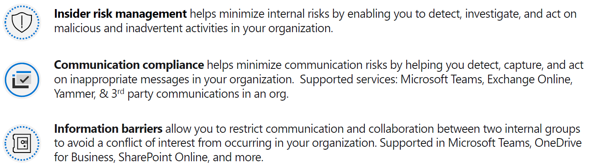
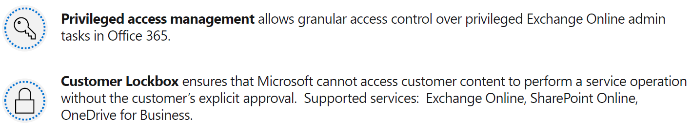
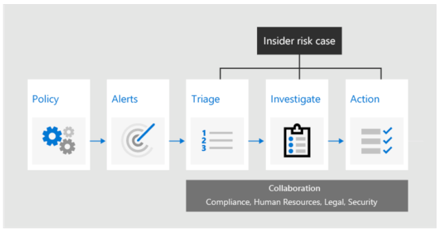
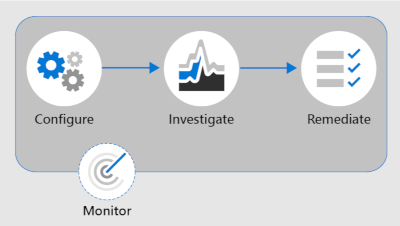
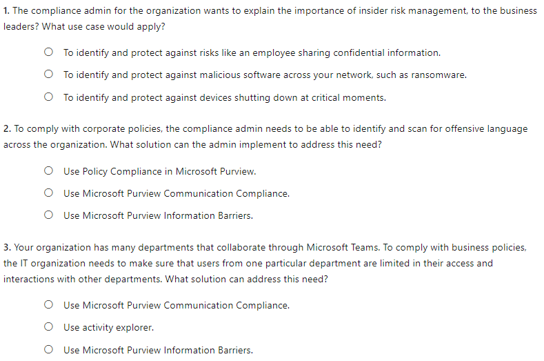
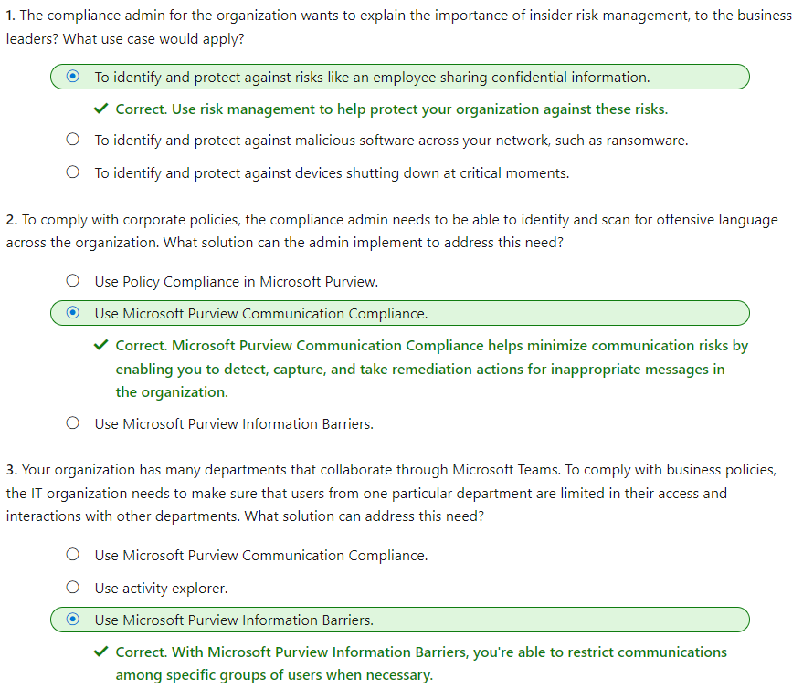

#### Microsoft Security Compliance and Identity Fundamentals | M4 Capabilities of Microsoft compliance solutions 
#### M4-4: Insider Risk Capabilities in Microsoft 365 

> Organizations understand that risks can come from insiders, like contractors, or even employees. There's always a risk that people might share information with competitors after leaving the company. Organizations need to ensure that they’re protected from these kinds of risks. 
> 
> In this module, you’ll learn how insider risk management, communication compliance, and information barriers in Microsoft Purview can help you protect your organization. 
> 
> After completing this module, you'll be able to: 
> 
> - Describe Microsoft Purview Insider Risk Management. 
> - Describe Microsoft Purview Communication Compliance. 
> - Describe Microsoft Purview Information Barriers.

# Insider Risk Management Solution 

Insider risk management is a solution that helps minimize internal risks by enabling an organization to detect, investigate, and act on risky and malicious activities. Insider risk management is available in the Microsoft Purview compliance portal. 
 
Managing and minimizing risk in an organization starts with understanding the types of risks found in the modern workplace. Some risks are driven by external events and factors, and are outside an organization’s direct control. Other risks are driven by internal events and employee activities that can be eliminated and avoided. Some examples are risks from illegal, inappropriate, unauthorized, or unethical behavior and actions by employees and managers. These behaviors can lead to a broad range of internal risks from employees: 
- Leaks of sensitive data and data spillage 
- Confidentiality violations 
- Intellectual property (IP) theft 
- Fraud 
- Insider trading 
- Regulatory compliance violations 
 
Insider risk management is centered around the following principles: 
- Transparency: Balance user privacy versus organization risk with privacy-by-design architecture. 
- Configurable: Configurable policies based on industry, geographical, and business groups. 
- Integrated: Integrated workflow across Microsoft Purview solutions. 
- Actionable: Provides insights to enable user notifications, data investigations, and user investigations. 

## Insider risk management workflow 

Insider risk management helps organizations to identify, investigate, and address internal risks. With focused policy templates, comprehensive activity signaling across Microsoft 365, and a flexible workflow, organizations can take advantage of actionable insights to help identify and resolve risky behavior quickly. Identifying and resolving internal risk activities and compliance issues with insider risk management in Microsoft Purview is achieved using the following workflow: 

- Policies - Insider risk management policies are created using predefined templates and policy conditions that define what risk indicators are examined in Microsoft 365 feature areas. These conditions include how indicators are used for alerts, what users are included in the policy, which services are prioritized, and the monitoring time period. 
- Alerts - Alerts are automatically generated by risk indicators that match policy conditions and are displayed in the Alerts dashboard. This dashboard enables a quick view of all alerts needing review, open alerts over time, and alert statistics for the organization. 
- Triage - New activities that need investigation automatically generate alerts that are assigned a Needs review status. Reviewers in the organization can quickly identify these alerts and scroll through each to evaluate and triage. Alerts are resolved by opening a new case, assigning the alert to an existing case, or dismissing the alert. As part of the triage process, reviewers can view alert details for the policy match, view user activity associated with the match, see the severity of the alert, and review user profile information. 
- Investigate - Cases are created for alerts that require deeper review and investigation of the details and circumstances around the policy match. The Case dashboard provides an all-up view of all active cases, open cases over time, and case statistics for the organization. Selecting a case on the dashboard opens it for investigation and review. This area is where risk activities, policy conditions, alerts details, and user details are synthesized into an integrated view for reviewers. 
- Action - After cases are investigated, reviewers can quickly act to resolve the case or collaborate with other risk stakeholders in the organization. 
  - Actions can be as simple as sending a notification when employees accidentally or inadvertently violate policy conditions. 
  - In more serious cases, reviewers may need to share the insider risk management case information with other reviewers in the organization. Escalating a case for investigation makes it possible to transfer data and management of the case to eDiscovery (Premium) in Microsoft Purview. 
 
Insider risk management can help you detect, investigate, and take action to mitigate internal risks in your organization in several common scenarios. These scenarios include data theft by employees, the intentional, or unintentional leak of confidential information, offensive behavior, and more. 
 
# Communication Compliance 

Communication compliance in the Microsoft Purview compliance portal helps minimize communication risks by enabling organizations to detect, capture, and take remediation actions for inappropriate messages. Predefined and custom policies in communication compliance make it possible to scan internal and external communications for policy matches so they can be examined by chosen reviewers. 

Identifying and resolving compliance issues with communication compliance in Microsoft Purview uses the following workflow: 

 
- Configure – in this step, admins identify compliance requirements and configure applicable communication compliance policies. 
- Investigate – admins look deeper into the issues detected when matching your communication compliance policies. Tools and steps that help include alerts, issue management to help remediation, document reviews, reviewing user history, and filters. 
- Remediate – remediate communications compliance issues. Options include resolving an alert, tagging a message, notifying the user, escalating to another reviewer, marking an alert as a false positive, removing a message in Teams, and escalating for investigation. 
- Monitor – Keeping track and managing compliance issues identified by communication compliance policies spans the entire workflow process. Communication compliance dashboard widgets, export logs, and events recorded in the unified audit logs can be used to continually evaluate and improve your compliance posture. 
 
Communication compliance enables reviewers to investigate scanned emails, and messages across Microsoft Teams, Exchange Online, Yammer, or third-party communications in an organization, taking appropriate remediation actions to make sure they're compliant with the organization's message standards. 
 
Some important compliance areas where communication compliance policies can assist with reviewing messages include: 
- Corporate policies - Users have to follow corporate policies like usage and ethical standards in their day-to-day business communications. With communication compliance, admins can scan user communications across the organization for potential concerns of offensive language or harassment. 
- Risk management - Communication compliance can help admins scan for unauthorized communication about projects that are considered to be confidential, such as acquisitions, earnings disclosures, and more. 
- Regulatory compliance - Most organizations are expected to follow some regulatory compliance standards during their day-to-day operations. For example, a regulation might require organizations to review communications of its brokers to safeguard against potential insider trading, money laundering, or bribery. Communication compliance enables the organization to scan and report on these types of communications in a way that meets their requirements. 
 
# Information Barriers

Microsoft 365 provides organizations with powerful communication and collaboration capabilities. However, an organization might want to restrict communications between some groups to avoid a conflict of interest from occurring in the organization, or to restrict communications between certain people to safeguard internal information. With information barriers, the organization can restrict communications among specific groups of users. 
 
Microsoft Purview Information Barriers is supported in Microsoft Teams, SharePoint Online, and OneDrive for Business. 
 
Information barriers are policies that admins can configure to prevent individuals or groups from communicating with each other. When information barrier policies are in place, people who shouldn't communicate with other specific users can't find, select, chat, or call those users. With information barriers, checks are in place to prevent unauthorized communication. 
 
Here are some examples of how information barriers can be applied: 
- Education: Students in one school can't look up contact details for students of other schools. 
- Legal: Maintaining confidentiality of data obtained by the lawyer of one client from being accessed by a lawyer for the same firm representing a different client. 
- Professional services: A group of people in a company is only able to chat with a client or specific customer via federation or guest access during a customer engagement. 

## Information barriers in Microsoft Teams 

In Microsoft Teams, information barrier policies determine and prevent the following kinds of unauthorized communications: 
- Searching for a user 
- Adding a member to a team 
- Starting a chat session with someone 
- Starting a group chat 
- Inviting someone to join a meeting 
- Sharing a screen 
- Placing a call 
- Sharing a file with another user 
- Access to file through sharing link 
 
If the people involved are included in an information barrier policy to prevent the activity, they can't continue. Potentially, everyone included in an information barrier policy can be blocked from communicating with others in Microsoft Teams. When people affected by information barrier policies are part of the same team or group chat, they might be removed from those chat sessions and further communication with the group might not be allowed. 
 
To learn more about the user experience with information barriers, see information barriers in [Microsoft Teams](https://learn.microsoft.com/en-us/purview/information-barriers-teams).  

# Knowledge check

