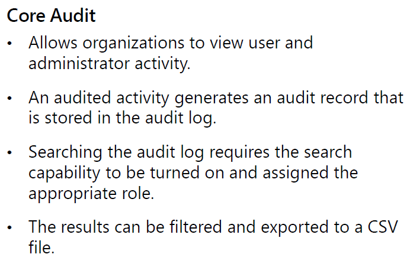

#### Microsoft Security Compliance and Identity Fundamentals | M4 Capabilities of Microsoft compliance solutions 
#### M4-5: eDiscovery and audit capabilities of Microsoft 365 

> Organizations may need to identify, collect, and/or audit information for legal, regulatory, or business reasons. With today's volume and variety of data, it’s vital that an organization can do this in an efficient and timely manner. The eDiscovery and audit capabilities in Microsoft Purview can help organizations to achieve this goal.
> Learn how the eDiscovery and audit capabilities of Microsoft Purview help organizations find relevant data quickly. 
> In this module, you’ll learn about the eDiscovery capabilities in Microsoft 365. 
> After completing this module, you'll be able to: 
> - Describe the eDiscovery solutions in Microsoft 365. 
> - Describe the auditing solutions in Microsoft 365. 

# eDiscovery solutions in Microsoft 365

Electronic discovery, or eDiscovery, is the process of identifying and delivering electronic information that can be used as evidence in legal cases. You can use eDiscovery tools in Microsoft Purview to search for content in Exchange Online, OneDrive for Business, SharePoint Online, Microsoft Teams, Microsoft 365 Groups, and Yammer teams. You can search mailboxes and sites in the same eDiscovery search, and then export the search results. You can use eDiscovery cases to identify, hold, and export content found in mailboxes and sites. 
Microsoft Purview provides three eDiscovery solutions: Content search, eDiscovery (Standard), and eDiscovery (Premium). 

 
## Content Search

 
Use the Content search tool to search for content across Microsoft 365 data sources and then export the search results to a local computer. 

## eDiscovery (Standard)

The eDiscovery (Standard) solution builds on the basic search and export functionality of Content search by enabling you to create eDiscovery cases and assign eDiscovery managers to specific cases. The eDiscovery (Standard) solution also lets you associate searches and exports with a case and lets you place an eDiscovery hold on content locations relevant to the case. 

## eDiscovery (Premium)

The eDiscovery (Premium) solution builds on the existing capabilities in eDiscovery (Standard). In addition, eDiscovery (Premium) provides an end-to-end workflow to identify, preserve, collect, review, analyze, and export content that's responsive to your organization's internal and external investigations. It lets legal teams manage custodians, people that you've identified as people of interest in the case, and the workflow to communicate with custodians. It allows you to collect and copy data into review sets, where you can filter, search, and tag content so you can identify and focus on content that's most relevant. The eDiscovery (Premium) solution provides analytics and machine learning-based predictive coding models to further narrow to scope of your investigation to the most relevant content. 

Subscriptions that support eDiscovery (Standard) also support Content search. Subscriptions that support eDiscovery (Premium) also support Content search and eDiscovery (Standard). 

To access any of the eDiscovery-related tools, a user must be assigned the appropriate permissions. Specifically, a user must be added as a member of the eDiscovery Manager role group in the Microsoft Purview compliance portal.  

# Audit solutions in Microsoft 365

Auditing solutions in Microsoft Purview help organizations effectively respond to security events, forensic investigations, internal investigations, and compliance obligations. Thousands of user and admin operations performed in dozens of Microsoft 365 services and solutions are captured, recorded, and retained in your organization's unified audit log. Audit records for these events are searchable by security ops, IT admins, insider risk teams, and compliance and legal investigators in your organization. This capability provides visibility into the activities performed across your Microsoft 365 organization. 

Microsoft Purview provides two auditing solutions: Audit (Standard) and Audit (Premium). 
 

## Audit (Standard)

Audit (Standard) provides with you with the ability to log and search for audited activities and power your forensic, IT, compliance, and legal investigations. Audit (Standard) is turned on by default for all organizations with the appropriate subscription. You can search for a wide-range of audited activities that occur in most of the Microsoft 365 services in your organization. Audit records can also be retrieved using the Office 365 Management Activity API. You can export the audit records returned by the search, to a CSV file, enabling further analysis using Microsoft Excel or Excel Power Query. In Audit (Standard), records are retained for 90 days. 

## Audit (Premium)

Audit (Premium) builds on the capabilities of Audit (Standard). Audit (Premium) provides audit log retention policies and longer retention of audit records. It provides audit records for high-value crucial events that can help your organization investigate possible security or compliance breaches and determine the scope of compromise. Audit (Premium) also provides organizations with more bandwidth to access auditing logs through the Office 365 Management Activity API. 

It can take anywhere from 30 minutes to 24 hours after an event occurs for the corresponding audit log record to be returned in the results of an audit log search. 
Licensing for Audit (Standard) or Audit (Premium) requires the appropriate organization-level subscription and corresponding per-user licensing. For additional information on licensing requirements, visit the Learn more section in the Summary and resources unit. 
Admins and members of investigation teams must be assigned the View-Only Audit Logs or Audit Logs role in Exchange Online to search the audit log. By default, these roles are assigned to the Compliance Management and Organization Management role groups on the Permissions page in the Exchange admin center. 

# Knowledge Check

