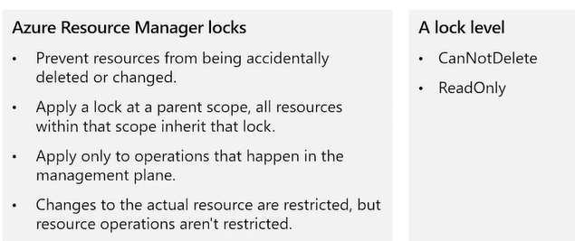
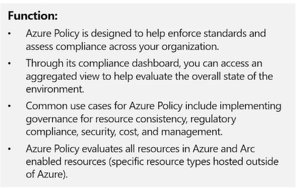
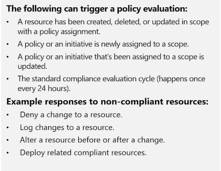
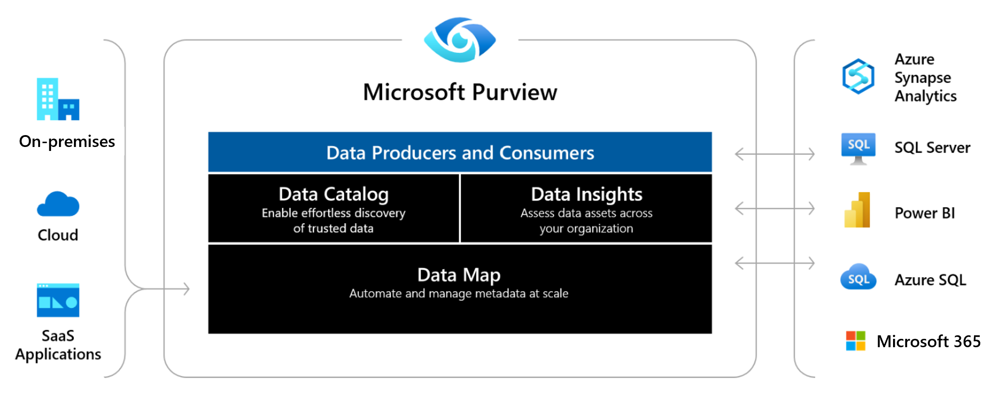
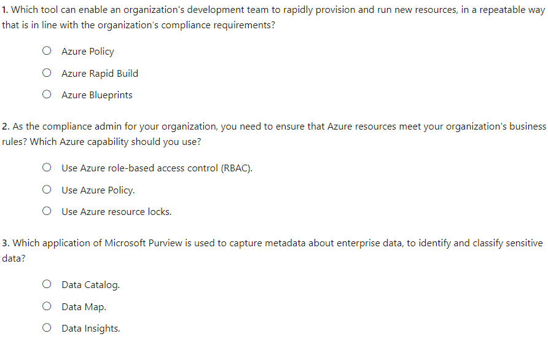
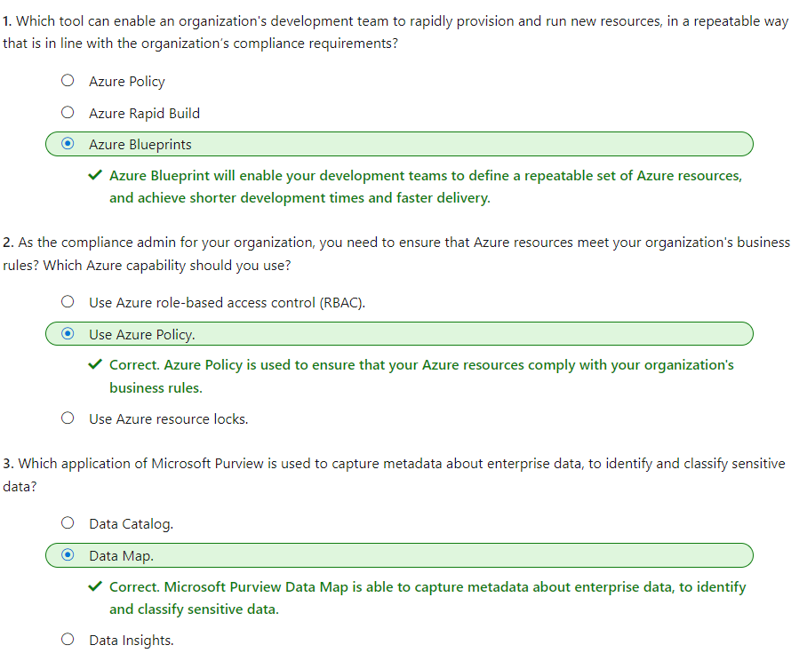

#### Microsoft Security Compliance and Identity Fundamentals | M4 Capabilities of Microsoft compliance solutions 
#### M4-6: Resource governance capabilities in Azure

> Azure has the capabilities that admins need to ensure that resources are governed properly, that they're secure, and in line with the organization’s compliance requirements. 
> 
> In this module, you’ll learn about the resource governance capabilities available for Azure. 
> 
> After completing this module, you'll be able to: 
> - Describe Azure Policy. 
> - Describe Azure Blueprints. 
> - Describe Microsoft Purview.

# Azure Resource Manger Locks and Azure Policy  

# Azure Policy 

Azure Policy is designed to help enforce standards and assess compliance across your organization. Through its compliance dashboard, you can access an aggregated view to help evaluate the overall state of the environment. You can drill down to a per-resource, or per-policy level granularity. You can also use capabilities like bulk remediation for existing resources and automatic remediation for new resources, to resolve issues rapidly and effectively. Common use cases for Azure Policy include implementing governance for resource consistency, regulatory compliance, security, cost, and management. 
 
Azure Policy evaluates all resources in Azure and Arc enabled resources (specific resource types hosted outside of Azure). 

Azure Policy evaluates whether the properties of resources match with business rules. These business rules are described using [JSON](https://learn.microsoft.com/en-us/azure/governance/policy/concepts/definition-structure-basics) format, and referred to as [policy definitions](https://learn.microsoft.com/en-us/azure/governance/policy/overview#policy-definition). For simplified management, you can group together multiple business rules to form a single [policy initiative](https://learn.microsoft.com/en-us/azure/governance/policy/overview#initiative-definition). After business rules have been formed, you can assign the policy definition, or policy initiative, to any scope of resources that are supported, such as management groups, subscriptions, resource groups, or individual resources. 

## Evaluation outcomes

Azure Policy evaluates resources at specific times during the resource lifecycle and the policy assignment lifecycle, and for regular ongoing compliance evaluation. The following events or times will trigger an evaluation: 
- A resource has been created, deleted, or updated in scope with a policy assignment. 
- A policy or an initiative is newly assigned to a scope. 
- A policy or an initiative that's been assigned to a scope is updated. 
- The standard compliance evaluation cycle (happens once every 24 hours). 
 
Organizations will vary in how they respond to non-compliant resources. Here's some examples: 
- Deny a change to a resource. 
- Log changes to a resource. 
- Alter a resource before or after a change. 
- Deploy related compliant resources. 

With Azure Policy, responses like these are made possible by using effects, which are specified in policy definitions. 

## What’s the difference between Azure Policy and Azure role-based access control (RBAC)? 

It’s important not to confuse Azure Policy and Azure RBAC. You use Azure Policy to ensure that the resource state is compliant to your organization’s business rules, no matter who made the change or who has permission to make changes. Azure Policy will evaluate the state of a resource, and act to ensure the resource stays compliant. 

Azure RBAC focuses instead on managing user actions at different scopes. Azure RBAC manages who has access to Azure resources, what they can do with those resources, and what areas they can access. If actions need to be controlled, then you would use Azure RBAC. If an individual has access to complete an action, but the result is a non-compliant resource, Azure Policy still blocks the action. 

Azure RBAC and Azure Policy should be used together to achieve full scope control in Azure. 

# Azure Blueprints 

Azure Blueprints provide a way to define a repeatable set of Azure resources. Azure Blueprints enable development teams to rapidly provision and run new environments, with the knowledge that they're in line with the organization’s compliance requirements. Teams can also provision Azure resources across several subscriptions simultaneously, meaning they can achieve shorter development times and quicker delivery. 

Azure Blueprints are a declarative way to orchestrate the deployment of various resource templates and other artifacts such as: 
- Role Assignments 
- Policy Assignments 
- Azure Resource Manager templates (ARM templates) 
- Resource Groups 

Blueprint objects are replicated to multiple Azure regions. This replication provides low latency, high availability, and consistent access to your blueprint objects, whatever region Azure Blueprints deploys your resources to. 

With Azure Blueprints, the relationship between the blueprint definition (what should be deployed) and the blueprint assignment (what was deployed) is preserved. This connection supports improved tracking and auditing of deployments. 

Azure Blueprints helps ensure Azure resources are deployed in a way that's in line with compliance requirements. However, a service like Azure Policy should be used to continuously monitor resources and ensure a continuation with compliance requirements. 

# Microsoft Purview 

An organization's data is constantly growing and users are storing and sharing data in new directions. For security and compliance administrators, the task of discovering, protecting, and governing sensitive data is one that never ends. The growth of data, also represents challenges for data consumers who might be unaware of a data source. For data producers, those who are responsible for producing and maintaining information assets, creating and maintaining documentation for data sources is complex and time-consuming. Restricting access to data sources and ensuring that data consumers know how to request access is an ongoing challenge. 

Microsoft Purview is designed to address the challenges associated with the rapid growth of data and to help enterprises get the most value from their information assets. 

Microsoft Purview is a unified data governance service that helps organizations manage and govern their on-premises, multi-cloud, and software-as-a-service (SaaS) data. With Microsoft Purview, organization can create a holistic, up-to-date map of the organization's data landscape with automated data discovery, sensitive data classification, and end-to-end data lineage. Security administrators and data curators can secure and manage their data estate. Data consumers are empowered to find valuable, trustworthy data. 

Purview automates data discovery by providing data scanning and classification as a service for assets across the organization's data estate. Metadata and descriptions of discovered data assets are integrated into a holistic map of the data estate. Atop this map, there are purpose-built apps that create environments for data discovery, access management, and insights about the organization's data landscape. 
 

## Data Map 

Microsoft Purview Data Map provides the foundation for data discovery and data governance. By scanning registered data sources, Azure Purview Data Map is able to capture metadata about enterprise data, to identify and classify sensitive data. Microsoft Purview supports Azure data sources and various data source categories including databases, file storage, and applications and services from third parties. 

## Data Catalog 

With the Microsoft Purview Data Catalog, business and technical users can quickly and easily find relevant data using a search experience with filters based on various lenses like glossary terms, classifications, sensitivity labels and more. 

## Data Insights 

With the Microsoft Purview Data Insights, data officers and security officers can get a bird’s eye view and at a glance understand what data is actively scanned, where sensitive data is, and how it moves. 
 
# Knowledge Check

